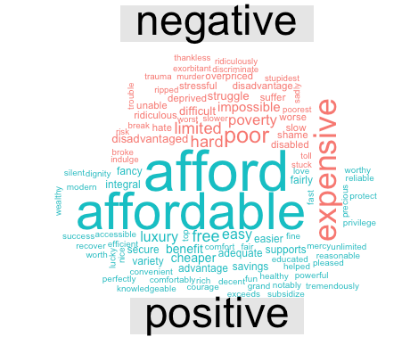
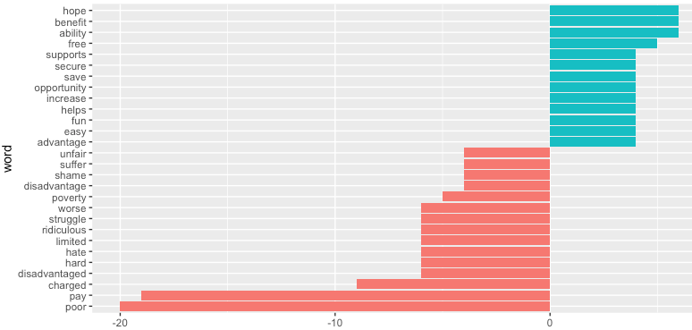
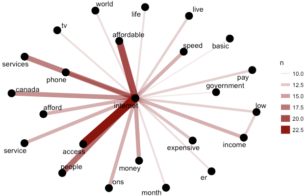
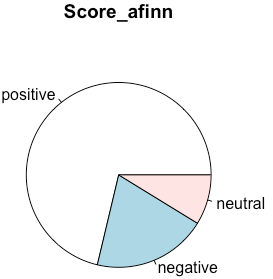
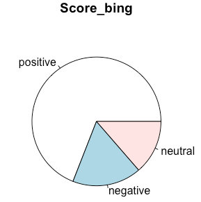
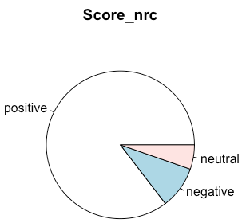
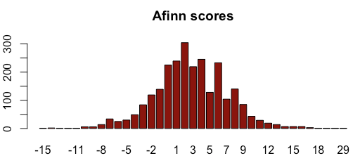
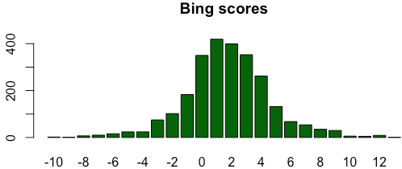
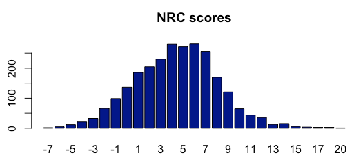

### Goal: 
understand the positions of intervenors on how affordable internet services should be if it mandated to be a basic service.

### Part1. ACORN members testimonials

 (ACORN (Association of Community Organizations for Reform Now) Canada is an independent national organization of low- and moderate-income families.)

`Documents`:

- 2015-134.224035.2409353.Intervention(1fn2h01!).pdf
- 2015-134.224035.2409354.Intervention(1fn2$01!).pdf

`Number of surveys analyzed`: 289

`Question`:
How do you feel about the current pricing of high speed internet? Please mark (x) on all that apply.

`Possible answers`:
- Reasonable, and I can afford it.
- Too high, but I can afford it.
- Extremely high, I can barely afford it.
- Extremely high I can't afford it, but because I need it I take money out of my:  
     - Food budget
     - Recreational budget
     - Rent
     - Other budget item
- Extremely high and I can't afford it, so I cancel my service from time to time.
- So expensive that I cannot afford it.
- Other.

`Results`:

Answer| Frequency
--- | ---
*Extremely high; I can't afford it, but because I need it I take money out of my budget for other item* |  92                                                                                   
*Extremely high; I can barely afford it.* | 82  
*Too high, but I can afford it.* |   39
*Extremely high; I can barely afford it. Extremely high; I can't afford it, but because I need it I take money out of my budget for other items*   |  20  
*So expensive that I cannot afford it.* | 14
*Extremely high; I can't afford it, but because I need it I take money out of my budget for other items Extremely high and I can't afford it, so I cancel my service from me to me.* | 11
*Extremely high and I can't afford it, so I cancel my service from me to me.* | 8
*Too high, but I can afford it. Extremely high; I can barely afford it.* | 6
*Extremely high; I can barely afford it. Extremely high; I can't afford it, but because I need it I take money out of my budget for other items So expensive that I cannot afford it.* | 3
*Extremely high; I can't afford it, but because I need it I take money out of my budget for other items So expensive that I cannot afford it.* | 3
*No Answer* | 2    
*Extremely high; I can barely afford it. Extremely high; I can't afford it, but because I need it I take money out of my budget for other items Extremely high and I can't afford it, so I cancel my service from me to me.* | 2
*Reasonable, and I can afford it.* | 2
*Extremely high; I can barely afford it. Extremely high and I can't afford it, so I cancel my service from me to me.* | 1
*Extremely high; I can barely afford it. Extremely high and I can't afford it, so I cancel my service from me to me. So expensive that I cannot afford it.* | 1
*Reasonable, and I can afford it. Extremely high; I can barely afford it.* | 1
*Reasonable, and I can afford it. Too high, but I can afford it.* | 1
*Too high, but I can afford it. Extremely high; I can barely afford it. Extremely high; I can't afford it, but because I need it I take money out of my budget for other items* |  1

`Analysis of Additional Comments`

Comparison Word cloud:

Sentiment ananlysis - top negative/positive distinctive  words:

Word co-occurence :

### Part2. Other documents

**Solr queries**:

(hl.method=original)

- bin/segment --add  --rows=158 '{!surround}content:3N(internet OR broadband,cost*)'
- bin/segment --add --rows=129  '{!surround}content:3N(services,cost*)'
- bin/segment --add --rows=272 '{!surround}content:3N(service,cost*)'
- bin/segment  --rows=76 --add '{!surround}content:5N(internet OR broadband OR service*,expensive)'
- bin/segment --add --rows=28  '{!surround}content:5N(internet OR broadband OR service*,cheap*)'
- bin/segment --add --rows=148 '{!surround}content:3N(internet OR broadband,price*)'
- bin/segment --add --rows=207 '{!surround}content:3N(service,price*)'
- bin/segment --add --rows=103 '{!surround}content:3N(services,price*)'
- bin/segment --rows=234 --add '{!surround}content:3N(internet OR broadband,afford*)'
- bin/segment --add --rows=149 '{!surround}content:3N(service,afford*)'
- bin/segment --add --rows=221 '{!surround}content:3N(services,afford*)'

647 Documents
2567 Segments

Used  tidytext sentiment dictionaries -  afinn, nrc and Bing

*Distribution of scores*:

**Most positive segments**

*Afinn*

- `score`: 29
- `document name`: 2015-134.224004.2394790.Intervention(1fbty01!).doc
- `text`:
funding be determined (e.g. only one service provider per area, all service providers that meet certain conditions, wireless service providers, or service providers that win a competitive bidding process)? The existing subsidy for rural voice delivered over copper networks should continue to be directed to the ILEC.Any new funding awarded for broadband development should be determined through needs analysis and competitive bidding processes, similar to the Digital Canada 150 program.13. d) How should the amount of funding be determined (e.g. based on costs to provide service or a competitive bidding process)? A competitive bidding process will ensure that the costs of providing service are not excessive.The Digital Canada 150 program set service targets, and allowed private firms to present the cost of meeting these targets, enabling a cost-benefit analysis of the solutions presented. This system allows Industry Canada clear visibility into the true costs associated with improving

*Nrc*

- `score`:  20
- `document name`: 2015-134.224010.2598227.Undertakings Report Appendix 1(1j_sz01!).pdf
- `text`:
three levels factors in technology adoption in northern and remote Indigenous communities are illustrated in the diagram below. All three need to be considered in the community-level research proposed for this project. Adoption by Indigenous community members and their households is the top level. Many factors are involved in a decision by community members and household to adopt a digital technology. Adoption within and by communities is the middle level. The community level includes how digital technologies are adopted by community organizations, and the regional community intermediary organizations that support community adoption. The base level is the infrastructure supporting digital technology adoption. Infrastructure issues such as availability, price, quality of service and/or experience, interoperability, ownership and accessibility are factors in digital technology adoption. Infrastructure also includes the middle mile and backhaul layer that affects bandwidth

*Bing*

- `score`:  13
- `document name`: DM#2433173 - 2015-134 - Resp to RFI - 21 Sept - CNOC_AAC_14Aug15-5.pdf
- `text`:
enhance the efficiency and competitiveness, at the national and international levels, of Canadian telecommunications; (f) to foster increased reliance on market forces for the provision of telecommunications services and to ensure that regulation, where required, is efficient and effective; (h) to respond to the economic and social requirements of users of telecommunications services; Mandated wholesale access to subsidized facilities will also enable consumers to enjoy benefits beyond those provided solely by access to broadband Internet service at specified target speeds and similar to those available by end-users residing in more accessible and competitive markets. These benefits include, for example, competitive offers and access to innovative and differentiated services. 1 Section 7(b) of the Telecommunications Act states, “to render reliable and affordable telecommunications services of high quality

**Most negative segments**

*Afinn*

- `score`:  -15
- `document name`: DM#2395599 - 2015-134 - Response to request for information - 150714-The Companies-CRTC-7May15-7 TNC 2015-134.doc
- `text`:
customers seeking to limit or reduce the cost of their service.1. Bill management tools (i.e., Long Distance, Directory Assistance, Collect Call, Pay-per-use, 1-900 Restrictions)We offer a number of options that customers may use with their home phone services to exclude the use of pay-per-use (PPU) features or long distance charges. The option to not access PPU features and/or long distance calling gives customers more certainty and control over their monthly bills and serves as an important bill management tool. The specific options that may be added are as follows:· Long distance calling restriction: This prevents out-going long distance calls from being placed from the telephone line.· Collect calling (and 3rd Party Calling) block: This prevents collect calls or 3rd party billed calls from being placed or billed to a telephone line, eliminating unwanted charges.· Directory assistance: This prevents out-going calls from connecting to the 411 Directory Assistance service, which

*Nrc*

- `score`:   -7
- `document name`: 2015-134.224015.2395444.Intervention Appendix A(1fcc401!).pdf
- `text`:
that the monies required to support any subsidy program should come from general tax revenues, not from taxes or charges on telecommunications services. “Contribution” payments by telecommunications providers to fund subsidies necessarily raise the cost of services provided by theses carriers and, therefore, require higher prices for these services, thereby discouraging their use. The loss in economic value from such narrowly-targeted support regimes is much greater than the loss that results from taxes that are collected from a much wider tax base. Hausman (1998) has estimated that the taxes levied by the FCC on U.S. international and interstate carrier revenues to support universal service more than double the economic cost of providing the universal service subsidies because they substantially reduce subscribers’ use of international and interstate services.40 If they were funded from general tax revenues, the economic welfare loss would be much lower

*Bing*

- `score`: -10
- `document name`: DM#2597436 - 2015-134 - Res to RFI - 5 May - CNOC - CNOC(CRTC)25Apr16-2 TNC 2015-134 .pdf
- `text`:
example, may have difficulties for reasons of geography in ensuring that all households within an operating territory have access to speeds of at least 5 Mbps download and 1 Mbps upload. Similarly, a wireline operator may not be able to afford extending services delivered over FTTN or FTTP to some remote households in its operating territory. In such cases, without additional factors, it is hard to say that the discrimination or disadvantage suffered by those unable to access speeds of at least 5 Mbps download and 1 Mbps upload is unjust, undue, or unreasonable. For example, discrimination may not contravene subsection 27(2) of the Act if it is either founded on factors largely beyond the reasonable control of the Canadian carrier, or the effort required to remedy the discrimination 1 Broadcasting and Telecom Decision CRTC 2015-26, Complaint against Bell Mobility Inc. and Quebecor Media Inc., Videotron Ltd. and Videotron
