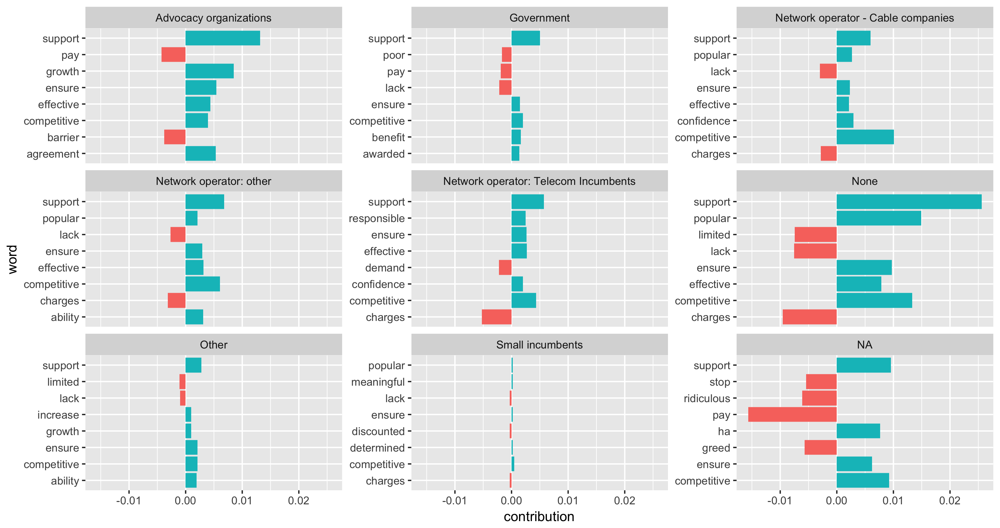

### Question1:
 What positions on affordability are being taken by different types of intervenors? 

### Summary stats:
Note: Numbers may be variable depending on what version of the application you're currently using. 

Category| In database | # of solr search results | # of doc2vec segments|
--- | --- | --- | --- |
Advocacy organizations |  264 | 112 | 1244
Chamber of commerce/economic dev agency |    4 | 0 | 0
Government  | 156 | 54 | 200
Network operator - Cable companies | 123 | 47 | 113
Network operator: other | 278 | 102 | 262
Network operator: Telecom Incumbents | 335 | 107| 198
Other | 108 | 32 | 140
Small incumbents  | 64  | 22  | 49
None  | 869 | 319  | 27

#### Top 10 most  common words:

Advocacy organizations  | Government | Network operator - Cable companies |  Network operator: other|  Network operator: Telecom Incumbents  | None   | Other  | Small incumbents
--- | --- | --- | --- | --- | --- | --- | ---
 internet   2%    |        service   2.9%    |  service   2.6%   |  service   2.7%   |   service   1.9%      |      service   2.1%   |        service   2.3%  |  service   2.4%
 services   1.4%    |       services   1.8%       |                services   2%      |     services   1.9%    |                   services   1.7%     |     broadband   1.4%       |      services   2%    |    jtf   1.8%
 service   1.3%    |       internet   1.6%         |            internet   1.6%   |       broadband   1.8%    |                 broadband   1.6%   |        services   1.2%       |    internet   1.8%  | services   1.5%
  crtc   1.1%     |     broadband   1.2%          |          broadband   1.6%    |      internet   1.2%        |                  telus   1.5%      |           ay   1.2% | telecommunications   1.4%   |    mbps   1.5%
 broadband    1.1%  | telecommunications    0.9%    |                     rogers   1%      |       access   1.1%             |          internet   1.2%     |      internet   1.2%     |     broadband   1.1% | broadband   1.4%
access   1%       |      access   0.9%       |                  access   1%      |   commission   0.9%              |         commission   1%    |        access   0.9%      |       access   1.1% | commission   1.1%
 canada   0.8%         |     basic   0.8%           |        commission   0.8%    |          basic   0.8%                |        access   0.9%          |       hw   0.8%           |   basic   1.1%    | internet   1%
 canadians   0.7%        |      speed   0.8%        |                 shaw   0.8% | telecommunications   0.8%               |            bell   0.8%          |  highway   0.7%              |   pm   0.8%    |   access   %1 |
telecommunications   0.7%    |        subsidy   0.7%     |                   basic   0.8%     |     canadians   0.7%     |                      mbps   0.7% | telecommunications   0.6%   |       canadians   0.7%   |    cost   0.9%
 basic   0.6%     |    government   0.7%         |                mbps   0.8%        |        ssi   0.6%       |      telecommunications   0.6%     |    commission   0.6%     |        canada   0.7%    |   crtc   0.8%

#### Top 10 most  common trigrams:

Advocacy organizations    |                                 Government      |      Network operator - Cable companies    |                   Network operator: other     |     Network operator: Telecom Incumbents |                                     None              |                           Other                |           Small incumbents
 --- | ---| --- | --- | --- | --- | --- | ---
  basic   telecommunications   services   1.2 %  | basic   telecommunications   services   0.6 %  |basic   telecommunications   services   0.7 %  | basic   telecommunications   services   0.6 %  |    telus   communications   company   1.2 % |  highway   highway   highway   2 % | basic   telecommunications   services   0.8 %       |    revenue   cost   provide   1.2 %
 city   postal   code   0.9 %   |   eeyou   communications   network   0.5 %      |     basic   service   objective   0.6 %       |    basic   service   objective   0.5 %    |    communications   company   tnc   0.7 %  | hig   hw   ay   1.3 %     |    communications   frpc   basic   0.3 %  | estimated   forecasted   revenues   0.9 %
  postal   code   comment   0.9 %   |         cree   nation   government   0.5 %     |   broadband   internet   service   0.5 %    |    broadband   internet   service   0.3 %  | basic   telecommunications   services   0.5 % |  ay   hig   hw   1.2 %        |        frpc   basic   service   0.3 %             |     citc   jtf   page   0.8 %
openmeida.ca   submission   crtc   0.9 %    |       basic   service   objective   0.4 %    |     broadband   internet   access   0.4 %    |     broadband   internet   access   0.3 %           |            dec   dec   dec   0.4 % | hw   ay   hig   1.2 %     |    broadband   internet   access   0.3 %       |     cap   usage   allowance   0.6 %
  submission   crtc   review   0.9 %     |       speed   internet   service   0.4 %     |     internet   access   services   0.4 %    |   national   broadband   strategy   0.3 %        |         mbps   target   speed   0.3 % | ay   highw   ay   0.9 %     |    basic   service   obligations   0.2 %  |      basic   service   objective   0.6 %
  email   medical   research   0.3 %    |     broadband   internet   access   0.2 %    |     telecom   regulatory   policy   0.3 %   |    backbone   assistance   program   0.3 %   | basic   telecommunications   service   0.3 % | highw   ay   highw   0.8 %      |     basic   service   objective   0.2 %   |   broadband   internet   access   0.6 %
homework   email   medical   0.3 %    |      basic   service   objectives   0.2 %   |    broadband   internet   services   0.3 %  | basic   telecommunications   service   0.3 %          |            tnc   2015   134   0.3 % | broadband   internet   access   0.3 %     |     basic   service   obligation   0.2 %        |      citc   jtf   response   0.6 %
 affordable   access   coalition   0.2 %      |       local   service   subsidy   0.2 %        |     entry   level   broadband   0.3 %      |    consumer   broadband   offer   0.2 %        |          company   tnc   july   0.2 % | basic   telecommunications   services   0.3 %    |            tnoc   comments   july   0.2 %     |   broadband   internet   plan   0.5 %
world   class   broadband   0.2 %    | nation   government   presentation   0.2 %      |   denotes   information   filed   0.2 %     |    canadian   radio   television   0.2 %         |        company   tnc   march   0.2 % |  basic   service   objective   0.2 %   |        http   www.crtc.gc.ca   eng   0.2 %     |   ii   marketing   strategies   0.5 %
 affordable   world   class   0.2 %   |     broadband   internet   service   0.2 %   |      canadian   radio   television   0.2 %   |   satellite   served   communities   0.2 %       |    tnc   attachment   abridged   0.2 % |  ig   hw   ay   0.2 %    |      service   obligations   tnoc   0.2 % | canadian   independent   telephone   0.5 %

#### Top sentiment words by category:

