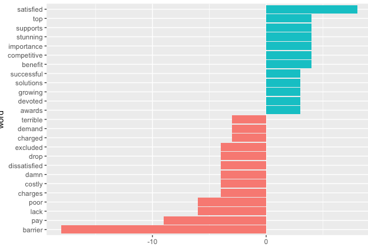
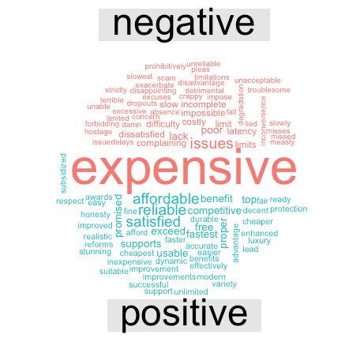

### Goal: 
understand the positions of intervenors on how affordable internet services should be if it mandated to be a basic service.

### Part1. ACORN members testimonials

 (ACORN (Association of Community Organizations for Reform Now) Canada is an independent national organization of low- and moderate-income families.)

`Documents`:

- 2015-134.224035.2409353.Intervention(1fn2h01!).pdf
- 2015-134.224035.2409354.Intervention(1fn2$01!).pdf

`Number of surveys analyzed`: 289

`Question`:
How do you feel about the current pricing of high speed internet? Please mark (x) on all that apply.

`Possible answers`:
- Reasonable, and I can afford it.
- Too high, but I can afford it.
- Extremely high, I can barely afford it.
- Extremely high I can't afford it, but because I need it I take money out of my:  
     - Food budget
     - Recreational budget
     - Rent
     - Other budget item
- Extremely high and I can't afford it, so I cancel my service from time to time.
- So expensive that I cannot afford it.
- Other.

`Results`:

Answer| Frequency
--- | ---
*Extremely high; I can't afford it, but because I need it I take money out of my budget for other item* |  92                                                                                   
*Extremely high; I can barely afford it.* | 82  
*Too high, but I can afford it.* |   39
*Extremely high; I can barely afford it. Extremely high; I can't afford it, but because I need it I take money out of my budget for other items*   |  20  
*So expensive that I cannot afford it.* | 14
*Extremely high; I can't afford it, but because I need it I take money out of my budget for other items Extremely high and I can't afford it, so I cancel my service from me to me.* | 11
*Extremely high and I can't afford it, so I cancel my service from me to me.* | 8
*Too high, but I can afford it. Extremely high; I can barely afford it.* | 6
*Extremely high; I can barely afford it. Extremely high; I can't afford it, but because I need it I take money out of my budget for other items So expensive that I cannot afford it.* | 3
*Extremely high; I can't afford it, but because I need it I take money out of my budget for other items So expensive that I cannot afford it.* | 3
*No Answer* | 2    
*Extremely high; I can barely afford it. Extremely high; I can't afford it, but because I need it I take money out of my budget for other items Extremely high and I can't afford it, so I cancel my service from me to me.* | 2
*Reasonable, and I can afford it.* | 2
*Extremely high; I can barely afford it. Extremely high and I can't afford it, so I cancel my service from me to me.* | 1
*Extremely high; I can barely afford it. Extremely high and I can't afford it, so I cancel my service from me to me. So expensive that I cannot afford it.* | 1
*Reasonable, and I can afford it. Extremely high; I can barely afford it.* | 1
*Reasonable, and I can afford it. Too high, but I can afford it.* | 1
*Too high, but I can afford it. Extremely high; I can barely afford it. Extremely high; I can't afford it, but because I need it I take money out of my budget for other items* |  1

`Analysis of Additional Comments`

Comparison Word cloud:

Sentiment ananlysis - top negative/positive distinctive  words:

Word co-occurence :

### Part2. Other documents

`Solr queries`:

(hl.method=original)

My original queries did not give much interesting results:
* bin/segment --rows=145 --add '{!surround}content:5N(internet,affordab*)' *
* bin/segment --rows=187 --add '{!surround}content:5N(internet,pric*)' *
* bin/segment  --rows=150 --add '{!surround}content:5N(internet,cost*)' *

Queries to get position/opinion:

* bin/segment --rows=35 --add '{!surround}content:3N(internet OR broadband OR service*,expensive)' *

Comparison Word cloud:

Sentiment ananlysis - top negative/positive distinctive words:

