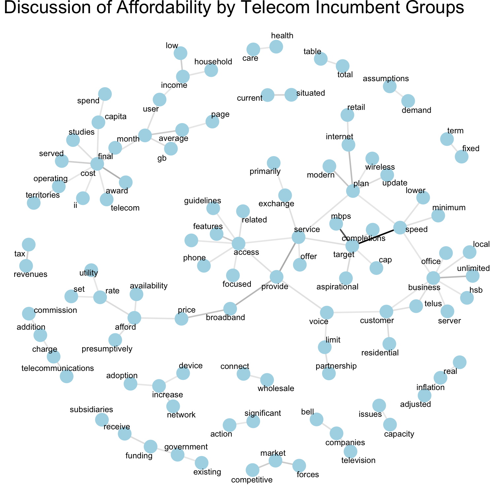
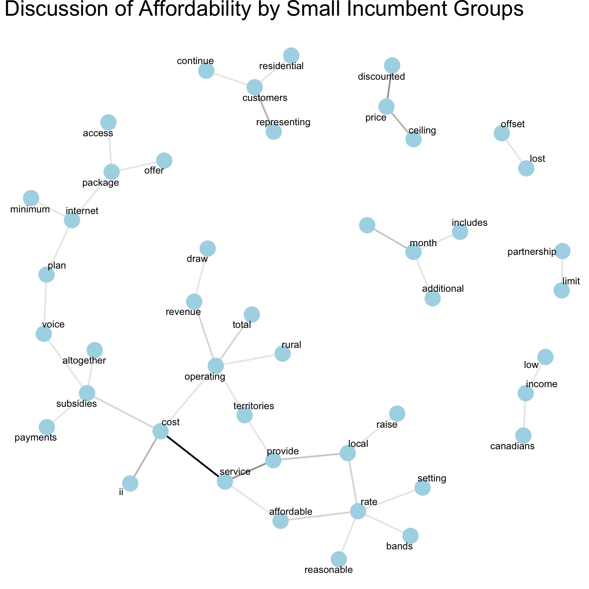
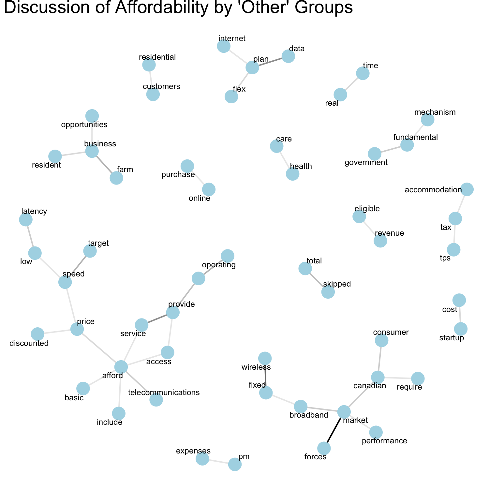

# Analysis of the Organizational Response to the Affordability question

## Introduction

This document will outline both the methods used and the organizational response to the question put forward by the CRTC concerning whether or not internet access in Canada is affordable.

NOTE: The completed stems do okay, but sometimes something like "funding" becomes "funded" so keep that in mind when reading the bigrams below. Or my personal favorite "information" sometimes becomes "informatica".

# Doc2vec

[Doc2vec](https://radimrehurek.com/gensim/models/doc2vec.html) is a machine learning algorithm which can be used to learn the semantic meaning or context of various lengths of text. This can be useful in order to find lengths of text which express a similar sentiment, or discuss similar topics. This is done by transforming each unique length of text, either sentences, paragraphs, or entire documents, into a vector representation of the text. Once each length of text has been vectorized, these vectors are then used to train a shallow three layer neural network (input, hidden and output), allowing the network to 'learn' the context expressed in each length of text. Once the neural network is trained, it is then possible to find the lengths of text which are most similar to each other based on their vector inner product from the output of the neural network. This method also has the advantage that you can find lengths of text that the network was trained on that are most similar to a length of text of your choosing -- in other words `doc2vec` provides an excellent search tool for concepts or ideas within a corpus of text.


## Our Model

We used the `gensim`'s `doc2vec` as implemented in Python. We divided every document into individual sentences, rather than paragraphs or documents, as it provided a artificially richer training set which is more straight forward to query. The neural network used had a hidden layer of 300 neurons and was trained over 20 epochs. Before training each sentence was cleaned by removing special characters, numbers, "sentences" that were less than 15 characters in length, from the raw text documents.  After this cleaning process we also applied a porter stemmer in order to reduce conjugated words to their basic form to reduce ambiguity between words. We additionally removed all stop words from the sentences used to train the network. Pre-cleaning the documents in this way simplify training the neural network reliably, as it reduces both ambiguity and the size of the corpus the network needs to learn.

In the case of the affordability question, we used our neural network to find sentences that would be contextually similar to the following sentence fragment:
```
Affordability of broadband internet access (1)
```
In using this phrase, the hope was that we should find all sentences with a sentiment contextually similar to the affordability of broadband internet access.

The algorithm used to find similar sentences within a set of documents contains an element of randomness to it, we used a Monte Carlo simulation to ensure our coverage of the document space was as broad as possible. In essence, we returned the top 30 most similar sentences to (1) 50000 times to ensure that we find as many of the most relevant sentences as possible. Using this methodology, the sentences which appear most frequently from those 50000 searches can be thought of as "most reliable". A histogram of tagged sentences can be found below


Using this algorithm, around 4000 sentences containing something conceptually similar to "affordability of broadband internet access" are found within the documents. Certainly, semantic relevance to the neural network may be different from semantic relevance as found by a human. Another interesting artifact of this analysis is that the histogram formed is functionally similar to an inverse exponential function, meaning that the "similarity" of sentences to our search term drop off exponentially with respect to how often they appear as the most similar terms. Using this histogram, we can rank tagged sentences by how frequently they appeared in the Monte Carlo analysis.

Once each sentence was tagged, in order to understand the discussions taking place, we then gathered two sentences above and below the sentence tagged by `doc2vec`, ensured that there was no overlap between two sentences that were found near-adjacent to avoid repeated data, and used those fragments of text in the following analysis.

 We cautiously note however that while this methodology will certainly find us a great deal of relevant sentence fragments, it is also likely to return a great deal of irrelevant sentence fragments, and due to the nature of this analysis we have no quantifiable way to rate its performance. An apt analogy of this method is looking for a particular needle in a stack of needles by blowing up the entire stack and sifting through the rubble. Certainly you'll find the needle you were looking for, but you'll also find some needles that look pretty close to the one you're looking for, as well as some needles horribly mangled from the explosion. In total this method was able to identify 1105 segments of text (where a segment is at least five sentences) which contain something of a similar context to "Affordability of broadband internet access". While the histogram plot above shows approximately 4000 total sentences found, some of these tagged sentences are in close proximity and get grouped together in a single, large segment.


## Analysis of Language Used by Different Organizational Groups.

### N-grams

In order to obtain a succinct overview of the content of the segments located by `doc2vec`, a common method is the use of $N$-grams. An $N$-gram within this context is simply $N$ word combinations that appear together frequently. For example, a bigram is a common word-pair that can be found within a document. For example, "Telecommunications" and "service" is a common bigram within the entire corpus of the CRTC documents. Using bigrams, it is possible to determine a general overview of the common themes of a block of text based on which words appear together most frequently.

$N$-grams can be visualized as a web of words, where bigrams that share common words form different clusters within the web. With such a visualization, each cluster may represent important topics within a block of text or document. One disadvantage of $N$-gram analysis however, is that while we gain an easily digestible overview of the content of the text, we will lose any sense of context surrounding the use of these word groupings, and it is important to avoid 'over interpreting' this data beyond noting important topics based on the word-pairs.

### All Groups

#### Unfiltered Bigram Web

To get a sense of the common issues surrounding the question of affordability it is instructive to see the most common word bigrams that appear in the entire corpus of the 1105 segments of text. Using this information, we can judge the most common phrases used in the entire corpus. This is shown in the image below, displaying only the bigrams which appear $N>70$ times. We have also applied a stemmer to the word pairs in order to ensure that different conjugations are only counted as one. However, after word pairs were sorted we "completed" the stems once again. We note however, that this process isn't perfect and sometimes the completed stems aren't the most 'logical' choice. For example, on occasion information will appear as 'informatica' etc.


In the plot above, the opacity of each line between word nodes is representative of how frequently the word-pair appears in the text . From this figure, it is clear that the discussion surrounding affordability of internet access in Canada seems to heavily surround terms which could are related to the question of basic service and internet access. This could be a result of two possibilities:
  1. The two issues are intimately related. The question of basic service is very much also a question of affordability.
  2. The question of basic service is also discussed in the same segment of text, but unrelated to, the affordability question.

In reality this correlation is likely a result of a combination of both these potential causes. However, this overview plot is not particularly insightful in terms of what the discussion surrounding affordability is. In order to avoid any bias due to this effect as resulting from one or both of the possibilities discussed above, we employ another filter to the documents to ensure we only find word-pairs relevant to only the discussion of affordability.

#### Further Filtering

In order to gain insight into the discussion advocacy organizations are having surrounding affordability, it is possible to filter these results even further using a method similar to `doc2vec`. Here we use a pre-trained set of word embeddings from [Stanford's GloVe 100 dimension, 400k vocabulary set](https://nlp.stanford.edu/projects/glove/) in order to filter our results even further. In this case, we will filter our bigrams down to those only containing words which are conceptually similar to
```
cost, affordability, price and expensive
```
which should return to us a highly relevant bigram web. Shown below is the common word pairs from all the documents using the above word embedding filter which we have only shown bigrams with frequency $N \geq 25 $.


This provides us with a much more succinct and relevant overview of the common terms used in regards to a discussion of internet affordability. The most common terms within this subset of documents surround fund(ing), afford(ability) and internet. A secondary cluster of words surrounding broadband and provide show us another secondary discussion taking place. It is tempting to take the "top-down" view of this information and begin trying to interpret this plot beyond a statement of common discussion points. However, it will be more useful to filter the text segments by organizational category, and discover which topics are important to each group, rather than making generalizations based on the entire discussion. I am hesitant to interpret this further than stating that these are the most common word pairs in the discussion around affordability in the documents submitted to the CRTC.  

### Advocacy Organizations

#### Unfiltered Bigram Web
To visualize the discussion of the conglomerate of advocacy organizations surround affordability, we plot the most common bigrams that appear $N>65$ times in the 551 segments of text tagged by `doc2vec` as semantically relevant to the affordability of internet access in Canada.


Where this plot is eerily similar to the plot of most common terms used by all organizations. Again, this figure is not particularly insightful in terms of the discussion the advocacy organizations are having about the affordability of broadband internet access. In such a case, it is prudent to again apply the `text2vec` filter that we used for all the groups.

#### Filtered Bigram Web
In this case we have filtered down to words which share a cosine similarity to the above of greater than 0.6, and display only bigram pairs that appear $N \geq 16$ times within the text supplied by the responses from advocacy groups.


  

The above figure shows us the most common terms used by advocacy groups which directly relate to the concept of affordability, filtered from the segments related in context to affordability of internet access.  In the largest cluster of word pairs we see that the advocacy groups use language suggesting discussion relevant to consumer-end pricing of internet access and government funding mechanisms. Using this plot it may be reasonable to state that the discussion concerning affordability by advocacy groups are centered around ensuring that internet access is affordable for the consumer. There is also significant discussion of government funding programs, which either center around funding for new infrastructure, or for Canadian consumers to have access to the internet. Interestingly the most frequent bigrams from the advocacy groups are "afford <-> internet", "fund(ing) <-> opportunities", "low <-> income" and "telecom <-> companies", which would indicate that the advocacy groups had significant discussion around these topics. However, we lose all sense of context surrounding interesting word pairs in a figure such as this. For example the discussion about government funding could be in terms of subsidies to expand existing infrastructure, government funding for non-profit organizations, or financial assistance for low-income households.

In essence these results aren't necessarily surprising. Advocacy groups seem to be primarily concerned with the affordability and access from the perspective of Canadian consumers, with common word pairs such as "price" and "gouge" and many common word pairs around "afford".  There are also many common bigrams relevant to government funding programs. Essentially this shows the discussion relevant to affordability by advocacy groups is a discussion centered around affordability issues important to the interests of advocacy groups. In other words, advocacy groups use language surrounding affordability that would suggest a consumer-centric point of view.

## Government Groups

The responses of government groups in regards to sentences that are semantically similar to the question of affordability of the internet appear to be similar to that of the Advocacy groups before the data is again filtered using the pre-trained `text2vec` word embeddings. However, for the sake of both brevity and interest, we skip the "unfiltered" bigram-web in favor of the more enlightening filtered version below. In this case, the similarity criteria of greater than 0.6 remains the same, however due to a smaller volume of documents we only show bigrams that appear $N \geq 3$ times in the 72 segments of text found by `doc2vec`.


Discussion by government groups surrounding affordability is noticeably different than that of the advocacy groups with respect to frequent word pairs. In terms of government discussion surrounding affordability there exist many frequent word pairs surrounding revenues and government funding mechanisms. Drawing our attention to the largest cluster around the word "prodid (provide)" we see that during the discussion of affordability by government groups that there are many common word pairs concerning providing access, service, consumers and so forth. Government organizations seem to be using language focused around, funding, revenues, and subsidies, as well as language surrounding the issues of services provided.

Again this isn't necessarily surprising. Government groups discuss affordability as it is relevant to them: in terms of both providing or receiving funding, and affordability and access with respect to their constituents.


## Telecom incumbents

The response of the large telecom incumbents to the issue of affordability is also shown here, where the bigrams shown appear $N \geq 4$ times in the 131 text segments from telecom incumbents.



From the figure above the discussion surrounding affordability by telecom incumbents is distinguishable from both advocacy organizations and government organizations. There are many word pairs associated with the word cost, such as telecom (telecommunications) or capit (capital) which seems to imply that the discussion of telecoms surrounding affordability is centered around what may be considered affordable in terms of providing telecommunications services. There is also significant discussion surrounding "busi" (business) and relationships between government funds and subsidies. Here what we may be seeing is evidence of a discussion about what affordability is to telecom incumbents. Or what is affordable to them in terms of what to charge and expenses relevant to providing their service and government funding that may help make that possible. Certainly, the context behind these statements is lost so we are unable to make strong claims as to what these groups are saying _about_ things like costs and subsidies, just that these topics are heavily discussed in segments of text relevant to when these incumbents discuss affordability.

## Cable incumbents
The discussion of the cable incumbent groups surrounding affordability is shown below with common word pairs appearing $N \geq 3$ times in 96 segments of text found by `doc2vec`.


In the case of the cable incumbents the language used surrounding the issue of affordability again is surrounding affordability through the lens of the particular incumbent. There is popular bigram pairs surrounding the word "market" with common pairs in terms of "forc (force(s))" and "competit (competition)" as well as retail. There is also a small cluster surrounding the word "fund" with respect to receive and government. Much like the telecom incumbents, the discussion of affordability by cable incumbents is primarily focused on what is affordable in terms of the services they provide.

## Small Incumbents
Showing bigrams with frequency $N \geq 2$ from 33 text segments. Honestly I don't think there's enough here to warrant any discussion. There's not much to see. It might be smarter to group these with cable or telecoms? oR just ignore them completely as this doesn't add anything to the discussion that we haven't already talked about.



Although I note that there is an interesting popular bigram between cost and service, which would indicate that small incumbents talk about "cost of service" with great frequency (16 times in all)

## 'Other' groups
Showing bigrams with frequency $N \geq 3$ from 80 segments of text found by `doc2vec`.


The submissions contained within this group come primarily from individual respondents or small businesses. Some of the common bigrams shown here aren't significantly different than the discussions of the advocacy groups or the government. We're seeing a lot of discussion around affordability relevant to telecommunication as discussions surrounding the market. One unique feature of this group is the nodes surrounding business such as residential and farm, which is reflective of the organizations that are grouped into this category.


## Other incumbents
This shows bigrams with frequency $N\geq 4$ from 155 segments found by `doc2vec`. Honestly there's not much new going on here either that we haven't already seen before. Other incumbents seem to have a discussion of affordability that is similar to telecoms and cable companies.


# Conclusion

By using `doc2vec` as a search tool to locate sentences which contain content semantically similar to the affordability of broadband internet access it was possible automatically identify segments of text from the CRTC documents with some mention of affordability. It was then possible to further refine these results by using `text2vec` word embeddings in order to further isolate the language used by different invested organizations surrounding the issue of affordability of broadband access in Canada. From these results it was possible to identify that the language used surrounding affordability is significantly different depending on which group is identified. Each group's discussion of affordability seems to be focused around what affordability is to them. Advocacy organizations discuss affordability from the perspective of Canadian consumers, telecom and cable companies discuss affordability from the perspective of running a business, and government groups discuss affordability in terms of receiving or granting funding as well as detailing services provided.

In essence we've discovered that there are essentially four different discussions of affordability taking place within the CRTC documents, where the issues surrounding affordability are different depending on who you ask. This result is not at all surprising due to the nature of `doc2vec`, as we're finding statements of semantic or contextual similarity. In this regard, each group discusses issues similar to affordability as it means to them. Businesses are concerned about affordability in terms of revenues and market forces, governments are concerned about affordability in terms of funding and service provided, and advocacy groups are concerned about affordability in terms of the cost to the consumer. From this perspective, this analysis has showcased the language used surrounding the issue affordability as it means to each group. While this certainly does not answer whether or not internet access in Canada is affordable, what it is able to clean is potentially important discussion points from every group surrounding the idea of affordability from a larger scope. Such analysis may prove to be useful in understanding what issues each group have surrounding affordability, and may make it more straight forward to understand the requirements of each group in order to find a price range which maximally satisfies every invested party.
