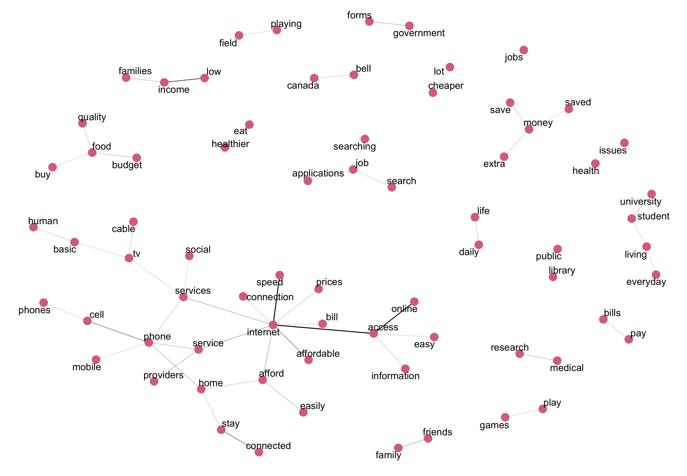
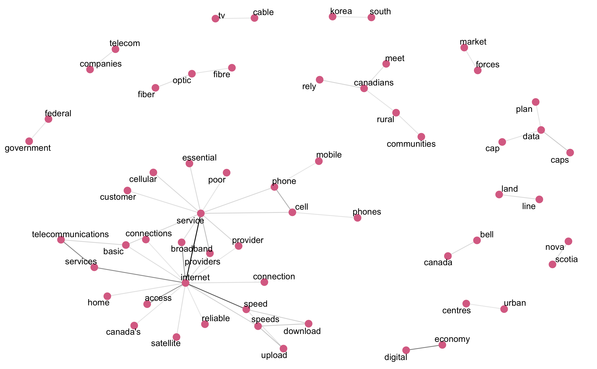

### Individual Submissions stats.

Sources of submissions: OpenMedia, Acorn, individual html submissions.

#### OpenMedia

OpenMedia is a Canadian non-profit advocacy organization working to encourage open and innovative communication systems within Canada.

Individual submissions coming from:
https://unblockcanada.ca/

Tell the CRTC: All Canadians Deserve Faster, Cheaper Internet Service

Big Telecom giants plan to keep you locked into some of the most expensive Internet services in the industrialized world.

They're trying to convince the government that Canadians are OK with their slow, costly services, and our huge digital divide. It's not fair: we deserve the same service as similar countries.

Time to set the record straight. In April 2016, a historic CRTC hearing will shape the future of Canada’s Internet. Join tens of thousands of Canadians and endorse our letter below NOW to demand affordable, world-class broadband Internet for all Canadians and we'll make sure your voice is heard

- *20281  individual submissions*
  - *2427  unique submissions*
  - *17854 standard submissions:*

 `Dear Commissioners, Universal access in Canada must be defined to include affordable, world-class broadband Internet for 100% of the population. This access must have upload and download speeds and quality on par with our international counterparts.
 Canada’s goals are currently much slower than other industrialized countries. The U.S. recently defined broadband at 25 megabits per second down, and 3 megabits per seconds up. Our targets should be at least this ambitious.
 The CRTC should also prioritize new mechanisms for achieving these goals, including special opportunities for non-incumbent ISPs, municipalities, community access programs and non-profit service providers to deliver services to Canadians.
 A successful strategy will ensure that all Canadians have affordable, next-generation service. All telecom providers must provide this minimal level of connectivity everywhere they can at a reasonable price.
 I acknowledge that my comments and information will form part of the public record for this proceeding including on the CRTC website.
 I do not wish to appear at the hearing in relation to this submission.
 I ask that this submission be granted the same weight as that of any other party.
 Thank you`

### ACORN members testimonials stats

  ACORN (Association of Community Organizations for Reform Now) Canada is an independent national organization of low- and moderate-income families.

  ACORN members were asked to fill out questionaries with set of questions:

   -  What online services, activities, or communications do you use?
   Why is online access important to you?
   - How do you feel about the current pricing of high speed internet?
   - Which budget items have you taken money out of to pay for internet?
   - Please share how your life would change if you could easily afford home high-speed Internet.
   - Please share anything else relevant.

  *289 Submissions*

 `Results for pricing question`:
 How do you feel about the current pricing of high speed internet? Please mark (x) on all that apply.

 `Possible answers`:
 - Reasonable, and I can afford it.
 - Too high, but I can afford it.
 - Extremely high, I can barely afford it.
 - Extremely high I can't afford it, but because I need it I take money out of my:  
      - Food budget
      - Recreational budget
      - Rent
      - Other budget item
 - Extremely high and I can't afford it, so I cancel my service from time to time.
 - So expensive that I cannot afford it.
 - Other.

 `Results`:

 Answer| Frequency
 --- | ---
 *Extremely high; I can't afford it, but because I need it I take money out of my budget for other item* |  92                                                                                   
 *Extremely high; I can barely afford it.* | 82  
 *Too high, but I can afford it.* |   39
 *Extremely high; I can barely afford it. Extremely high; I can't afford it, but because I need it I take money out of my budget for other items*   |  20  
 *So expensive that I cannot afford it.* | 14
 *Extremely high; I can't afford it, but because I need it I take money out of my budget for other items Extremely high and I can't afford it, so I cancel my service from me to me.* | 11
 *Extremely high and I can't afford it, so I cancel my service from me to me.* | 8
 *Too high, but I can afford it. Extremely high; I can barely afford it.* | 6
 *Extremely high; I can barely afford it. Extremely high; I can't afford it, but because I need it I take money out of my budget for other items So expensive that I cannot afford it.* | 3
 *Extremely high; I can't afford it, but because I need it I take money out of my budget for other items So expensive that I cannot afford it.* | 3
 *No Answer* | 2    
 *Extremely high; I can barely afford it. Extremely high; I can't afford it, but because I need it I take money out of my budget for other items Extremely high and I can't afford it, so I cancel my service from me to me.* | 2
 *Reasonable, and I can afford it.* | 2
 *Extremely high; I can barely afford it. Extremely high and I can't afford it, so I cancel my service from me to me.* | 1
 *Extremely high; I can barely afford it. Extremely high and I can't afford it, so I cancel my service from me to me. So expensive that I cannot afford it.* | 1
 *Reasonable, and I can afford it. Extremely high; I can barely afford it.* | 1
 *Reasonable, and I can afford it. Too high, but I can afford it.* | 1
 *Too high, but I can afford it. Extremely high; I can barely afford it. Extremely high; I can't afford it, but because I need it I take money out of my budget for other items* |  1

### Individual html submissions.
- *266 Submissions*
  - *239 Submissions in English*
  - *27 Submissions in French*
  - *6 Empty submissions*
  (used google translate API to translate them)

### Comparing individual submissions language

- 2427 free form comments from OpenMedia.
- 289  ACORN member comments discussing following questions:
  - Why is online access important to you?
  - Please share how your life would change if you could easily afford home high-speed Internet.
  - Please share anything else relevant.
- 258 individual html submissions.

##### Top 10 most frequent words
 (excluded words - "canada","service","canadians", "canadian", "services")

OM | ACORN | HTML
--- | --- | ---
 internet  5.4% | internet   4.6% | internet 3.3%
 world  1.9% | access    2.2% | speed 1.5%
 access  1.9% | afford 1.3% | access 1%
 telecom   1.2% | money    1.2% | month 0.7%
 companies   1.1% | online    1.1% | data 0.7%
 pay   1% | family  0.9% | mbps 0.6%
 prices   0.9% | life    0.9% | rural 0.6%
 broadband   0.9% | home    0.9% | speeds 0.6%
 speed   0.9% | food 0.8% | live 0.6%
 affordable   0.9% | people 0.8% | bell 0.6%

- Similarities:
  - ACORN, OM, HTML discuss internet access.
  - ACORN, OM discuss affordability, prices.
  - OM, HTM discuss internet speeds.
- Differences:
  - OM discussing more big  telecom companies.
  - ACORN - more often mentions family, life, home.
  - HTML submissions discuss rural access.

##### Bigrams

OM | ACORN | HTML
--- | --- | ---
telecom companies   1.6%  | speed   internet    1.6% | internet    service 1.2%
internet  services   1.4% | internet  access   1.6% | speed   internet 0.7%
internet    access   1.2% | online access    1.5% | internet     access 0.5%
internet   service   1.1% | low    income     0.9% | internet   services 0.4%
world     class   0.8%    | stay connected     0.6% | download      speed 0.4%
25      mbps   0.7%     | affordable internet     0.6% | 5       mbps 0.3%
community    access   0.6% | cell   phone     0.6% | service  providers 0.3%
3      mbps   0.6%         | internet service     0.4% | data       caps 0.3%
profit providers   0.6%    | afford internet     0.3% | internet connection 0.3%
industrialized     world   0.6% | internet services      0.3% | bell     canada 0.2%

Submissions from both sources discuss internet access and internet services.

ACORN members are more concerned about internet speed (most frequent bigram), internet affordability and importance to stay connected.

OM submissions are more focused on discussing telecom companies, profit providers and community access.

HTML submissions talk about internet speed, data caps and service providers like Bell.

##### Trigrams

OM | ACORN | HTML
--- | --- | ---
community         access       programs   1.7% | low    income  families 0.7% | internet            service providers 0.3%
3           mbps         upload   1.6% | affordable internet    access     0.5% | cell              phone   service 0.3%
25           mbps       download   1.5% | easily   afford      home     0.5% |  1               mbps    upload 0.2%
municipalities      community         access   1.4% |speed internet    access 0.5% | speed           internet   service 0.2%
 world          class      broadband   1.4% | cell    phone   service     0.3% | basic telecommunications  services 0.2%
 affordable          world          class   1.4% | cell    phone   services     0.3% | residential           internet  services 0.2%
sell      broadband       services   1.4% | easily   afford groceries 0.3% |  speed           internet    access 0.2%
incumbent           isps municipalities   1.3% | jobs     jobs      jobs     0.3% | 5               mbps  download 0.2%  
isps municipalities      community  1.3% | low   income    people    0.3% | internet            service  provider 0.2%
class      broadband       internet   1.1% | university  student    living     0.3% | mbps             upload     speed 0.2%

Affordable world class broadband internet, 3 mbps upload and  25 mbps download  speeds are discussed mostly in OM submissions.

ACORN members talk about low income families and people, university students living, importance of affordable internet access.

HTML submissions talk about 	internet service providers a lot, upload/download speeds
(1/5 vs 5/25 in OM submissions) and internet as basic telecommunication service.

##### Bigrams visualization

`OpenMedia`:

Narratives:

- canadians pay and canadians deserve affordable Internet
- internet - slow, expensive, (need to be) faster, cheaper, reliable.
- giant telecom companies, corporate greed
- reasonable price, ambitious funds, real competition

`ACORN`:

Narratives:

- pay bills, search jobs, save extra money
- stay connected, easily afford internet access.
- low-income families
- budget food quality

`HTML`:

Narratives:
- telephone-land-cell
- satellite-tv-cable
- rural-canadians-internet-speeds
- data-cap-unlimited
- upload/download speeds

##### Topic modeling

`OpenMedia`

OM submissions topics:
1. telecom companies
2. internet: fast/slow/affordable
3. people pay money to government/country?
4. speed/cost/price/rates competition
5. world class broadband access

`ACORN`

ACORN submissions topics:
1. budget save/afford food/Internet
2. internet to stay in touch with family and friends
3. internet/phone/tv at home per month affordable
4. internet access for job/life
5. low income, pay bills

`HTML`

HTML submissions topics:
1. internet /live/speech(?) /crtc/shaw
2. internet providers /speed/data
3. rural/internet/phone/telus
4. rural internet/bell
5. internet download speed pay

##### Most common positive/negative words

`OpenMedia`

Most common negative word in OM submissions is pay.

Narrative:
- negative: pay-ridiculous-poor-tired, greed
- positive: opportunities to improve, support, fair, competitive.

`ACORN`

Similarly in ACORN submissions most common negative word is pay, it goes along with worry

Narrative:
- negative: pay-worry-poor-limited-struggle-difficult
- positive: hope-chance-care-support
- to the question how would your life change if you have affordable internet:
helps-fun-nice-happy-healthy

`HTML`

Most common negative word is pay.

Narrative:
- negative: pay-poor-limited-ridiculous-disadvantage-terrible.
- positive: opportunities to improve, hope, support, fair, happy, encourage

##### Most negative/positive comments

`Negative OpenMedia`:

"It's crazy that canada lets it's Canadian citizens Suffer at the hands of big telecom!! All about greed greed and more greed!! "

`Positive OpenMedia`:

"Fast and affordable Internet, competing with the technology available in other countries, often for less than we pay for our sub par access, is important for Canadians bank accounts as well as for the Canadian economy as a whole. With more money in the bank, Canadians can contribute to the economy in other meaningful ways with their purchases, and with better technology Canada can better compete in global markets and be more resourceful here in the Canadian economy. It's a win for Canadians and a win for Canada, instead of just the big telecom companies winning by gouging us all, and Canada falling behind the rest of the world. "

`Positive ACORN`:

"It's important to also have fun in life! "

`Negative ACORN`:

"I would be able to afford a car and insurance for it gas without that money i can not afford to get married or own or insure a car for that ma er and that makes me very mad. "

`Positive HTML(not really positive)`

"I am using this as an opportunity to voice my opinion regarding internet in Nova Scotia- that being in rural areas. Several years back Eastlink \"won\" the contract in my area of N.S. ( Lunenburg County) to provide high speed internet. Previously having \"dial-up\" , this was a miracle. First of all they were at least a year over contract to have the job done and our government did nothing to obtain penalties from them. So, then we get it  ! So excited ! As it stands now , evenings and weekends, I am no better off than I was with dial-up. I have called and had my system checked out and told \"NO, that's as good as it gets\" . While I am thankful to have this wireless, the speeds are nowhere near what we were promised and nobody is checking into this. So Eastlink can brush us off and there are no consequences. We are supposed to be satisfied. Bell advertises Fibre-Op - what a joke that is. You have to live somewhere in town or close to town to get it. We are being shafted by corpor... <truncated>"

`Negative HTML`

"I am a resident of Chaplin Saskatchewan and a vacationer at Palliser Regional Park on Lake Diefenbaker SK.  Our cellular service is absolutely terrible.  We farm 5 miles north of the #1 highway and our service is spotty at best.  North of us where we farm there is absolutely no cell service at all which makes it impossible for communications for breakdowns or any urgent problems or emergencies.At Palliser Park we have a seasonal site and there is not service where we camp there.  We bought a $600 booster so that we can at least be able to text but the tower there is too small to provide service once the park is at full capacity.  This not only causes problems at the park but it hinders all surrounding communities as far a Central Butte, SK.These concerns only encompass cellular coverage.  We also have absolutely terrible internet service.  Worse than the old dial up internet use to be.People in the cities pay a fee for service and have service!  We in the rural areas have to pay f... <truncated>

### Conclusion
OpenMedia and ACORN and HTML submissions discuss the importance  of affordable  internet access and talk about internet speeds.

OpenMedia submissions talk more about about large  telecom companies, real competition, industrialized world and community access. OM submissions mostly often mention upload/download speed  5/25.

ACORN submissions touch low-income families issues, discuss internet as  necessity for work and  everyday life.

HTML submissions mostly discuss large telecom provides - shaw, bell and Telus, talk about 1/5 upload/download speeds, mention phone services cell and land.
