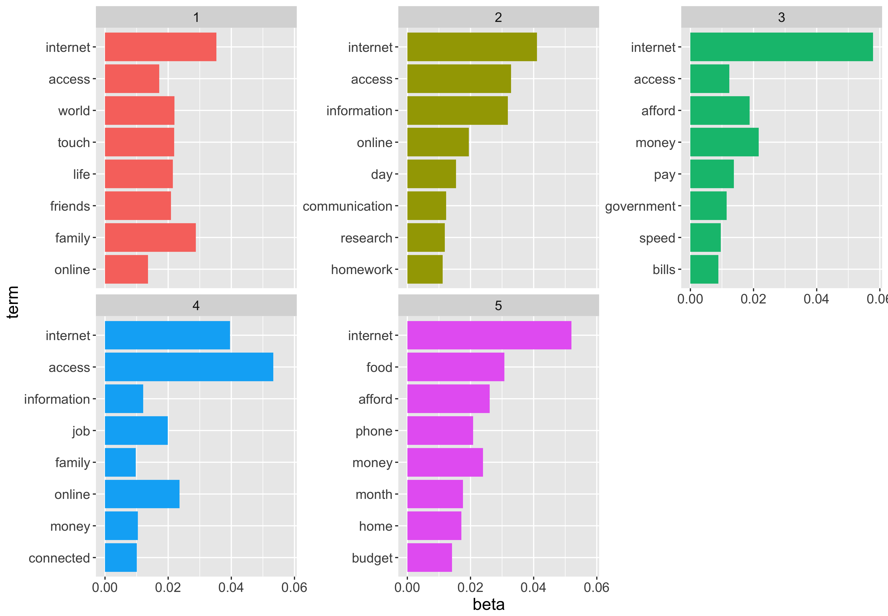
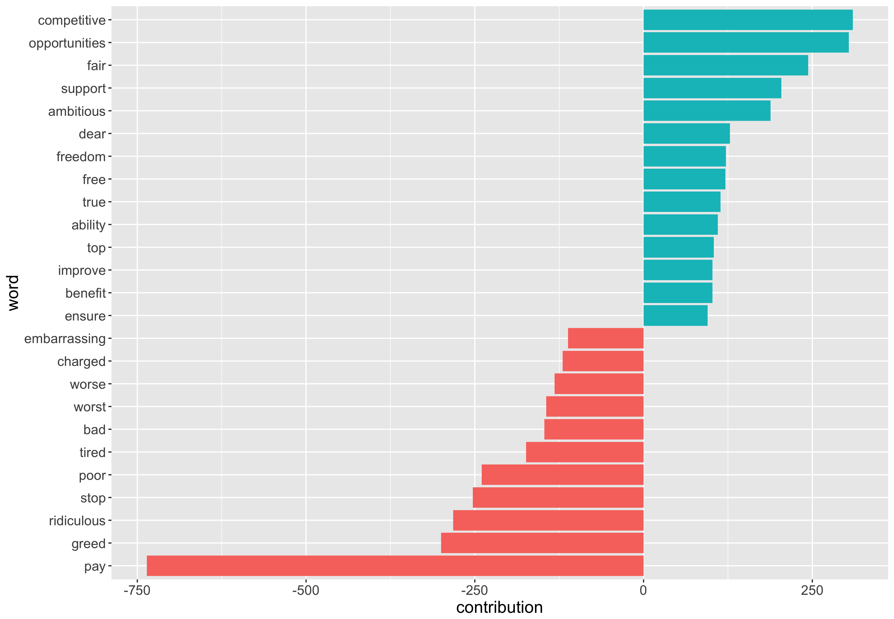
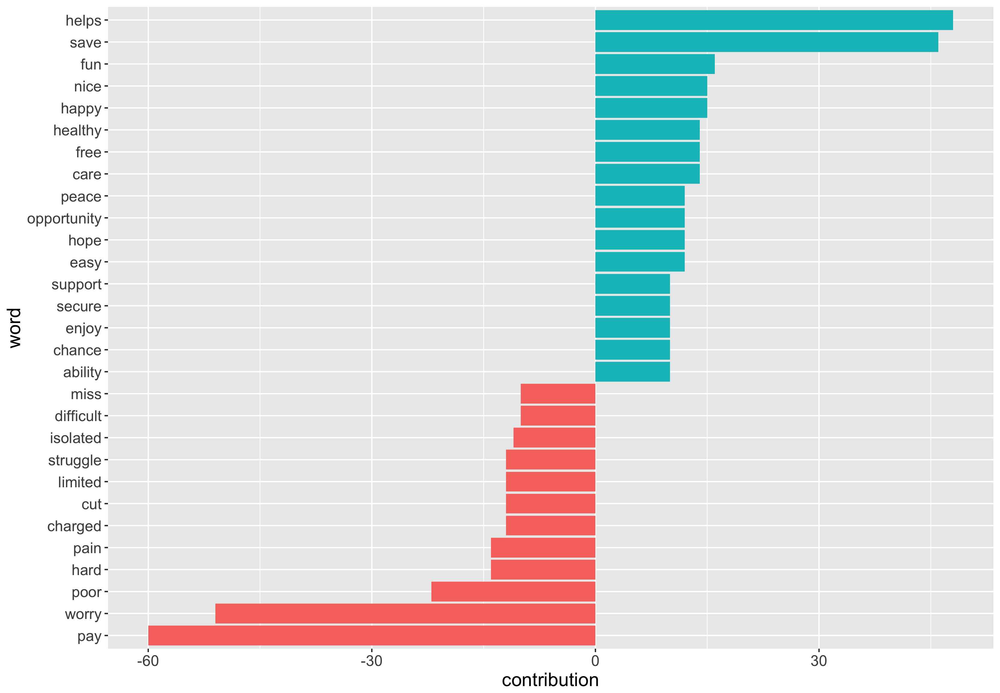

### Individual Submissions stats.

Sources of submissions: OpenMedia, Acorn, individual  submissions from Interventions Phase2.

#### OpenMedia

OpenMedia is a Canadian non-profit advocacy organization working to encourage open and innovative communication systems within Canada.

Individual submissions coming from:
https://unblockcanada.ca/

Tell the CRTC: All Canadians Deserve Faster, Cheaper Internet Service

Big Telecom giants plan to keep you locked into some of the most expensive Internet services in the industrialized world.

They're trying to convince the government that Canadians are OK with their slow, costly services, and our huge digital divide. It's not fair: we deserve the same service as similar countries.

Time to set the record straight. In April 2016, a historic CRTC hearing will shape the future of Canada’s Internet. Join tens of thousands of Canadians and endorse our letter below NOW to demand affordable, world-class broadband Internet for all Canadians and we'll make sure your voice is heard

- *20281  individual submissions*
  - *2427  unique submissions*
  - *17854 standard submissions:*

 `Dear Commissioners, Universal access in Canada must be defined to include affordable, world-class broadband Internet for 100% of the population. This access must have upload and download speeds and quality on par with our international counterparts.
 Canada’s goals are currently much slower than other industrialized countries. The U.S. recently defined broadband at 25 megabits per second down, and 3 megabits per seconds up. Our targets should be at least this ambitious.
 The CRTC should also prioritize new mechanisms for achieving these goals, including special opportunities for non-incumbent ISPs, municipalities, community access programs and non-profit service providers to deliver services to Canadians.
 A successful strategy will ensure that all Canadians have affordable, next-generation service. All telecom providers must provide this minimal level of connectivity everywhere they can at a reasonable price.
 I acknowledge that my comments and information will form part of the public record for this proceeding including on the CRTC website.
 I do not wish to appear at the hearing in relation to this submission.
 I ask that this submission be granted the same weight as that of any other party.
 Thank you`

### ACORN members testimonials stats

  ACORN (Association of Community Organizations for Reform Now) Canada is an independent national organization of low- and moderate-income families.

  ACORN members were asked to fill out questionaries with set of questions:

   -  What online services, activities, or communications do you use?
   Why is online access important to you?
   - How do you feel about the current pricing of high speed internet?
   - Which budget items have you taken money out of to pay for internet?
   - Please share how your life would change if you could easily afford home high-speed Internet.
   - Please share anything else relevant.

  *289 Submissions*

 `Results for pricing question`:
 How do you feel about the current pricing of high speed internet? Please mark (x) on all that apply.

 `Possible answers`:
 - Reasonable, and I can afford it.
 - Too high, but I can afford it.
 - Extremely high, I can barely afford it.
 - Extremely high I can't afford it, but because I need it I take money out of my:  
      - Food budget
      - Recreational budget
      - Rent
      - Other budget item
 - Extremely high and I can't afford it, so I cancel my service from time to time.
 - So expensive that I cannot afford it.
 - Other.

 `Results`:

 Answer| Frequency
 --- | ---
 *Extremely high; I can't afford it, but because I need it I take money out of my budget for other item* |  92                                                                                   
 *Extremely high; I can barely afford it.* | 82  
 *Too high, but I can afford it.* |   39
 *Extremely high; I can barely afford it. Extremely high; I can't afford it, but because I need it I take money out of my budget for other items*   |  20  
 *So expensive that I cannot afford it.* | 14
 *Extremely high; I can't afford it, but because I need it I take money out of my budget for other items Extremely high and I can't afford it, so I cancel my service from me to me.* | 11
 *Extremely high and I can't afford it, so I cancel my service from me to me.* | 8
 *Too high, but I can afford it. Extremely high; I can barely afford it.* | 6
 *Extremely high; I can barely afford it. Extremely high; I can't afford it, but because I need it I take money out of my budget for other items So expensive that I cannot afford it.* | 3
 *Extremely high; I can't afford it, but because I need it I take money out of my budget for other items So expensive that I cannot afford it.* | 3
 *No Answer* | 2    
 *Extremely high; I can barely afford it. Extremely high; I can't afford it, but because I need it I take money out of my budget for other items Extremely high and I can't afford it, so I cancel my service from me to me.* | 2
 *Reasonable, and I can afford it.* | 2
 *Extremely high; I can barely afford it. Extremely high and I can't afford it, so I cancel my service from me to me.* | 1
 *Extremely high; I can barely afford it. Extremely high and I can't afford it, so I cancel my service from me to me. So expensive that I cannot afford it.* | 1
 *Reasonable, and I can afford it. Extremely high; I can barely afford it.* | 1
 *Reasonable, and I can afford it. Too high, but I can afford it.* | 1
 *Too high, but I can afford it. Extremely high; I can barely afford it. Extremely high; I can't afford it, but because I need it I take money out of my budget for other items* |  1

### Html submissions for Interventions Phase2
- *529 Submissions*
  - *378 Submissions in English*
  - *88 Submissions in French*  (used google translate API to translate them)
  - *63 Empty submissions*

### Comparing individual submissions language

- 2427 free form comments from OpenMedia.
- 289  ACORN member comments discussing following questions:
  - Why is online access important to you?
  - Please share how your life would change if you could easily afford home high-speed Internet.
  - Please share anything else relevant.
- 466 Phase2 html submissions.

##### Top 10 most frequent words
 (excluded words - "canada","service","canadians", "canadian", "services")

OM | ACORN | Phase2
--- | --- | ---
 internet  5.4% | internet   4.5% | internet 3%
 world  1.9% | access    2.2% | speed 1%
 access  1.9% | afford 1.3% | access 1%
 telecom   1.2% | money    1.2% | rural 0.8%
 companies   1.1% | online    1% | data  0.6%
 pay   1% | information  1% | broadband 0.56%
 prices   0.9% | family  0.9% | bell 0.55%
 broadband   0.9% | life    0.9% | pay 0.55%
 speed   0.9% | home    0.8% | speeds 0.5%
 affordable   0.9% | food 0.8% | crtc 0.5%

- Similarities:
  - ACORN, OM, Phase2 discuss internet access.
  - ACORN, OM discuss affordability, prices.
  - OM, Phase2 discuss internet speeds.
- Differences:
  - OM discussing more big  telecom companies.
  - ACORN - more often mentions family, life, home.
  - Phase2 submissions discuss rural access.

##### Bigrams

OM | ACORN | Phase2
--- | --- | ---
telecom companies   1.6%  | speed   internet    1.5% | internet   service 1.14%
internet  services   1.4% | internet  access   1.4% | speed  internet 0.67%
internet    access   1.2% | online access    1.3% | digital   economy 0.55%
internet   service   1.1% | low    income     0.8% | telecommunications  services 0.51%
world     class   0.8%    | stay connected     0.5% |  internet  services 0.50%
25      mbps   0.7%     | affordable internet     0.5% |internet    access 0.46%
community    access   0.6% | cell   phone     0.5% | broadband  internet 0.43%
3      mbps   0.6%         | internet service     0.3% | cell     phone 0.32%
profit providers   0.6%    | afford internet     0.3% | service providers 0.25%
industrialized     world   0.6% | internet services      0.3% | upload    speeds 0.22%

Submissions from all sources discuss internet access and internet services.

ACORN members are more concerned about internet speed (most frequent bigram), internet affordability and importance to stay connected.

OM submissions are more focused on discussing telecom companies, profit providers and community access.

Phase2 submissions talk about internet speed, cell phone services and digital economy.

##### Trigrams

OM | ACORN | Phase2
--- | --- | ---
community         access       programs   1.7% | low    income  families 0.7% | broadband           internet   service 0.43%
3           mbps         upload   1.6% | affordable internet    access     0.4% | basic telecommunications  services 0.31%
25           mbps       download   1.5% | easily   afford      home     0.4% | speed           internet   service 0.27%
municipalities      community         access   1.4% |speed internet    access 0.4% | internet            service providers 0.21%
 world          class      broadband   1.4% | cell    phone   service     0.3% | broadband           internet  services 0.18%
 affordable          world          class   1.4% | cell    phone   services     0.3% | broadband           internet    access 0.16%
sell      broadband       services   1.4% | easily   afford groceries 0.3% |   speed           internet    access 0.16%
incumbent           isps municipalities   1.3% | jobs     jobs      jobs     0.3% | rural               nova    scotia 0.14%  
isps municipalities      community  1.3% | low   income    people    0.3% | canada's           internet   economy 0.12%
class      broadband       internet   1.1% | university  student    living     0.3% | considered          essential   service 0.12%

Affordable world class broadband internet, 3 mbps upload and  25 mbps download  speeds are discussed mostly in OM submissions.

ACORN members talk about low income families and people, university students living, importance of affordable internet access.

Phase2 submissions talk about internet service providers, canada's internet economy and internet speed.

##### Bigrams visualization

`OpenMedia`:

Narratives:

- canadians pay and canadians deserve affordable Internet
- internet - slow, expensive, (need to be) faster, cheaper, reliable.
- giant telecom companies, corporate greed
- reasonable price, ambitious funds, real competition

`ACORN`:

Narratives:

- pay bills, search jobs, save extra money
- stay connected, easily afford internet access.
- low-income families
- buy quality food

`Phase2`:

Narratives:
- internet essential/poor/basic service
- internet access reliable/satellite
- rural communities
- data caps
- cell phone service
- internet upload/download speeds

##### Topic modeling

`OpenMedia`

OM submissions topics:
1. world telecom companies
2. internet: fast/slow/affordable
3. people pay money to government/country
4. speed/cost/price/rates competition
5. world class broadband access

`ACORN`

ACORN submissions topics:
1. internet to stay in touch with family
2. internet access to get information/ do research and homework
3. internet/access afford, money, pay bills.
4. internet access to stay connected and get information, get a job.
5. budget - home per month - afford internet and food.

`Phase2`

Phase2 submissions topics:
1. internet prices/ competitions.
2. internet access in rural areas - bell, telus.
3. crtc, telecommunications.
4. telecommunications/ digital economy.
5. download speed in rural areas/ pay.

##### Most common positive/negative words

`OpenMedia`

Most common negative word in OM submissions is pay.

Narrative:
- negative: pay-ridiculous-poor-tired.
- positive: opportunities to improve, support, fair, competitive.

`ACORN`

Similarly in ACORN submissions most common negative word is pay, it goes along with worry

Narrative:
- negative: pay-worry-poor-hard-limited-struggle-difficult
- positive: helps-save-hope-care-support
- to the question how would your life change if you have affordable internet:
helps-fun-nice-happy-healthy

`Phase2`

Most common negative word is pay.

Narrative:
- negative: pay-poor-limited-lack-costly-charged,bad-worse-barrier.
- positive: support,lucky improve, free.

##### Most negative/positive comments

`Negative OpenMedia`:

"It's crazy that canada lets it's Canadian citizens Suffer at the hands of big telecom!! All about greed greed and more greed!! "

`Positive OpenMedia`:

"Fast and affordable Internet, competing with the technology available in other countries, often for less than we pay for our sub par access, is important for Canadians bank accounts as well as for the Canadian economy as a whole. With more money in the bank, Canadians can contribute to the economy in other meaningful ways with their purchases, and with better technology Canada can better compete in global markets and be more resourceful here in the Canadian economy. It's a win for Canadians and a win for Canada, instead of just the big telecom companies winning by gouging us all, and Canada falling behind the rest of the world. "

`Positive ACORN`:

"It's important to also have fun in life! "

`Negative ACORN`:

"The medical research I access is critically important as I have a health issue I must keep up to date on and my doctor sends me for the tests etc but does not have me to discuss in detail I want to keep up regarding the latest break- throughs and alternative therapies. I would feel more lost and worried without out more extensive information. Being able to email is very important as it keeps me connected to others and as I have this health issue right now it al- lows me to connectwhen I don't always have the energy to go out. "

`Positive Phase2`

" The basic service should include the medium speed internet service in my opinion and cover the whole territory. The customers benefit, the telecommunication companies benefit, the banks benefit, the merchants benefit, the health services, the Government the cities benefit and so on. The costs must therefore be borne by all those who benefit if we want a fair and equitable service.Mario Girard"

`Negative Phase2`

""I wish to comment on the regulation of broadband internet services in Canada, particularly the additional charges when customers go over their data usage caps. I am currently with an internet service provider whose best plan, which I have, costs $62.97 per month, and offers me 125GB of data traffic per month (downloading and uploading). If I use additional data, I am charged $3.00 per additional Gigabyte. That means that if I used an additional 125GB, I would be charged an additional $375.00. There is an alternative, which I have looked into, which is to have a second phone line installed, and set up an additional internet connection, to get another 125GB at $62.97. It seems absurd that in the one circumstance, I am paying $375.00 for an additional 125GB, while in the other, I am only paying an $62.97 for an additional 125GB. Why the company wants to put me through this is beyond comprehension. They will be supplying me with an additional modem (at their expense - it comes with th... <truncated>"

### Conclusion
OpenMedia and ACORN and Phase2 submissions discuss the importance  of affordable  internet access and talk about internet speeds.

OpenMedia submissions talk more about about large  telecom companies, real competition, industrialized world and community access. OM submissions mostly often mention upload/download speed  5/25.

ACORN submissions touch low-income families issues, discuss internet as  necessity for work and  everyday life.

Phase2 html submissions discuss internet and phone access in rural areas, talk about land line and cell phone, mention data caps.
