# Topics.

## 2 topics:

### Most frequent words:
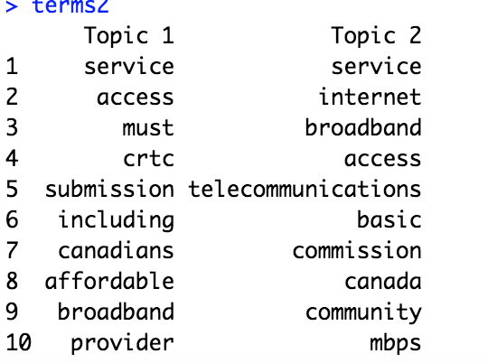

### Frequency 

### Gamma matrix
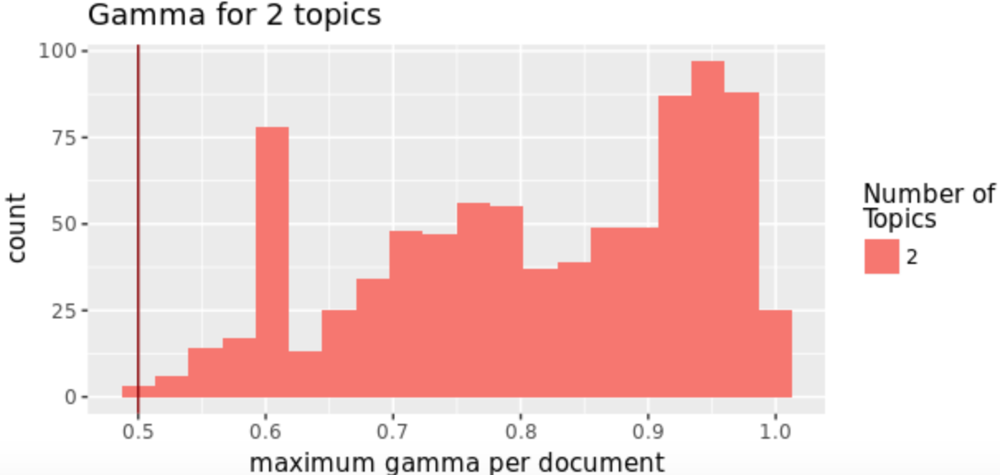

### Visual representation
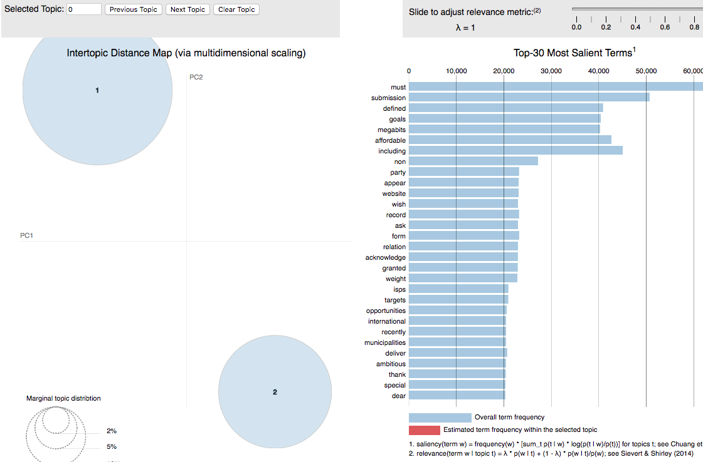

## 5 topics:

### Most frequent words:
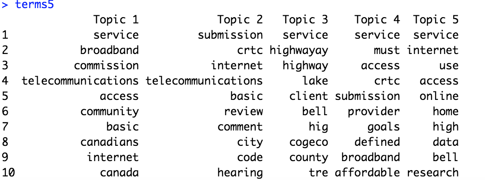

### Frequency 
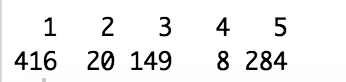

### Gamma matrix
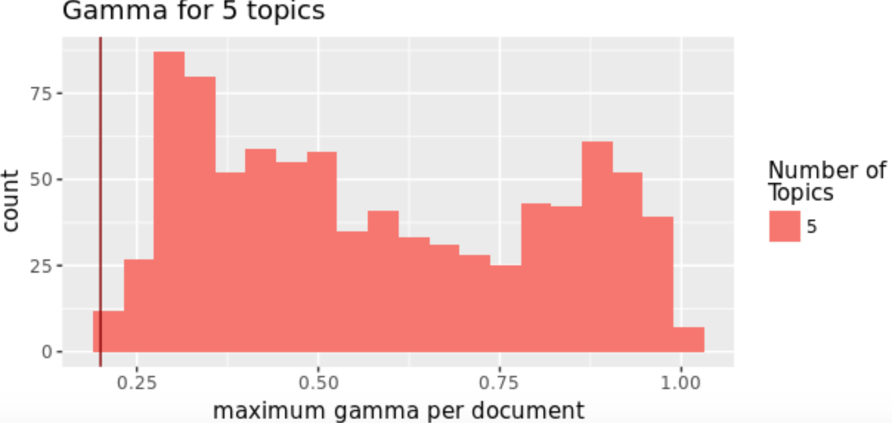

### Visual representation
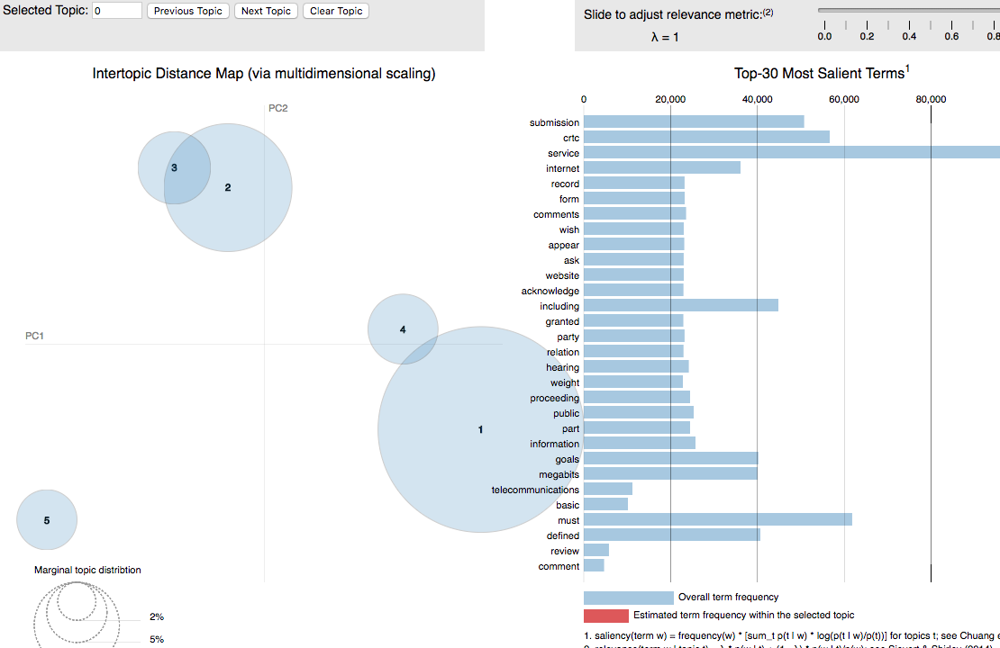

## 10 topics:

### Most frequent words:
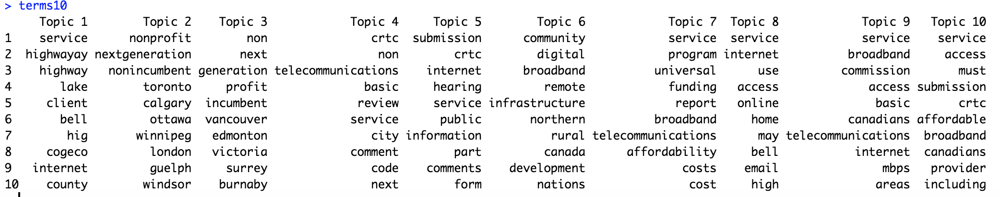

### Frequency 
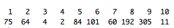

### Gamma matrix
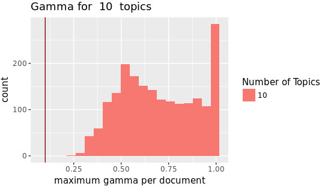

### Visual representation
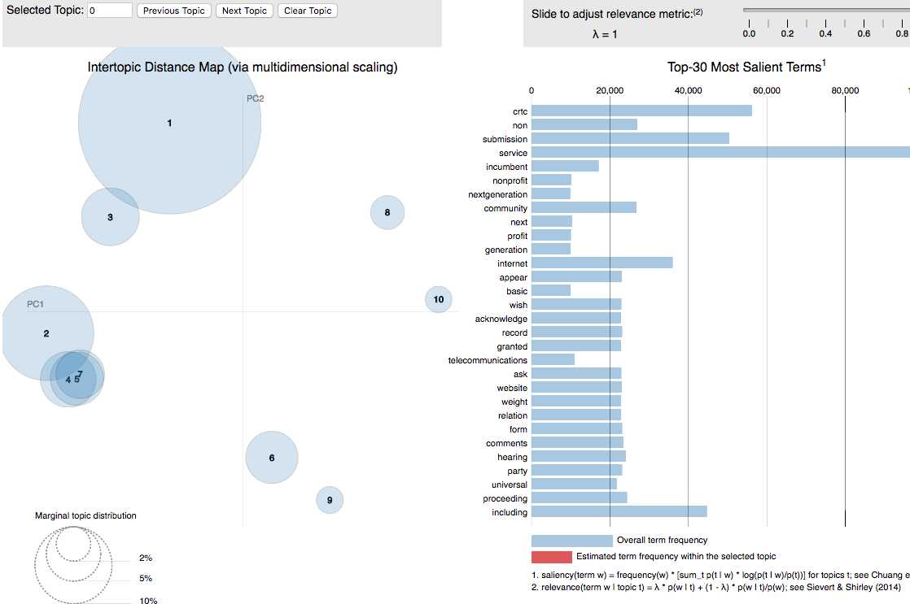

### Topics  by document

## 15 topics:

### Most frequent words:
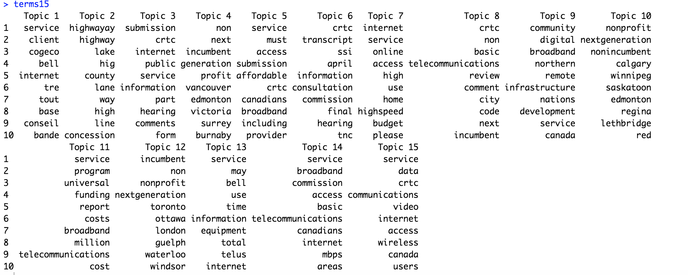

### Frequency 
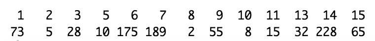

### Gamma matrix
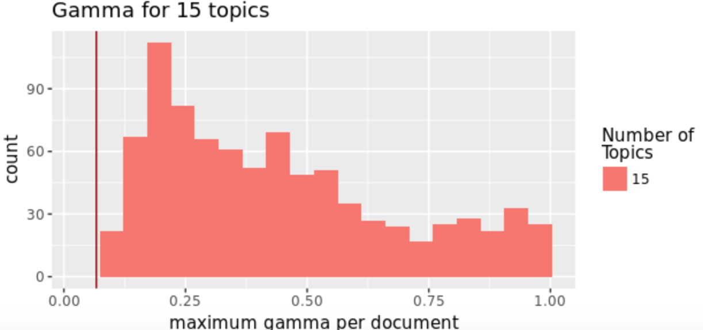

### Visual representation
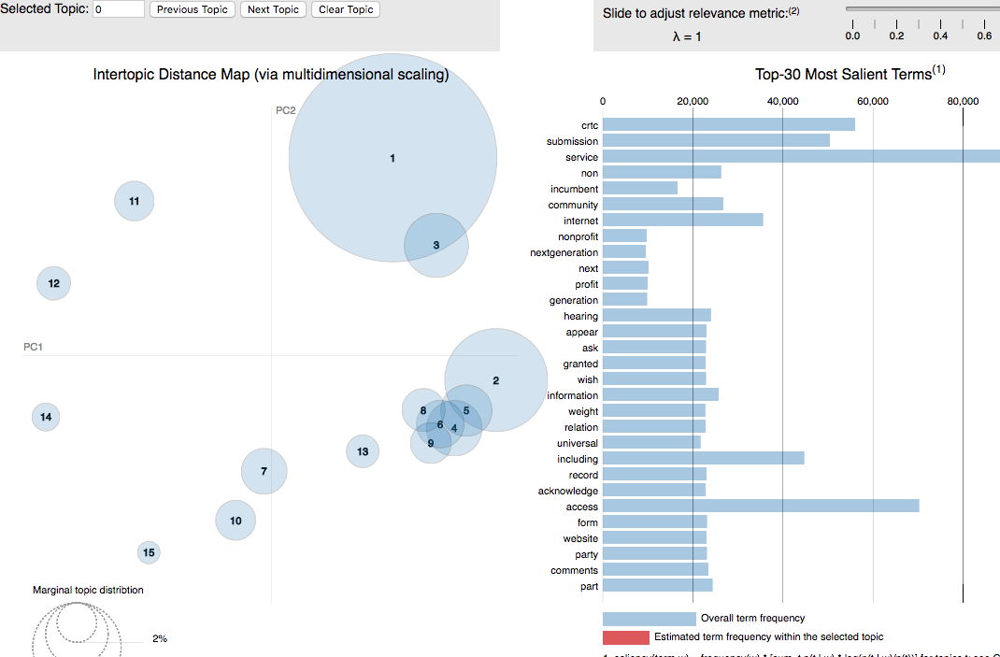

