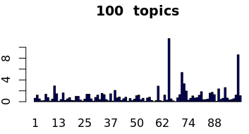

## LDA Topic modeling across all documents

- Took document content + french translation for french documents.
- Used words that appear more than 50 times
- Dictionary: 4338 terms

#### Maximum gamma per document for 10/30/100 topics

For 100 topics model more documents have gamma (per document per topic probability) closer to 1. It indicates better model.

#### Number of documents(%) per topic for 10 topics

`Top 4 most frequent topics + keywords`

Topic| Percent of docs | Keyword1 |Keyword2 | Keyword3 | Keyword4 | Keyword5 | Keyword6 | Keyword7 | Keyword8 | Keyword9 | Keyword10
--- | --- | --- | --- | --- | --- | --- | --- | --- | --- |
4 | 35.9% | "information"  | “service"   |  "internet"   | "crtc"     |   "mbps"    |    "customers"  |  "wireless"  |  "response"  |  "provide"  |   "data"
9  |  24.4% |  "service"  |   "services"   | "broadband" |   "commission" | "access"   |  "internet" | "basic"   |  “subsidy"  |  "canadians" |  "funding"
3  |  18.6% | "internet"  | ”service" |  "online" |  "costs"  |  "services" | "speed"  |  "access"  | "home"   |  "time"  |   "phone"
8  | 15.6%  | "broadband"  |  "services"  |  "communities"  | ”access"   |   "digital"   |  "community"  | ”service"  |   "internet"  |  "canada"    |  "network"  
Sum  | 94.5%  |   |   |   |   |   |   |   |   |   |  

#### Number of documents(%) per topic for 30 topics

`Top 6 most frequent topics + keywords`

Topic| Percent of docs | Keyword1 |Keyword2 | Keyword3 | Keyword4 | Keyword5 | Keyword6 | Keyword7 | Keyword8 | Keyword9 | Keyword10
--- | --- | --- | --- | --- | --- | --- | --- | --- | --- |
 6  | 13% | "telecommunications" | "crtc" | "commission" |  "telecom" |         "canadian" |  "regulatory" | "consultation"   | "information"  | "notice" |          "canada"            
24  |  12.9% | "internet" | ”speed"  |  "data"  |   "access"  | "rural"  |  "bell"   |  "month"  |  "wireless" | ”home"   |  "xplornet"
15  |  8.5%  | "information"  |  "response"   |  "crtc"    |     "commission"  |  "disclosure"   | "confidential" | "request"   |   "rogers"  |     "confidence"  |  "provided"  
30  | 7.8% | "internet"  |  "customers" | "wireless"  | "mbps"  |   "unlimited"  | ”plan"  |  "data"  |   "average"  | "gb"  |    "wireline"
26  | 7.6%  | "mbps"    |   "internet"  | "speeds"   |  "broadband"  | "upload"   |  "provide"  |  "download"  | ”households" | ”response"  |  "speed"
22  |  6.3%  | "bell"     |     "commission"    |     "canada"    |         "act"      |     "local"         |     "rate"       |        "crtc"        |       "telecommunications" |  "decision"      |     "rates"
Sum  |  56.1% |   |   |   |   |   |   |   |   |   |  

#### Number of documents(%) per topic for 100 topics

`Top 6 most frequent topics + keywords`

Topic| Percent of docs| Keyword1 |Keyword2 | Keyword3 | Keyword4 | Keyword5 | Keyword6 | Keyword7 | Keyword8 | Keyword9 | Keyword10
--- | --- | --- | --- | --- | --- | --- | --- | --- | ---
14  | 8%  | "internet" | "service"  | "speed"  |  "access" |  "bell"  |  "home"   |  "rural"  |  "month"  |  "line"   |  "cellular"
 82  | 7.4%  | "crtc"    |     "telecom"   |   "regulatory"  |  "commission"  | "notice"    |   "consultation"  | ”canadian"   |  "review"   |    "basic"     |   "services"
34  | 4%  |  "internet"  |  "data"   |   "service"  |  "price" |    "prices"  |  "month"   |  "speeds"  |   "caps"    |  "canada"  |  "companies"
99  | 3.8%  |  "bell"   |     "canada"  |    "local"   |    "northwestel" | “bands"   |    "rate"    |   "residential"  | "subsidy"  |   "partnership"  | "télébec"
29  |  3.6% |  "customers" |  "service"   |  "plan"    |    "call"    |    "wireless"  |   "mobile"   |   "voice"   |    "services"  |  "internet"  |  "information"  
91  | 2.2%  |   "internet" | "mbps"  |    "unlimited" |  "dsl"  |     "gb"    |    "data"  |    "monthly" |  "speed"    | "business"  |  "cable"
Sum  | 29%  |   |   |   |   |   |   |   |   |   |  
