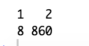
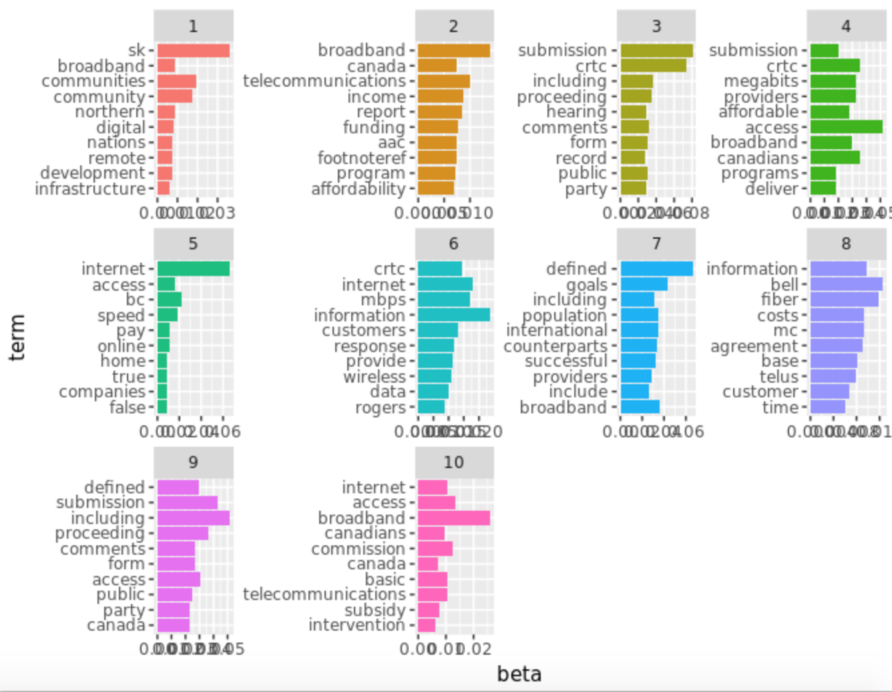
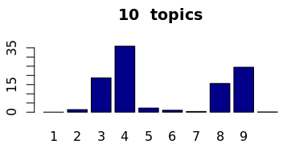
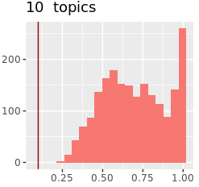

# Topics.

## 2 topics:

### Most frequent words:

### Frequency 

### Gamma matrix

### Visual representation

## 5 topics:

### Most frequent words:

### Frequency 

### Gamma matrix

### Visual representation

## 10 topics:

### Most frequent words:

### Frequency 

### Gamma matrix

### Visual representation

### Topics  by document

## 15 topics:

### Most frequent words:

### Frequency 

### Gamma matrix

### Visual representation

