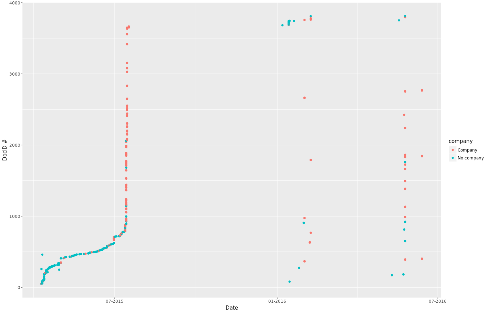

# Definitions

import-docs.rb populates the following tables in docs.db: 
docentities - table that contains `docid`,`type`,`value` tuples for anything I could get out of named entity extraction for each document
docmeta - any meta-info is being put in “docmeta”… 
docs - the text of the document is going into “docs”, associated with the original file name…
segmentmeta - metadata created based on the actual segment data - i.e. text of the data
segment - “segments” that divides the text by sections separated by at least one line break… each one containing an id value that allows you to associate it back with the original document, and a sequence number value that allows you to recombine the segments in order

## Definition of columns in metadata table: 
- key
- docid
- value
- source 
- version

## Definitions of metadata items: 
- case
- DMID
- intervention number

# Metadata Exploration

  

Number of items per metadata category. Note the ~4,000 item max as I think there are about that many docs. Surprisingly, many of the categories peak at about 1000 - I think there might be an issue in the metadata parsing where it can't properly process submissions that have both an html file and other files associated with it. E.g. there should really be a date_arrived value for each doc, but it is absent for any submissions that included more than one file. 

  
Determined which submissions were made by companies as determined through the "on behalf of" field. There were about 120 companies that submitted a total of about 500 docs. Here you can see the top 50 companies based on how many docs they submitted.

Plot of when the docs were submitted (based on the ~1,000 date_arrived values we currently have). Clearly there must have been three deadlines associated with when docs arrived. Each dot is coloured by whether or not it was a company who submitted. It can be seen that during the later rounds of the consultation, it becomes largely companies that submit and the # of submissions by individuals dies down.  

# Analyses to conduct

The metadata provides a convenient way to subtype the submissions that were received as part of CRTC consultation 2015-134. Many of these features should be integrated into the data explorer for intuitive organization of the submissions. For example, there should be a view that arranges the submissions on a timeline in order for viewers to see when each doc was submitted, which would correlate to the stage of the consultation. Other views or filters to consider are: 

- Date of submission
- Submissions by a company vs. individual
- Type of organization that submitted (e.g. NFP, ILEC, etc)
- Which province they came from
- Consultation stage
- Also see the metadata [wishlist](https://github.com/cybera/policy-browser/blob/master/scripts/test/metadata.py)