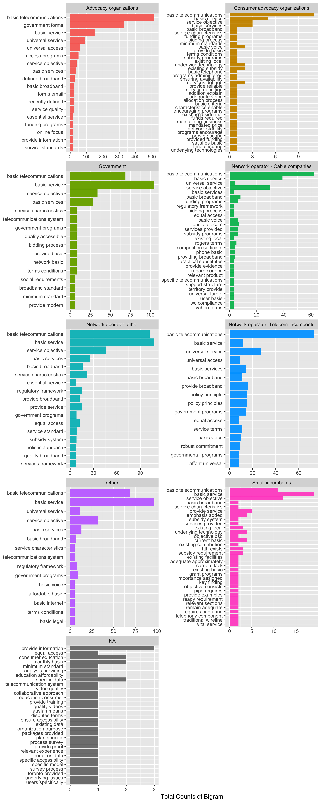
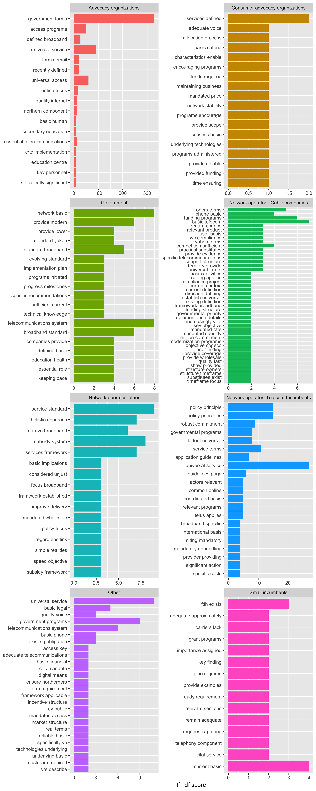

# BTS Question Results from doc2vec
This is a quick and dirty write up to get my ideas down/some criticism. I'll clean this up as I decide what makes sense and what doesn't. However, the word-webs aren't that enlightening for the basic service question, so now we have to get more (or less?) creative.
## Introduction
I'm not sure if this will give us anything interesting to talk about, but this is the analysis of text found from `doc2vec` based on the basic service question. For a more complete introduction to that analysis, please see `Affordability_doc2vec.md`, as there's nothing super different done here. I do however note that the sentence we searched for in `doc2vec` was

```
broadband internet services should be considered a basic telecommunications service
```

As stop words were removed, this sentence should look identical to those which also contain the word 'not'.

## Basic Bigrams

For the BTS question I actually decided to make a bigram of each organization. I applied the same `text2vec` filter as before, except this time I was looking for words semantically similar to
```
"defined", "essential", "basic", "universal", "mandated", "essential"
```
with a cosine similarity threshold of 0. to act as a secondary filter to the text. Using only raw counts of bigram pairs, I get the following plot using `bigrams.R`



Where there's not a whole lot going on here that we wouldn't expect. The conversation seems to be pretty consistent in terms of bigram pairs. To see if we can tease anything more interesting out of this, let's see what tf_idf can tease out



In this case the conversation seems to be getting a little more interesting. By applying a tf_idf score there is now some more interesting distinguishability between the bigrams of each organizational type. While I'm confident that each group is still having the same conversation in regards to the basic service question (in contrast to affordability), however their "tf-idf important" terms change depending on who they are. For example the Advocacy organizations talk a lot about education, access and service without any words that one could argue imply a discussion regarding the _implementation_ of broadband internet as a basic service, but what such a definition might affect.

The government organizations discuss heavily different standards such as "standard broadband" and "evolving standard". They also discuss programs and progress milestones. To me, this would imply that the discussion around the basic service objective by government groups may focus heavily on defining these services, and what should be considered standard. In which case the discussion around the basic service objective by government groups is a semantic one attempting to define what the basic service should be. However, this is speculative and I may be grasping at the proverbial straw.

In terms of network operators (cable + telecom + other) the important terms seem to be focused around what could (logical leap?) be considered to be issues surrounding issues they may have with an implementation of an extended basic service objective. For example, there's discussion of policies, funding programs, subsidies, and commitments which may indicate they have concern surrounding how they may/are currently fulfill a revised basic service objective. However, this feels like a pretty big logical leap and I'm not really sold on this interpretation myself

# Thoughts

I'm still not really convinced there's much interesting to talk about here. I'm certainly confident that they're having the same conversation this time, but I don't think we get a freebie like we did with the affordability question in terms of we can discuss how it appears that they're discussing what affordability means to them. I think at best we can say that the advocacy/government organizations have a different key-points from those groups invested in the service/infrastructure directly. Beyond that, I'm not sure how much we have in the case of the basic service objective in regards to the doc2vec/bigram analysis. 
