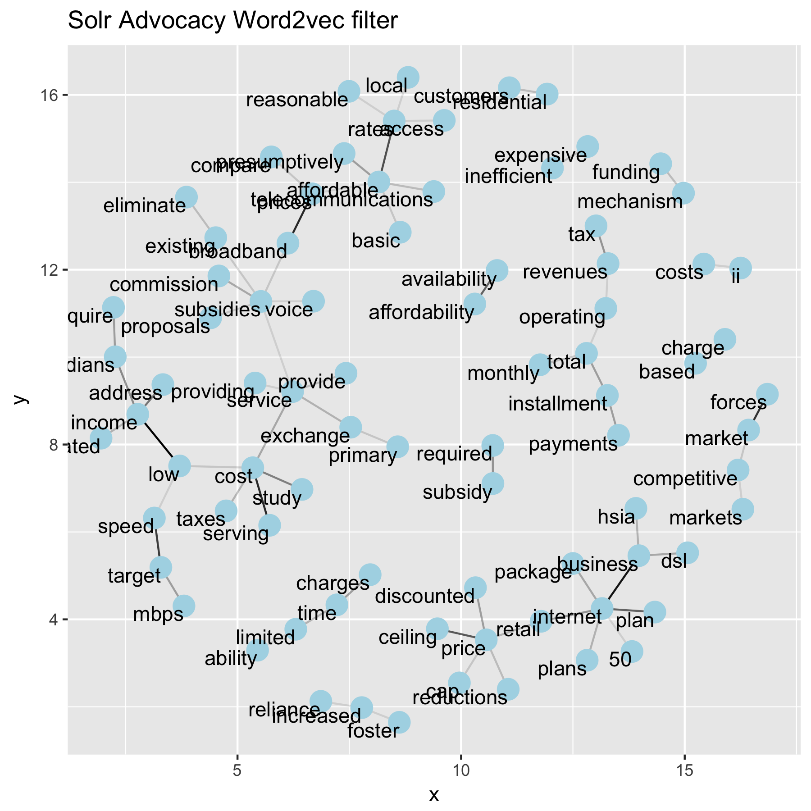
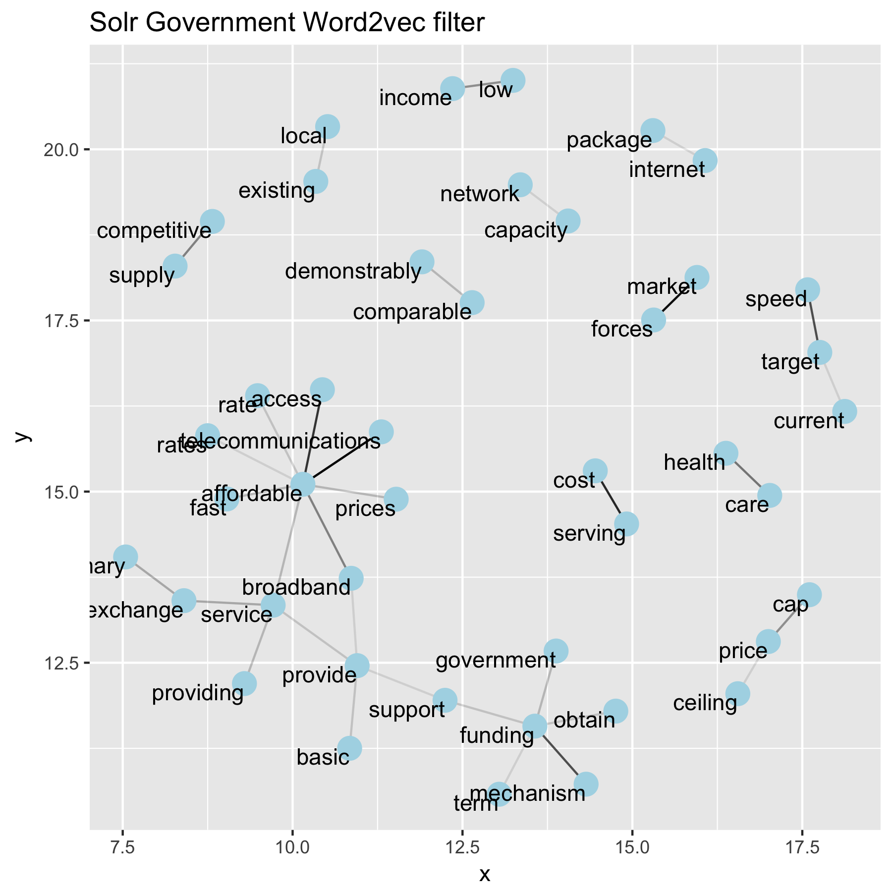
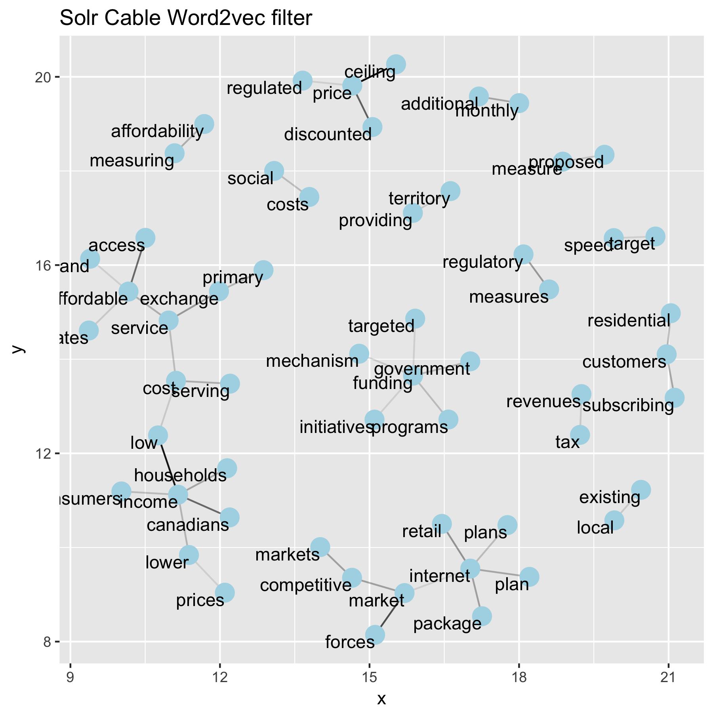
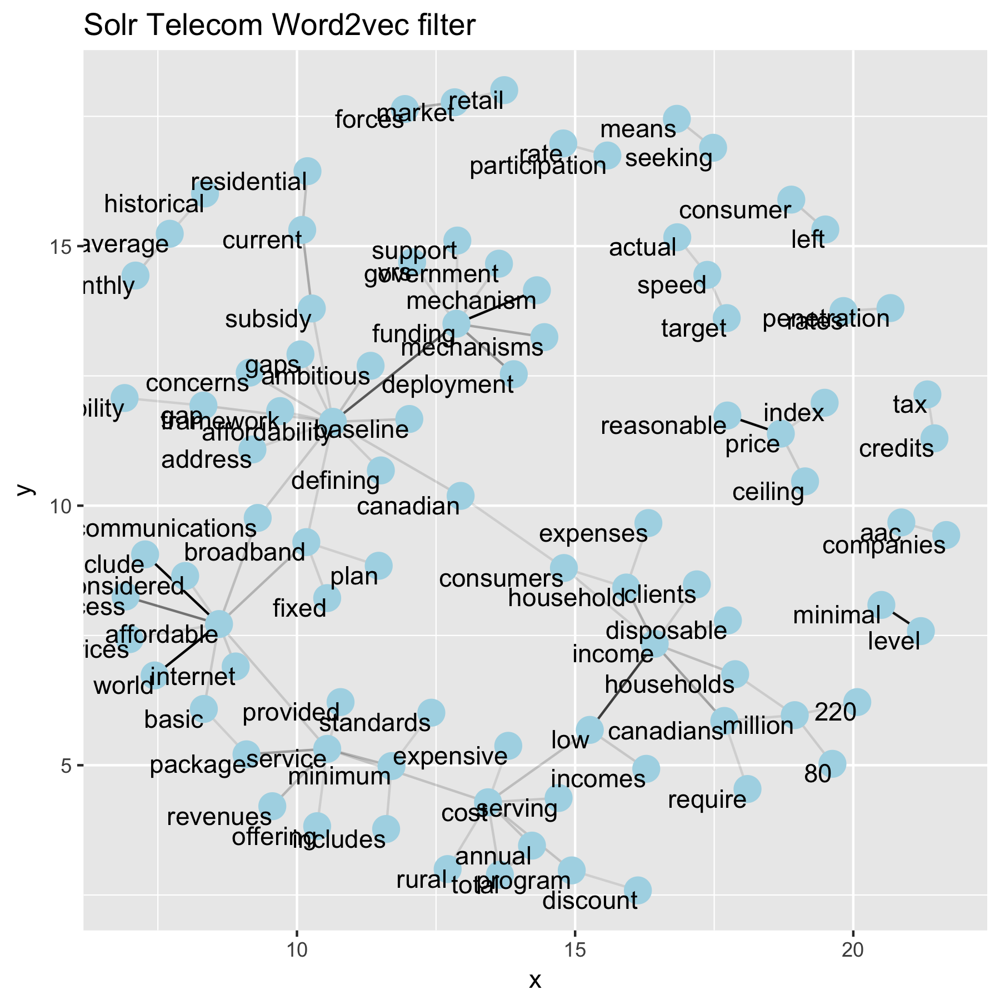
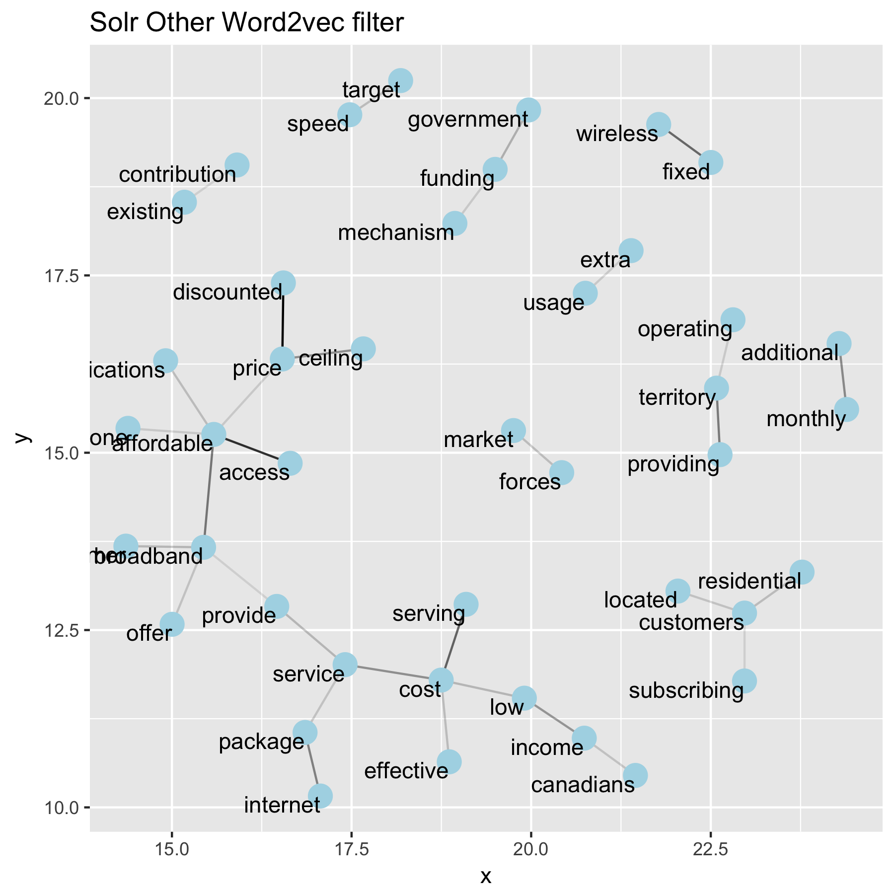
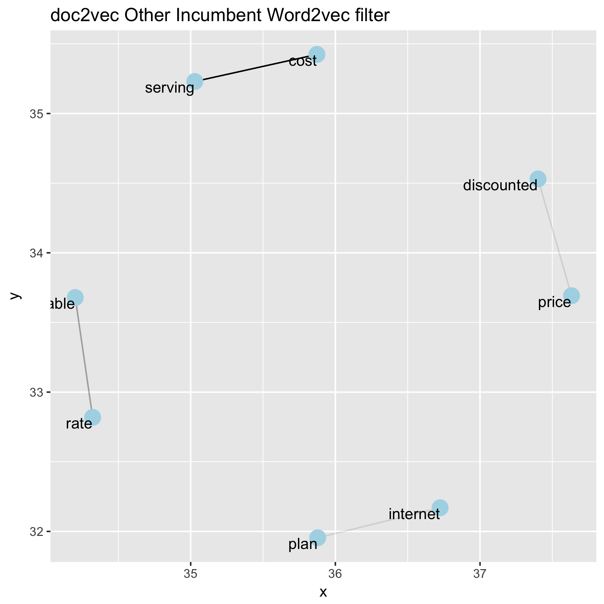

# Fancy Bigram Web Comparison of Solr and Doc2vec

## Introduction

NOTE: Incomplete, will be finished soon. This is more fore reference

In order to try and understand how different organizations talk about both affordability and the basic service question, this document will compare both `solr` searches and `doc2vec` searches. The hope being that these comparisons will massage out some issues of each organizaton group around each question. As `agentdave` said: it would be interesting to determine if there's one conversation happening, or a different conversation for each group.

This markdown will be organized as follows:

1. Affordability question analysis
   - `doc2vec` and `solr` word webs for each organization group,
   unfiltered.
   - Apply some filters to try and reduce noise/manipulate the results that may reveal a narrative for each group.  
   - Compare with the `wordvec` bigrams of `agentdave`?

2. Basic service question.

    - Ditto above, but I'll probably be sadder when writing that section.

## Organizational Response to Affordability

I think comparisons will be more effective if I place the  `solr` and `doc2vec` results side by side. So in this case, I'll consistently put `doc2vec` results on the right, and `solr` results on the left. I'm not going to do analysis on the organizations all grouped together in this document, I'm just going to do it for the individual groups in hopes of establishing a narrative for each group.

### Advocacy Organizations

#### #nofilter
Below are the bigram word clouds of the advocacy groups for `doc2vec` and `solr` respectively. I haven't applied any filters to this data besides only taking the $75$ most frequently appearing word pairs in order to make the diagram a little more readable.

 

Where the same issue as before is cropping up in that the affordability question is heavily related to the basic service question in terms of word pairs. While it's inherently interesting, and probably worth noting, it might be more informative to filter this down to words we know to be semantically or conceptually similar to the issue of affordability.

In either case, both `doc2vec` and `solr` seem to pick up on the same "big idea" pictures, but `doc2vec` grabs a few of the ideas surrounding the issue as well. It gets more apparent on larger plots, but I haven't included them here. So, let's see if we can tell these related ideas to take a hike, and see how words closer to affordability are related in these documents.

#### #filter
I note that the word2vec filter is slow, so I might not finish all of these tonight, but hopefully one or two so that maybe something interesting pops out. Once I know some are working I'll script it and let it run over night. But, these are the plots where things start to get (more?) interesting! When we apply a similar filter that can be seen in `bigram.R` to the `solr` and `doc2vec` results looking for only bigrams that are conceptually similar key words like affordable, the bigrams get sifted down to much more relevant subsets of data. In the plots below, I've limited it to only word-pairs that appear greater than $8$ times in the subset of text, and a cosine similarity $>0.6$

 

Where now things get a little more interesting. There are simply more `doc2vec` results in the database so it's a little larger, but I wanted to keep the minimum word pairs the same. But from the second figures, it's this is much more representative around the language used by this group of organizations around affordability. Things like gap, accessibility, gouging, price, income, etc. all come up as common word pairs in this group of organizations.

#### Potential Narrative?
1. Advocacy groups talk affordability and the basic service question in very similar contexts implying those ideas are intimately related. However, that's not really surprising, as basic service typically implies an affordable one.  Of course, this could simply be an artifact of them answering those questions closely together in their document.

2. This group seems to care a lot about the affordability of internet access for individual Canadians, which makes sense considering they're the advocacy groups... However, there is the risk of taking these out of context, but based on the language used by these groups, it might be reasonable to say that they feel internet access could be more affordable in Canada.
### Consumer Advocacy Organizations
I note that this is just (probably) BC Broadband (I think) because it only returns a small amount of rows -- I'll double check to be sure
#### #nofilter

#### #filter
So there's not a lot here, but here's all the word pairs that appear $N>1$ in this section.

####Potential Narrative?

### Government

#### #nofilter

#### #filter
This shows word-pairs with $N>5$ and a cosine similarity $>0.6$

#### Potential Narrative?

### Cable Companies

#### #nofilter

#### #filter
This shows word pairs of $N>5$ .

#### Potential Narrative?

### Telecom Incumbents
#### #nofilter
Here this displays the word-pairs which appear $N>30$ times under each search for how Telecoms feel about affordability.

In the case of telecoms, the "big picture" view seems to look pretty much the same as everywhere for both `doc2vec` and `solr`. It's almost like they were all answering the same questions. Theres a few more keywords like adoption ad dsl, but in principle that may not be interesting. There's also groupings based on telecom names, but I wouldn't read into that too much as they seem to answer in the third person (third company?)

#### #filter
Here the webs below show the word pairs that appeared $N>6$ times in the segments that were found by either `solr` or `doc2vec`.

Where in terms of things relevant to affordability, telecoms typically talk about things in terms of how _they_ get money, words like subsidies, retail, price ceiling, competitive market etc. appear. However, that's not to say that they don't mention low income, as it appears in the `doc2vec` results, however, it seems their discussion of affordability is predominantly related to their operating costs and revenue streams. Which makes sense, if I was a telecom I wouldn't be taking a position on if my prices were unfair.  

#### Potential Narrative?
1. Basic service question still appears in similar contexts for both `solr` and `doc2vec`. However, this could simply be an artifact of them answering those questions closely together in their document.
2. I don't think we can say much about their opinion on affordable rates for internet access, however, I think we could say something along the lines of telecom's discussion of affordability seems to be limited to their revenues/whether or not their operating costs are affordable for them or not.
### Other Network Operators

#### #nofilter

#### #filter
These images show word-pairs of frequency $N>5$ and cosine similarity of $0.6$.

#### Potential Narrative?

###Small Incumbents

#### #nofilter

#### #filter
These images show word-pairs of frequency $N>3$ and cosine similarity of $0.6$.

 

#### Potential Narriative?

### "Other"

#### #nofilter

#### #filter
These images show word-pairs of frequency $N>3$ and cosine similarity of $0.6$.

#### Potential Narriative?

## Organizational Response to the Basic Service Question

### Advocacy Organizations

#### #nofilter

#### #filter

#### Potential Narrative?

### Consumer Advocacy Organizations

#### #nofilter

#### #filter

####Potential Narrative?

### Government

#### #nofilter

#### #filter

#### Potential Narrative?

### Cable Companies

#### #nofilter

#### #filter

#### Potential Narrative?

### Telecom Incumbents

#### #nofilter

#### #filter

#### Potential Narrative?

### Other Network Operators

#### #nofilter

#### #filter

#### Potential Narrative?

### Small Incumbents

#### #nofilter

#### #filter

#### Potential Narriative?

### "Other"

#### #nofilter

#### #filter

#### Potential Narriative?

## Conclusion
