# Bigram Webs of the Organizational Response to the Basic Service Question.

## Introduction
In this markdown I use the search results from both `solr` and `doc2vec` results to try and understand the organizational response to the basic service question. Here I'm following a similar approach to the affordability question, however, because it's not written there either I figured I'd give an "organizational" rundown before we get into the nitty-gritty.

#### Processing the Data
To start, the data was found using the following `neo4j` query, changed only to filter down the basic organization.

```
MATCH (Q:Question)<-[r:ABOUT]-(Qe:Query) <-[:MATCHES]-(s:Segment)-[:SEGMENT_OF]->(d:Document)<-[:SUBMITTED]-(o:Organization)
WHERE r.method = 'doc2vec-MonteCarlo'
AND o.category = 'Network operator: other'
AND Q.ref = 'Q9'
RETURN distinct s.content AS Segment, o.name as Organization"
```
This is an example of a search for `doc2vev` results, where the word `NOT` is added into the `r.method` condition if you were interested `solr` search results instead.

Once I had the segments from each organization, I also did a little bit of pre-processing such as removing the stop words (however, I left "not" in as that word is important for this question and I removed things like symbols. I left numbers in, however, they will only appear in `solr` results, as `doc2vec` had them removed before the network was changed. I applied a filter supplied by `agentdave` in `bigrams.R`, however I modified it slightly to suit my needs by not saving the bigram explicitly, and changing the filter as
```R
relevance.affordability <- read.csv("solr_SmallInc_afford_filter.csv")
bigram_counts<-relevance.affordability %>%
  #mutate(bigram = paste(word1, word2)) %>%
  mutate(max_relevance = pmax(relevance1, relevance2)) %>%
  filter(max_relevance > 0.6) %>%
  count(word1, word2, sort = TRUE)# %>%
  #bind_tf_idf(word1, Organization, n) %>%
  #arrange(desc(tf_idf)) %>%
 # mutate(bigram = factor(bigram, levels = rev(unique(bigram))))
```
where I've left the comments of my changes in explicitly. Essentially removed the tf_idf scoring from the results, and everything we'll deal with will be in terms of raw counts. As well, the hand-picked relevant words where set as
```R
relevant_words = c("basic", "universal", "mandated", "essential")
```

 The graphs were then made in a straight forward was as
```R
bigram_graph<-bigram_counts %>%
    filter(n >6) %>%
    graph_from_data_frame()
```
where `n > 6` was changed throughout depending on how many points there were to plot. But anyways, enough boring details that no one cares about, let's take a look at some plots!


## Organizational Response to the Basic Service Question
I've opted not to display the "unfiltered" diagrams here, I've left the section as a place holder if it's decided that we may need to take a peek at the unfiltered data.

### Advocacy Organizations

#### #nofilter

#### #filter
Here the doc2vec results are only showing pairs which occur with $N>30$ times, solr is $N>10$, both with a minimum cosine similarity to the filter words of 0.6
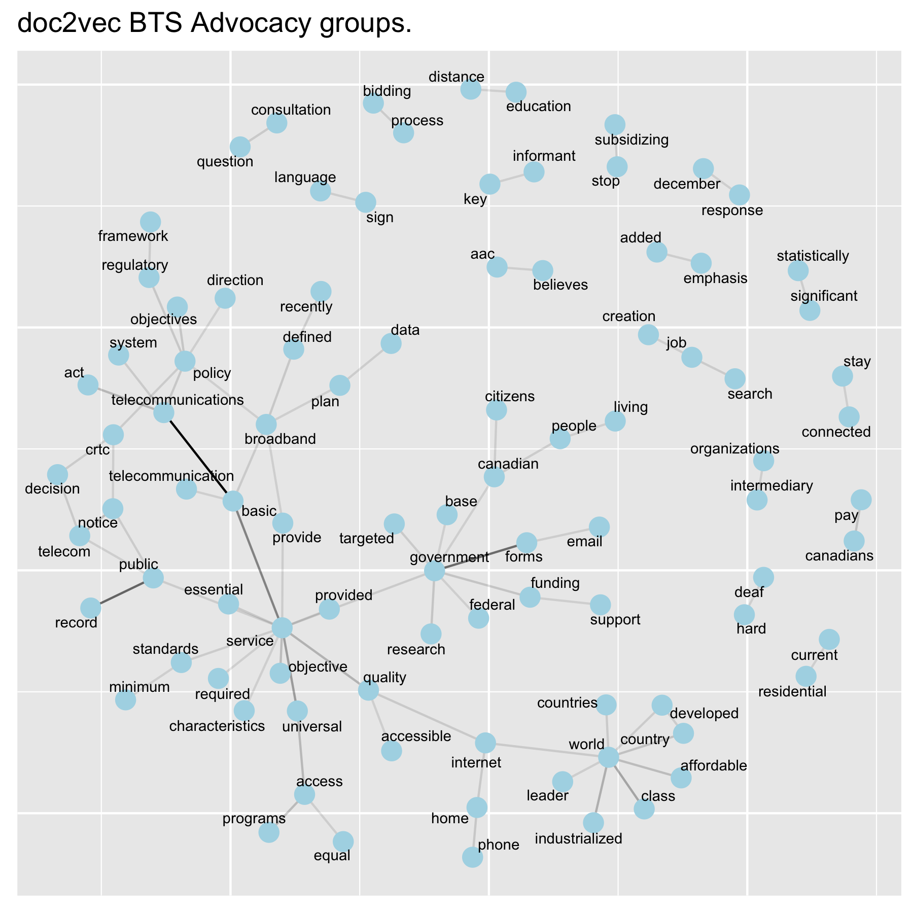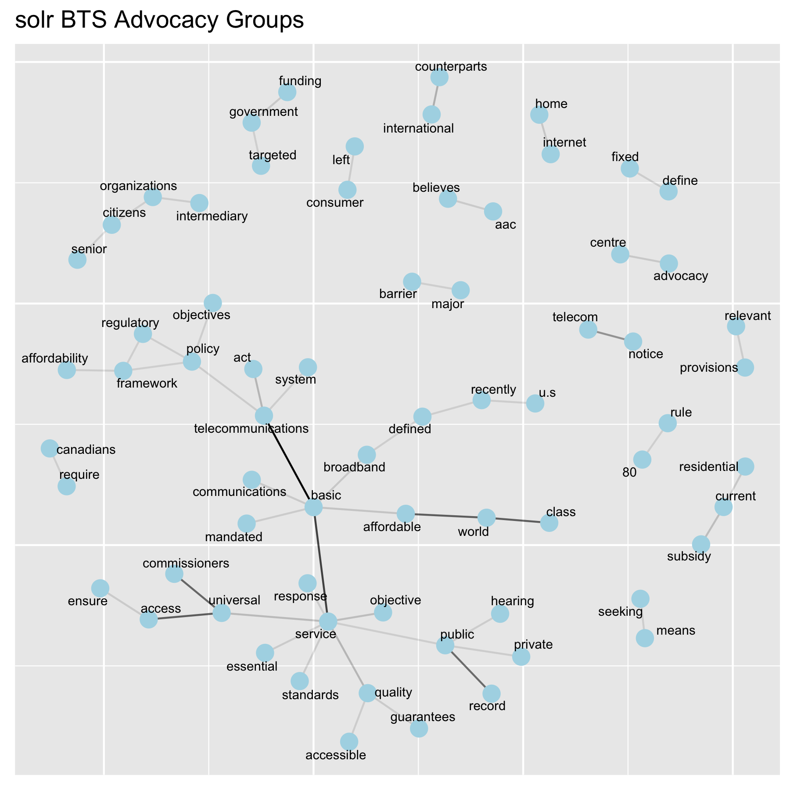


#### What we might be seeing
Narrative aside, there are considerably more hits with `doc2vec` and `solr` from the advocacy groups than there are any other group for the basic service question, which we can tell easily from the $N>30$ for word pairs. Meaning that in terms of answering this question, this group answered significantly more. I might toss all the telecom groups together to see if their response was similar, as there is probably just more advocacy groups than there are incumbents.

In terms of a narrative however this isn't as "clear" as it was before for the affordability question where there was clear differences between how the groups discuss it. In this case I _think_ the interesting bits might actually end up being outside of the main cluster. for example there's a lot of talk about education, jobs, staying connected etc. that may be interesting in terms of "sub-topics" that we find. However, the affordability things may be noise due to statement proximity.

There is also an interesting node of the word "provided" which links directly to government, indicating that there may be a call for government action by advocacy groups. However, I'm tentative about that because we lack context and I feel like I may be reaching on that one. But it caught my eye.

But in all seriousness I think there are some interesting pairs such as "stop - subsidizing" which appears in the `doc2vec` results, or "major - barrier" in the `solr` results. There are also interesting issues around the basic service question cluster such as the cluster around the word "world" in the bottom right of the `doc2vec` plot, as well as "equal" and "ensure" connected to access. But essentially we see a lot of word-pairs focused around we Canadians when it comes to segments found around the basic service question. While these diagrams certainly don't tell us anything about whether or not anyone is in favor of defining broadband as a basic service, what we can say is that Advocacy groups discussed how such a ruling may impact Canadians. Certainly however, this may be a "biased viewing" of the chart.

### Consumer Advocacy Organizations
Mushed in with the Advocacy groups.


### Government

#### #nofilter

#### #filter
Here the doc2vec results are only showing pairs which occur with $N>5$ times and solr has $N>2$, both with a minimum cosine similarity to the filter words of 0.6

 

#### What we might be seeing
Government groups seem to talk about either themselves or other governments quite about when surrounding the basic service question. Besides that the main cluster of frequent word pairs are very similar to that of the Advocacy groups, however there is also talk of online education and social requirements which might be of interest Besides that the main cluster of points is basically the same as everywhere else, and I think that could be an artifact of everyone restating the question in their response. Which while nice for reading responses by hand, sometimes may make things more difficult for text mining.

### Cable Companies
Again, the main cluster seems to be primarily a restatement of the question itself, however there is a potentially addition of the pair "regulatory framework" to the policy node. There is also a smaller cluster which seems to talk about government funding and subsidies which may be of interest, however, that's another CRTC question that was close in proximity to the BTO question, so that might not be of interest. I think the case for ignoring that is that it does not appear in the `solr` search, only the `doc2vec` search. One interesting cluster is the "maximum extent feasible" cluster, but I'm not sure how much we can take away from this.


#### #nofilter

#### #filter

Here the doc2vec results are only showing pairs which occur with $N>4$ times and solr has $N>3$, with a minimum cosine similarity to the filter words of 0.6

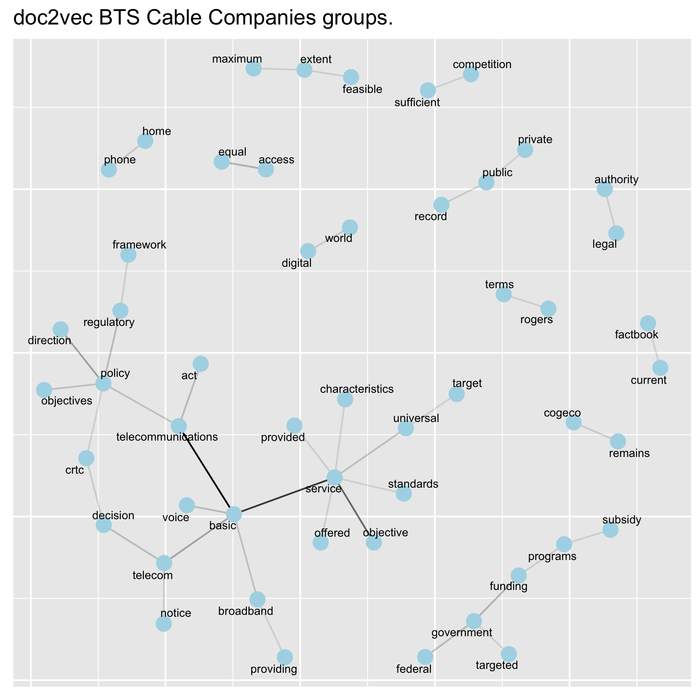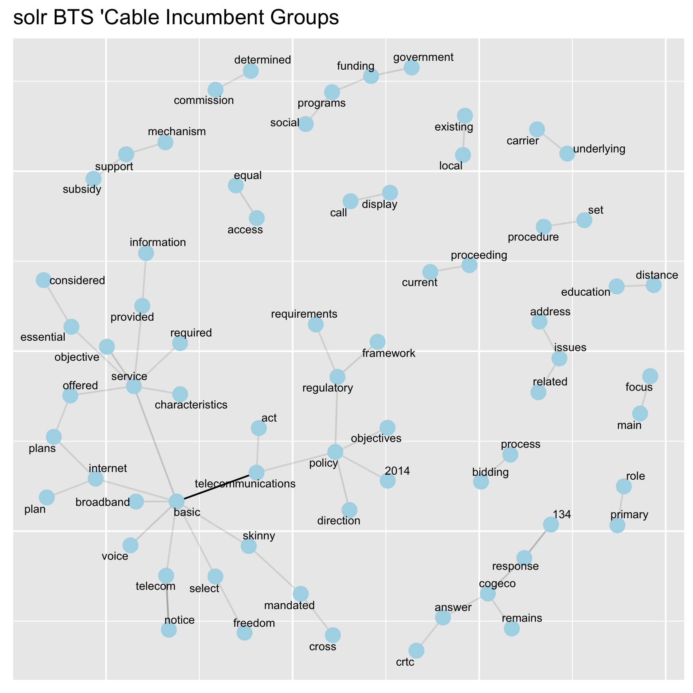

#### What we might be seeing


### Telecom Incumbents


#### #nofilter

#### #filter
Here the telecom word-pairs are limited to those that appear $N>8$ times, solr is $N>4$, both with a minimum cosine similarity of 0.6

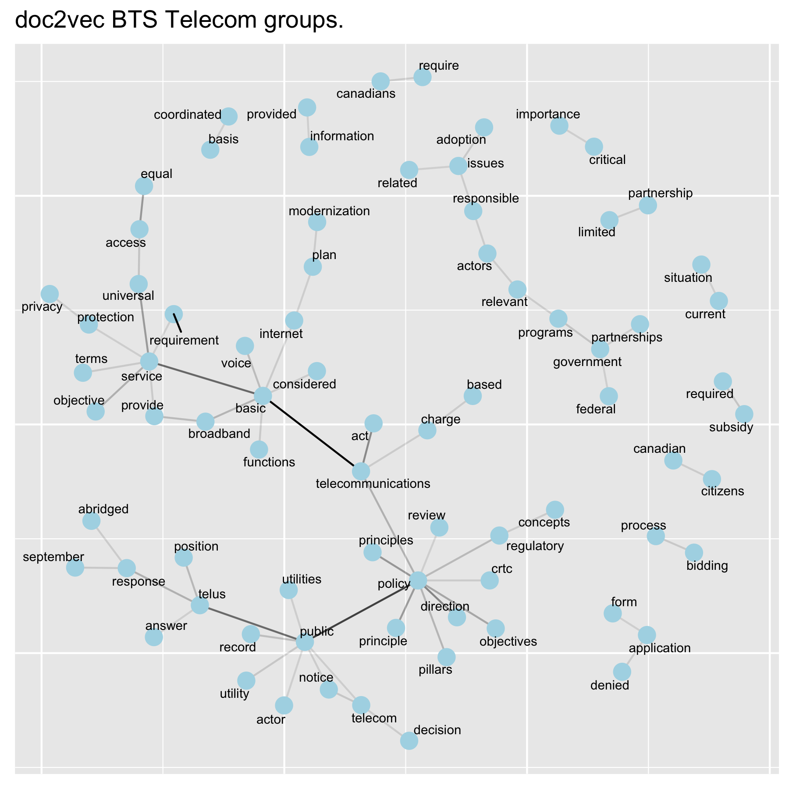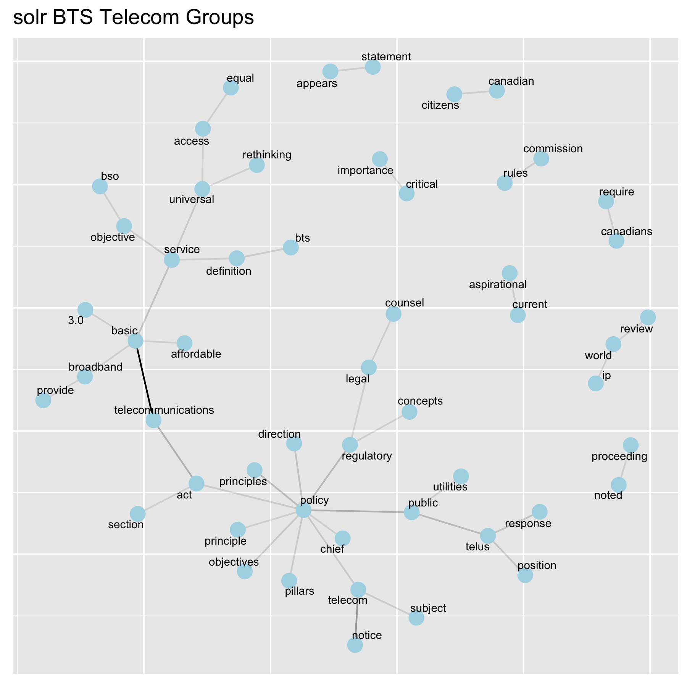

#### What we might be seeing

This is a little more interesting than the cable company word web I have to admit. There's a sub cluster that seems to be about service adoption issues, and there's a branch of the word "basic" which seems to be about internet modernization which could be an interesting analysis route. However, besides that, the main cluster still looks the same to me as every other main cluster.


### Other Network Operators

#### #nofilter

#### #filter
Here the doc2vec results are only showing pairs which occur with $N>5$ times, solr with $N>1$, both with a minimum cosine similarity to the filter words of 0.6

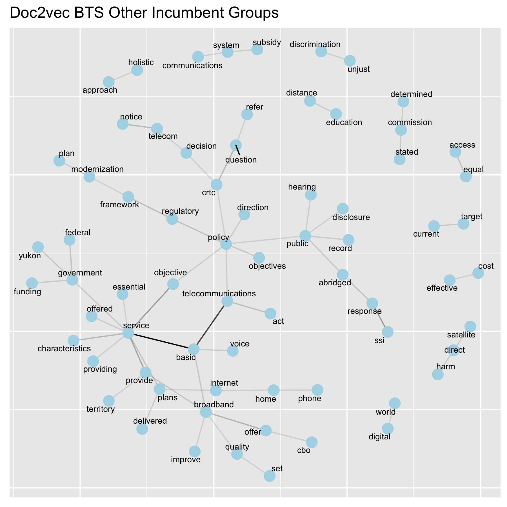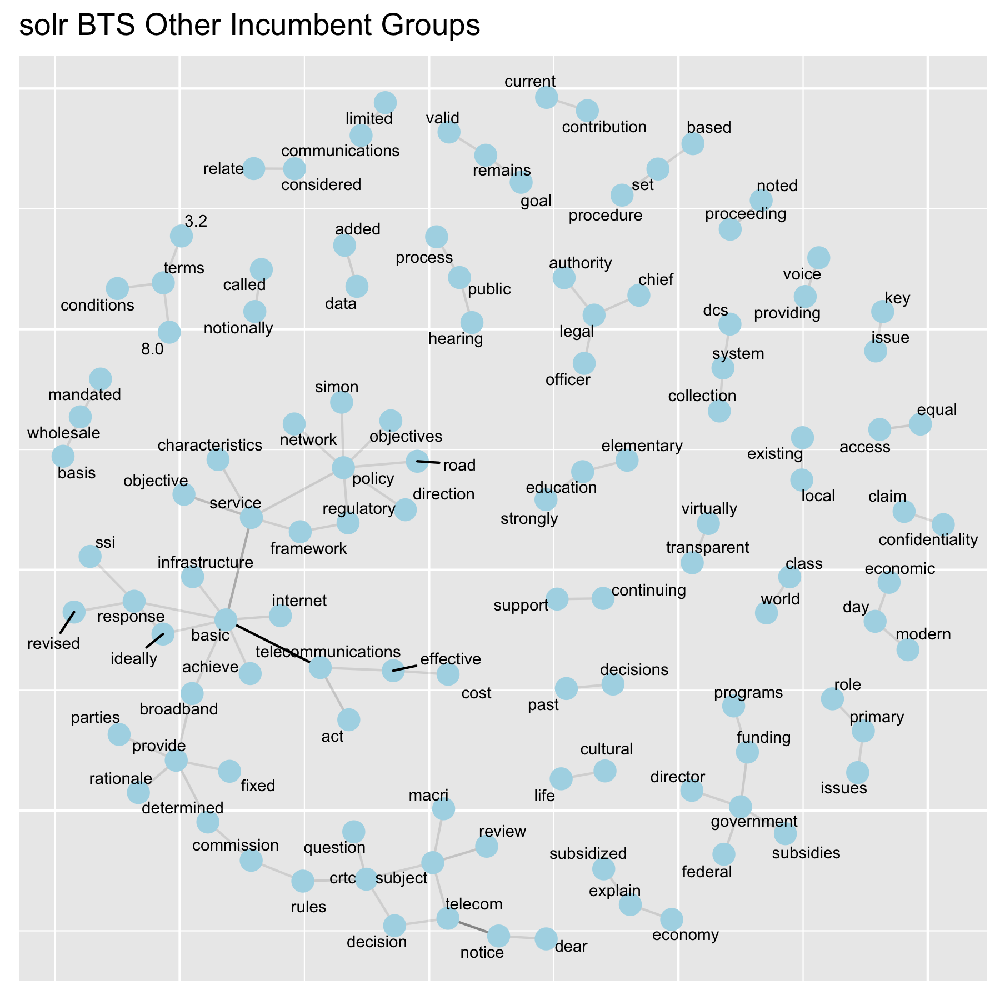

#### What we might be seeing

These look a little different than the other incumbents, but that may partially be due to the different amounts of data. Theres's a few new things such as "satellite" and "yukon", however, I don't think that's something worth looking into as I feel like these are providers of those more niche/remote services.

### Small Incumbents

#### #nofilter

#### #filter
Here both solr and doc2vec results are only showing pairs which occur with $N>1$ times, with a minimum cosine similarity to the filter words of 0.6
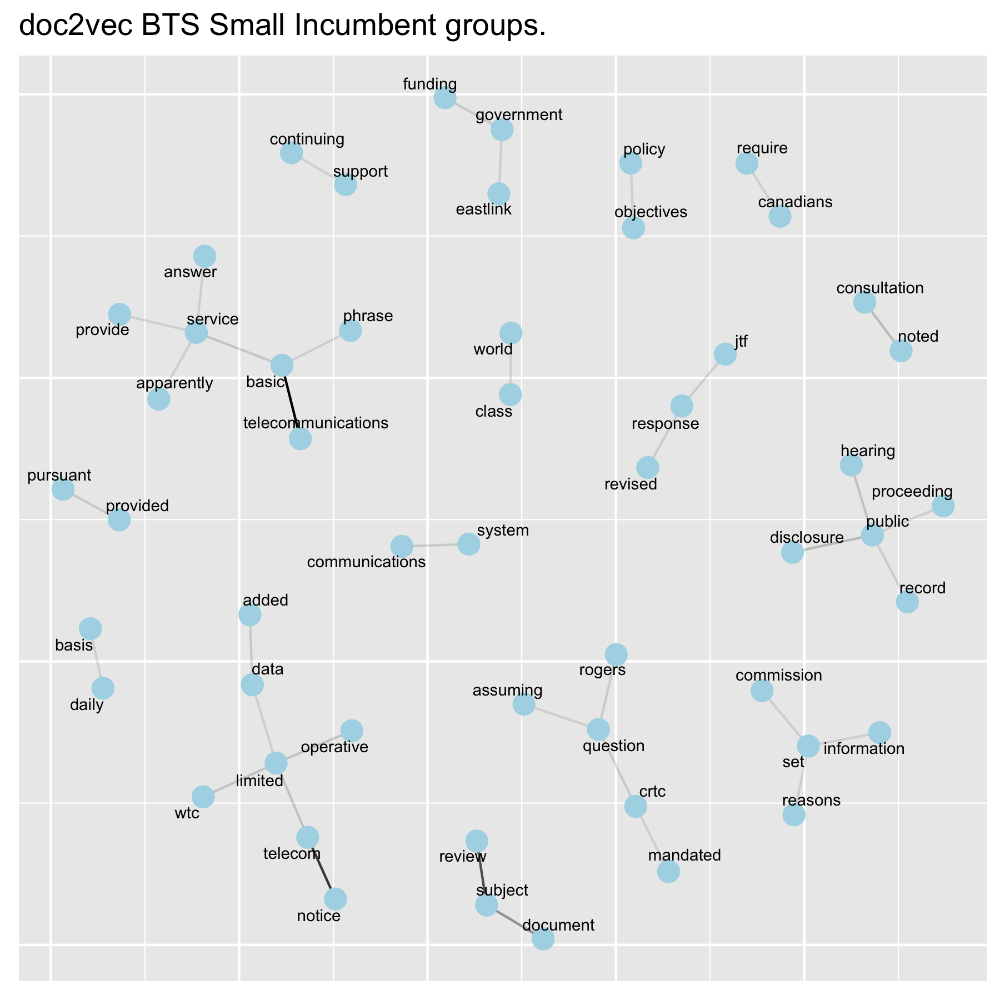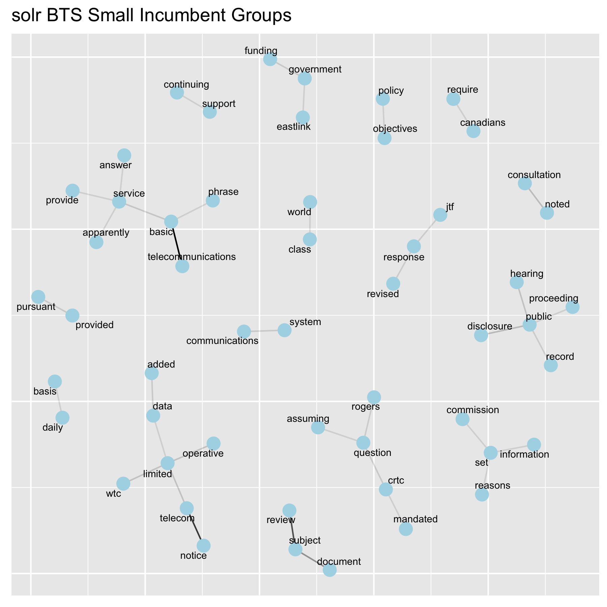

#### What we might be seeing

### "Other"

#### #nofilter

#### #filter
Here both solr and doc2vec results are only showing pairs which occur with $N>1$ times, with a minimum cosine similarity to the filter words of 0.6

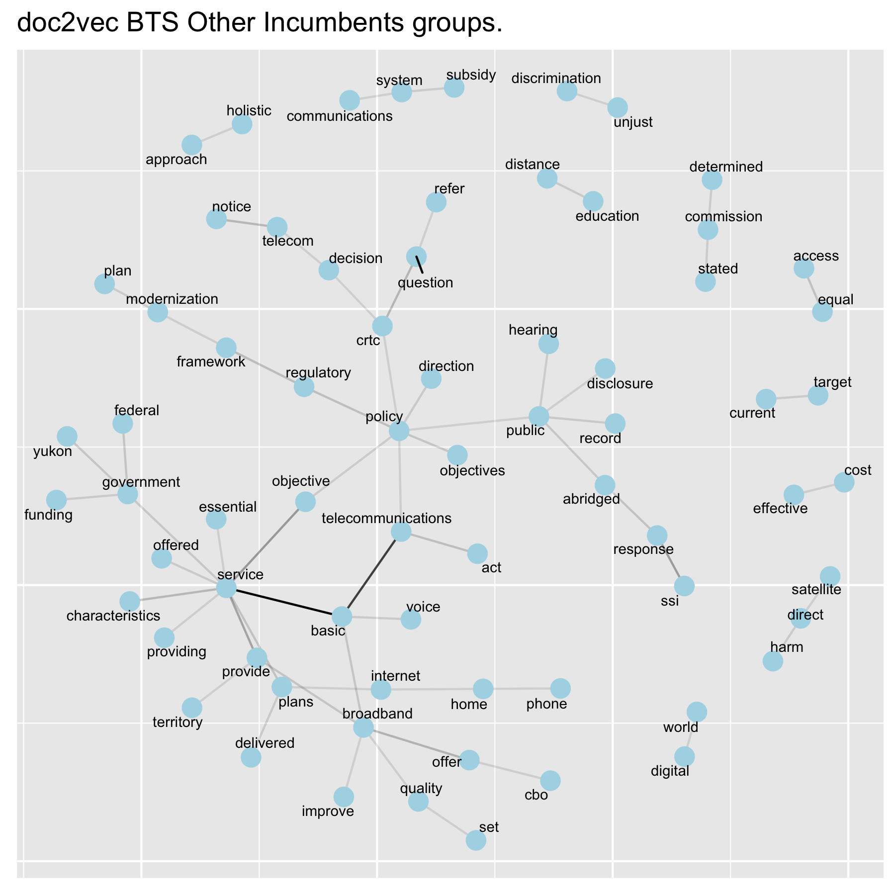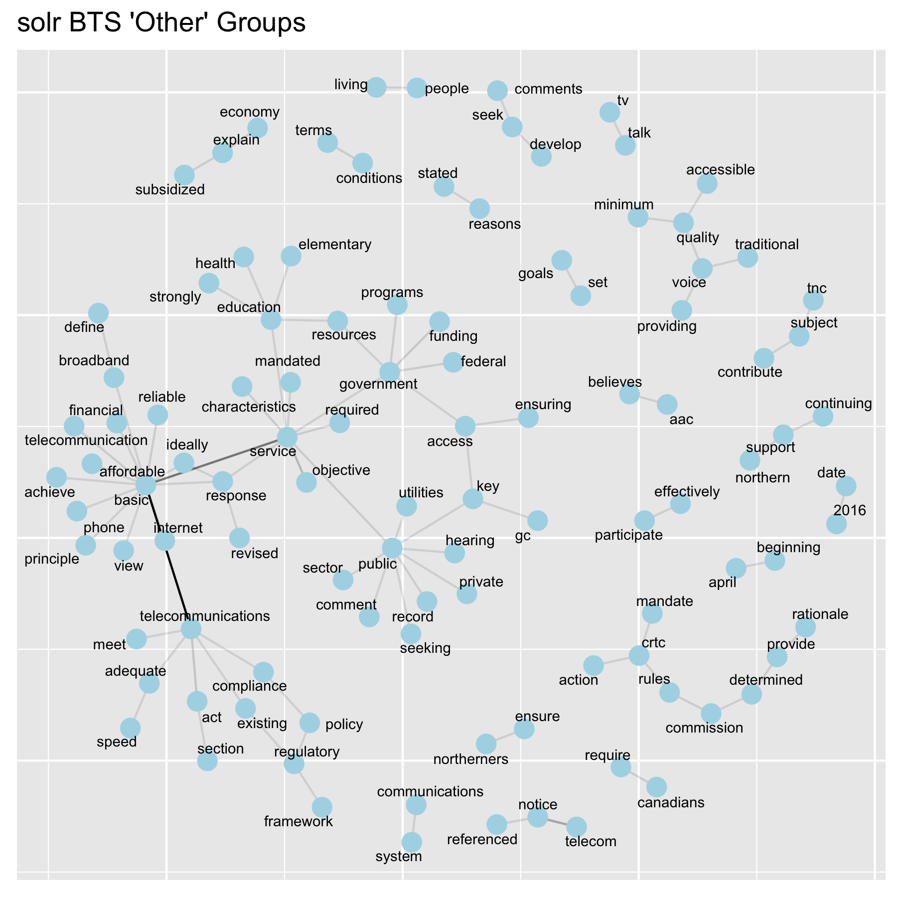

#### What we might be seeing
Truth be told, I don't think there's enough data here to make any claims about what they're talking about.


## Conclusion

I think the basic service objective question is a little less interesting in regards to the plots we make and the language used, however, in terms of the BTO I think each group is at least having the _same_ conversation. Unlike the affordability question where mostly saw how each group talks about affordability to them, in this case the question is so pointed that most groups seem to respond the same. A lot of that is likely due to restating the question itself in each response. But regardless, I think it's pretty clear each group is having the same conversation about this question, and that there may be small differences in common word pairs for each group surrounding the question. That said, I'm not sure how much we can say in terms of "who seems to be in favor of the basic service objective" vs. who isn't. At this point, the most I'm willing to claim is that everyone seems to be having the same conversation in this case.
