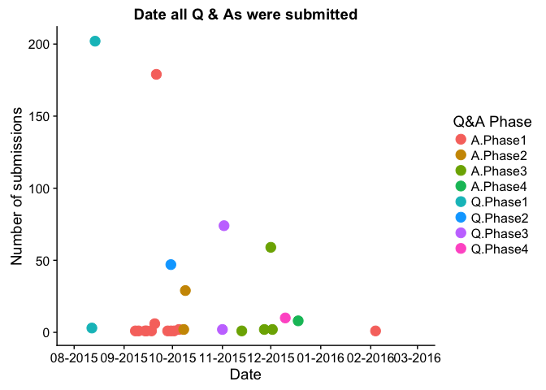
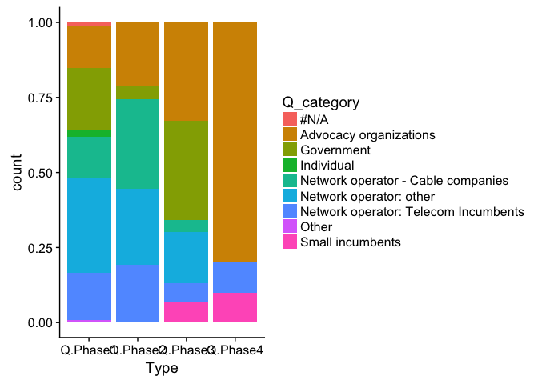
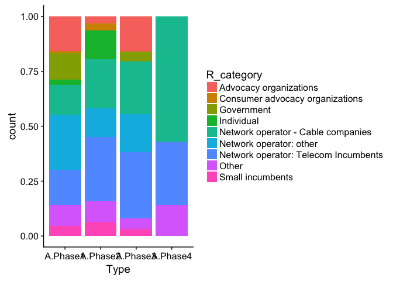
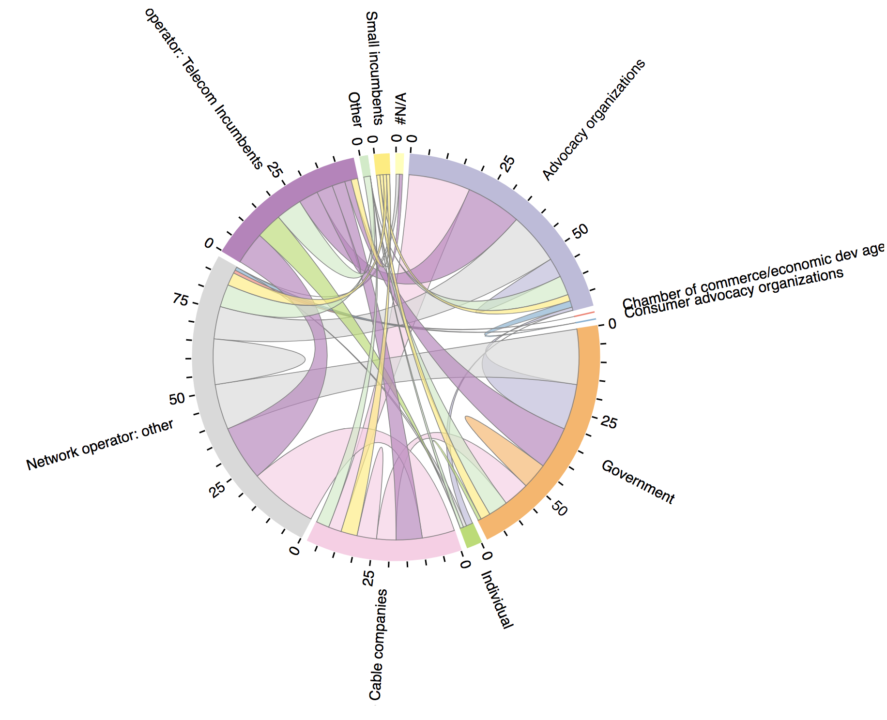
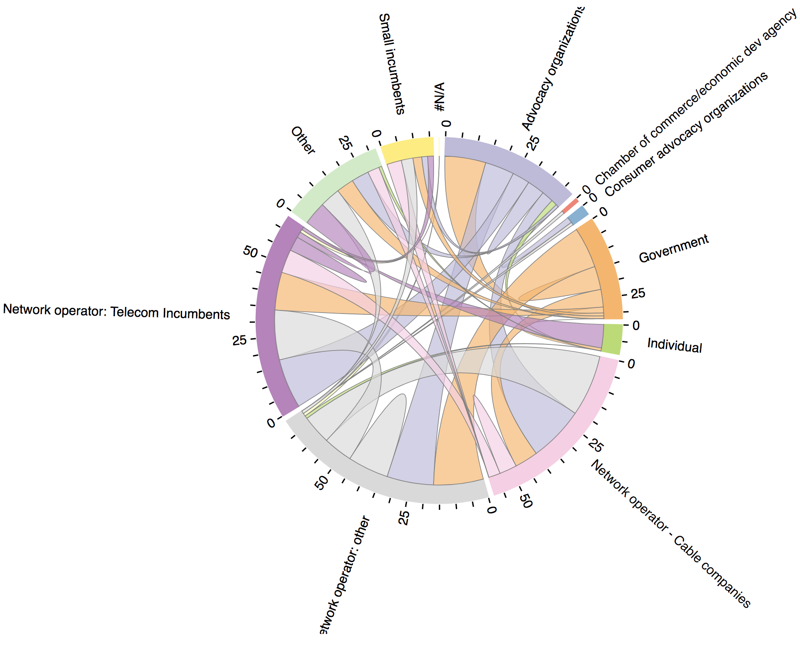
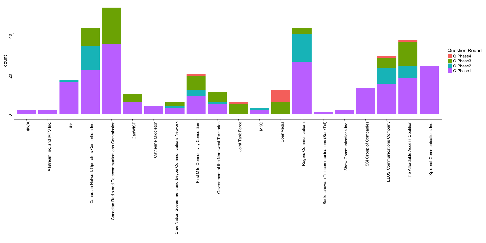
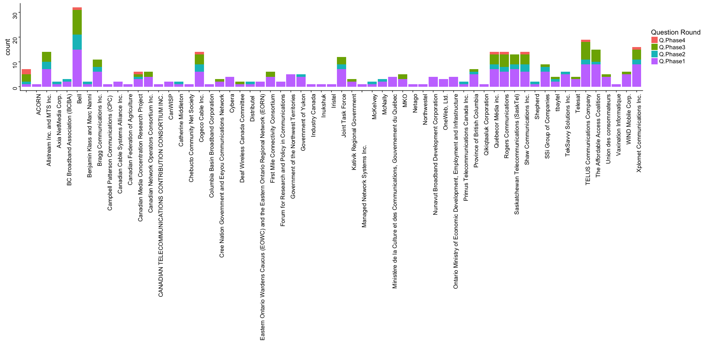
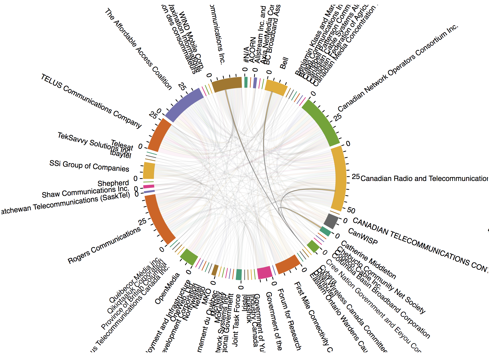
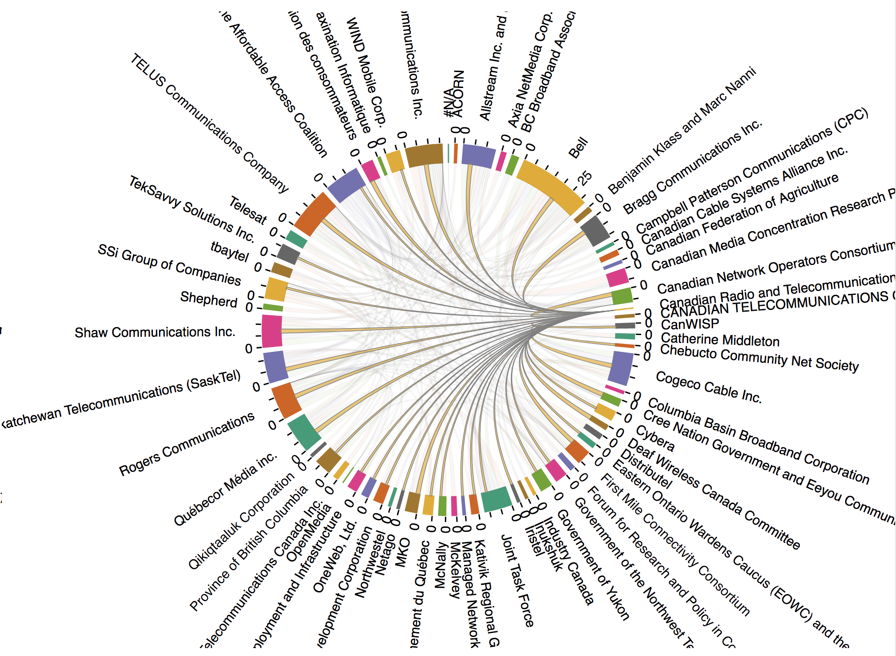

Analyzing lines of questioning among intervenors
================

-   [Overview of questions asked](#overview-of-questions-asked)
-   [Who is asking whom questions?](#who-is-asking-whom-questions)
-   [Who are the top questioners?](#who-are-the-top-questioners)
-   [Who asked questions and who was asked questions?](#who-asked-questions-and-who-was-asked-questions)
-   [Question/answer imbalance](#questionanswer-imbalance)
-   [Conclusions](#conclusions)

Analyzing Intervenor Question & Answers in CRTC 2015-134
--------------------------------------------------------

During CRTC consultation 2015-134, there were four rounds of questioning that allowed intervenors the opportunity to ask for additional information from others. The goal of this analysis is to determine how intervenors interacted with each other, how often, and which groups interacted with each other primarily.

## Overview of questions asked

#### Number of questions asked in each round of questioning

    ## # A tibble: 4 x 2
    ##       Type Qs_asked
    ##      <chr>    <int>
    ## 1 Q.Phase1      205
    ## 2 Q.Phase2       47
    ## 3 Q.Phase3       76
    ## 4 Q.Phase4       10

The four rounds of questioning took place over approximately 6 months. 

Who is asking whom questions?
-----------------------------

Over all rounds of questioning, Network operator: other, advocacy organizations, and government make up the most active questioning parties.

Of note, individual intervenors hardly ever participate in the questioning rounds as can be seen below.

In table format:

    ## # A tibble: 9 x 2
    ##                             Q_category Qs_asked
    ##                                 <fctr>    <int>
    ## 1              Network operator: other       90
    ## 2               Advocacy organizations       72
    ## 3                           Government       70
    ## 4 Network operator: Telecom Incumbents       47
    ## 5   Network operator - Cable companies       45
    ## 6                     Small incumbents        6
    ## 7                           Individual        4
    ## 8                                 #N/A        2
    ## 9                                Other        2

Split over each round of questioning, the dynamics of who asks - and is asked - questions shifts considerably. While the percentage shifts look quite drastic, it should be noted that round 4 of questioning had about 1/20 as many questions as round 1 (~10 vs. 200).

Patterns and lines of questioning can also be displayed using chord diagrams. Chord diagrams show where the questions originated from and which party they ended up with. The starting width of the chord shows how many questions were asked by that party in that direction. The ending point shows how many questions were asked in the other direction.

For example, all of the CRTC's chords are wide from the start and narrow at the end: It asked lots of questions, but no one asked the CRTC questions.

The plot on the right shows who was asked. That is, a wide bar shows that that group of intervenors was asked a lot of questions. This provides an interesting contrast with regards to who was asking questions (on the left) and who was asked questions (on the right).

<table class="container">
<tr>
<td>
<!--html_preserve-->

<!--/html_preserve-->
</td>
<td>
<!--html_preserve-->

<!--/html_preserve-->
</td>
</tr>
</table>
Who are the top questioners?
----------------------------

In total, there were only 20 intervenors who asked questions over all 4 rounds of questioning. Maybe not surprisingly, the CRTC was the most active questioning party of all, having issued requests for information from 53 entities.

    ## # A tibble: 20 x 3
    ## # Groups:   Questioner_reformat [20]
    ##                                        Questioner_reformat
    ##                                                     <fctr>
    ##  1        Canadian Radio and Telecommunications Commission
    ##  2              Canadian Network Operators Consortium Inc.
    ##  3                                   Rogers Communications
    ##  4                         The Affordable Access Coalition
    ##  5                            TELUS Communications Company
    ##  6                            Xplornet Communications Inc.
    ##  7                      First Mile Connectivity Consortium
    ##  8                                                    Bell
    ##  9                                  SSi Group of Companies
    ## 10                                               OpenMedia
    ## 11                 Government of the Northwest Territories
    ## 12                                                 CanWISP
    ## 13 Cree Nation Government and Eeyou Communications Network
    ## 14                                        Joint Task Force
    ## 15                                     Catherine Middleton
    ## 16                                                     MKO
    ## 17                                                    #N/A
    ## 18                             Allstream Inc. and MTS Inc.
    ## 19                                Shaw Communications Inc.
    ## 20               Saskatchewan Telecommunications (SaskTel)
    ## # ... with 2 more variables: Q_category <fctr>, Qs_asked <int>

Who asked questions and who was asked questions?
------------------------------------------------

The following is a more detailed breakdown of each organization and how many questions they asked and in which round. Secondly, the next plot shows how many questions each intervenor was asked.

These chord diagrams show which individual intervenors asked others questions. This gets messy quickly, but the interactivity of the plot allows one to isolate and see who individual intervenors communicated with.

For example, while it is clear that certain organizations asked a lot of questions (e.g. Bell), the plot on the right shows a much more even distribution of those who were asked questions.

Hovering over the CRTC field on the right, it also clearly shows a fairly uniform distribution of questions amongst intervening organizations.

<table class="container">
<tr>
<td>
<!--html_preserve-->

<!--/html_preserve-->
</td>
<td>
<!--html_preserve-->

<!--/html_preserve-->
</td>
</tr>
</table>
Question/answer imbalance
-------------------------

Certain organizations notably ask more questions than they answer and vice versa. The following show the top 10 organizations that display an imbalance in questions asked and received.

On one hand, the CRTC leads the list, as they received 0 questions and asked 53, followed by CNOC, and Rogers. Notably, 3 out of the top 5 organizations are public advocacy groups.

On the other end of the spectrum, Bell was asked 15 more questions than it received, followed by Quebecor Media Inc, Cogeco, Sasktel, and Shaw - all 5 of which are network operators.

    ## # A tibble: 10 x 5
    ## # Groups:   Responder_reformat [10]
    ##                                  Responder_reformat Qs_received Qs_asked
    ##                                               <chr>       <dbl>    <dbl>
    ##  1 Canadian Radio and Telecommunications Commission           0       53
    ##  2       Canadian Network Operators Consortium Inc.           6       43
    ##  3                            Rogers Communications          14       43
    ##  4                  The Affordable Access Coalition          15       37
    ##  5               First Mile Connectivity Consortium           6       20
    ##  6                                        OpenMedia           0       12
    ##  7                     TELUS Communications Company          19       29
    ##  8                     Xplornet Communications Inc.          16       24
    ##  9                                          CanWISP           2       10
    ## 10          Government of the Northwest Territories           5       11
    ## # ... with 2 more variables: delta <dbl>, org_category <chr>

    ## # A tibble: 10 x 5
    ## # Groups:   Responder_reformat [10]
    ##                           Responder_reformat Qs_received Qs_asked delta
    ##                                        <chr>       <dbl>    <dbl> <dbl>
    ##  1                         WIND Mobile Corp.           6        0    -6
    ##  2                                                     7        0    -7
    ##  3              Province of British Columbia           7        0    -7
    ##  4                 Bragg Communications Inc.          11        0   -11
    ##  5               Allstream Inc. and MTS Inc.          14        2   -12
    ##  6                  Shaw Communications Inc.          14        2   -12
    ##  7 Saskatchewan Telecommunications (SaskTel)          13        1   -12
    ##  8                         Cogeco Cable Inc.          14        0   -14
    ##  9                       Québecor Média inc.          14        0   -14
    ## 10                                      Bell          32       17   -15
    ## # ... with 1 more variables: org_category <chr>

Conclusions
-----------

-   Individual intervenors asked very few questions over the course of the 4 rounds of questioning
-   The CRTC was the most active group requesting additional information from intervenors
-   Network operators, while also active asking questions, overall receive more questions than they ask
