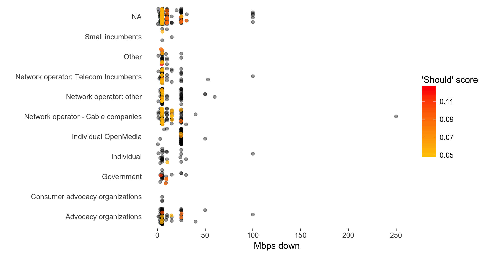
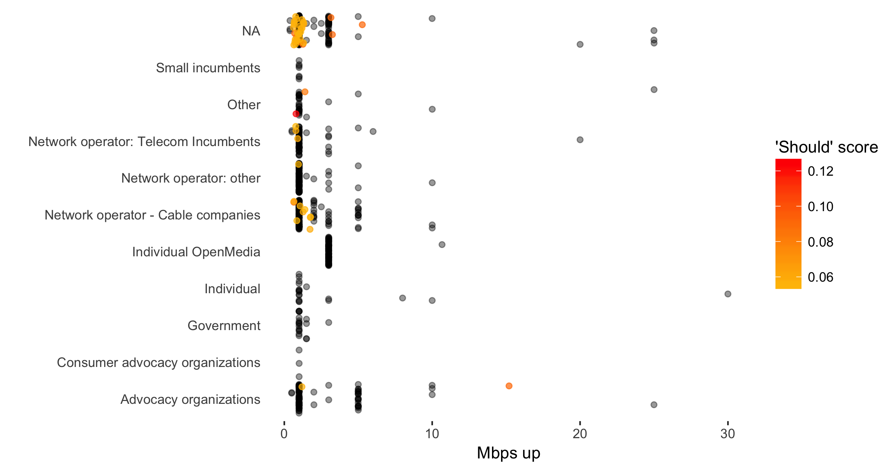

# MBPS Investigation

## The Question

Can we discover any sort of consensus, either overall or among particular groups, on what the minimum Mbps speed should be for upload and download?

## Challenges

This seems like a simple thing to do because it *is* simple for human beings. Someone saying, "This is what internet speeds are right now" or "I know someone with this speed" is obviously different to us from someone saying "I think internet speeds should be X". A human reading a statements like this would identify the last one as the one we're interested in and would then look for the upload/download numbers immediately following and record them as "Company X thinks upload/download speeds should be..."

However, that requires someone to actually spend time reading through all of the documents to find this information. Requiring submissions to state targets like this explicitly in some standard format would, of course, make an automated solution relatively easy. But what if we don't have that? Can we still get any sort of idea on what the participants in this process think upload and download speeds should be without reading through 16 million words?

## Approach

We start by using Solr to grab representative segments of text for further analysis via a boutique of queries. The aim at this step is to get as high a quality chunks of text containing statements that sound like they're declaring what Mbps upload/download speeds *should* be. It's not as important at this point to be exact. We're mainly just trying to reduce the words we'll be sifting through.

After we have our chunks of text, we could simply search for the pattern `__ Mbps download` and plot out the results. We'll have to be a bit fancier than that, as there are some common variations on that pattern. For example, `5/1 Mbps` would refer to 5 Mbps upload and 1 Mbps download. A few regular expressions went a long way in taming these variations in the text we worked with.

In plotting these raw numbers, it's jitter and semi-transparent opacity are useful to allow overplotting to show where we might be getting some sort of consensus. Areas that are darker mean that several points are agreeing on that number. Jitter allows you to see more of the points by fanning them out.

However, we still run into the problem mentioned above: we may be able to determine that a consensus is being formed around particular numbers, but we can't tell whether the consensus is based on the present or a desired future. Or perhaps many are mentioning a speed that they think we should absolutely *not* try and reach.

### The 'Should' Score

A simple heuristic approach is to look for "should" or some word/phrase sharing similar meaning (we chose "should", "must", "needs to", and "target", and record its position in a block of text. Then, get the position of our matching Mbps string in that same block of text. Then calculate the character distance between the two. The closer our "should-like" statement is to the Mbps string, the more likely that Mbps number is in the desired future. To make things a bit simpler to plot and think about, we're going to make the final 'Should' score be `1 / (pos(mbps) - pos('should'))` so that a higher 'Should' score equates to a closer relationship.

We can now add a dimension of colour to our plot, based on the 'Should' score, and start to see the future looking statements rise up from the general chatter.

## Plots

Looking at the full range of upload download speeds mentioned, we can make a couple of observations:

1. Speeds of up to 250 Mbps down and 200 Mbps up are mentioned.
2. No one seems to be arguing that those speeds *should* be minimums.

### Download speeds

### Upload speeds

It also makes it a lot harder to see what's going on with the lower speeds, so let's just filter out all speeds higher than 50 Mbps.

### Download speeds <= 50 Mbps

We see pretty strong stratification of speeds at expected levels, jumping by 5Mbps intervals until higher speeds where we start to jump by 10Mbps. 5Mbps seems to be a pretty strong consensus among small incumbents and telecom, cable, and other network operators. This consensus is conspicuously absent from government and advocacy organizations. We see some clusters at 15 and 25 Mbps, but we don't see nearly as strong a consensus on any one speed.

Telecom incumbents and cable companies do show some interest at the 10 Mbps (for telecoms) and 15 Mbps (for cable) levels. One reason for these differing preferences may be that, as fibre to the home still isn't the norm, cable companies tend to be at a last mile advantage when delivering higher speeds. In other words, it might be easier for them to suggest a 15 Mbps standard than for the telcos to suggest the same.

### Upload speeds <= 50 Mbps

Upload speeds have historically been much lower than download speeds, so we'd expect our scales to be a bit different when talking about what they should be in the future, but a few patterns also emerge that are different than download speeds. For one, we don't see all that much interest from anyone in increasing the speeds above 1-2 Mbps. Some telecom incumbents seem okay with speeds in the 3-5 Mbps area. Historically, it has also been easier for existing telecom infrastructure to deliver similar upload and download speeds, just as it's been easier for cable company infrastructure to deliver higher download speeds.

Perhaps more surprising is the lack of data points for government and advocacy organizations. There's a single 'should' above 1 Mbps, suggesting a 15 Mbps upload speed.

This probably reflects the fact that much of the demand for internet speeds is still driven by consumption which inherently involves more downloading than uploading.

