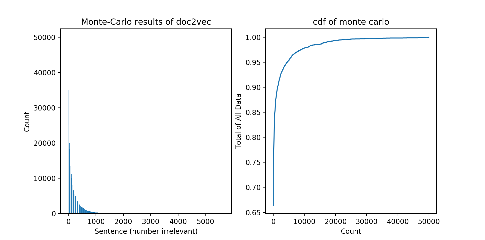
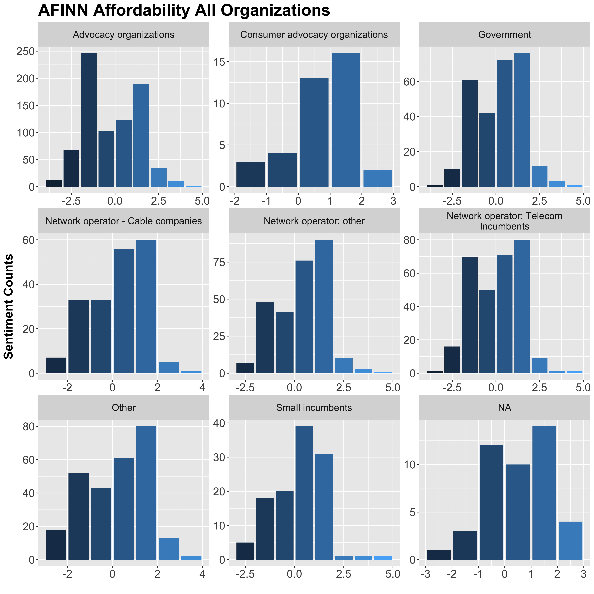
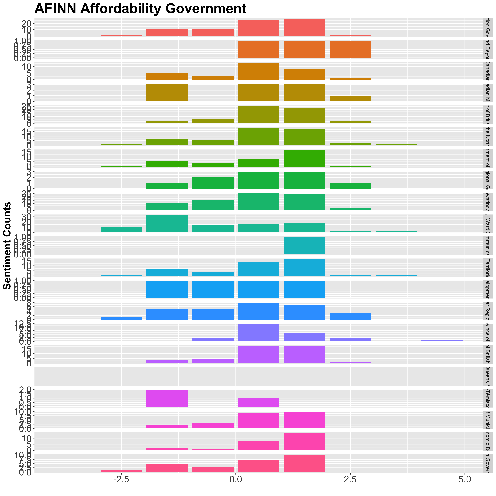

# Doc2Vec Analysis of CIRA Data

## Introduction

NOTE: if you want the math equations to display in a non-latex way, the only way I could get them to work online was to install this chrome extension:
https://chrome.google.com/webstore/detail/github-with-mathjax/ioemnmodlmafdkllaclgeombjnmnbima/related

  For this analysis we decided to train a doc2vec model of the
documents submitted to CIRA from all organizations and individuals.
In this case, the network was trained on all documents, with
duplicate sentences, numbers, and sentences shorter than 15 characters
removed. As well, a stemmer was applied to the data set for training
which applies a mapping to for similar words conjugated differently.
For example, `application` and `apply` would both go to the 'root' word.
of `appli` while training the word vectors. Using `gensim`'s doc2vec
python library, a neural network can be trained using the following
python snippet:

```python
model = gensim.models.Doc2Vec(tagged,
                                dm = 0,
                                alpha=0.025,
                                size= 1500,
                                min_alpha=0.0001,
                                min_count = 10,
                                sample = 1e-4,
                                workers = 8,
                                dbow_words=1,
                                iter = 20,
                                window = 15,
                                hs = 0)
```
where `tagged` are the tokenized and labeled word vectors that were cleaned from the raw text documents, `dm` is the word model. In this case, `dm=0` implies the distributed bag of words model. `alpha` is the standard initial learning rate, `size` is the size of the word vector and the hidden layer of neurons. `min_alpha` is the smallest training rate. `sample` down-samples frequently used words, `workers` is the number of cores to use, `dbow_words` tells `doc2vec` to also train word vectors as well as document vectors. However, this does tend to slow down training, but I found it worked a little better for shorter search terms. `iter` is how many training epochs to go through, were typical values reported in the literature are between 10 and 20, `window` is how many words apart to calculate word probabilities for each token and finally `hs=0` tells `doc2vec` to use negative sampling instead of hierarchical softmax for training.

Once the model is trained, you can ask `doc2vec` to return to you 'semantically similar' statements to a statement you provide yourself. To do this, we envoke the `infer_vector` and `most_similar` methods as follows
```python
infer_vector = model.infer_vector(stemmed_tokens, steps=20, alpha=0.025)
similars = model.docvecs.most_similar(positive=[infer_vector], topn=num_return)
```
where here `stemmed_tokens` is the stemmed and tokenized sentence you're looking for (cleaned in the same way as the documents), and `steps` is how many training steps to do on your custom search. In this case, `doc2vec` will find the most similar sentences or documents to the one you provided based on the cosine similarity of the vectors you trained on as compared to the one you provided. In more mathematical terms, we're simply looking for the largest inner product

$$ s = \max (\vec{V^+} \cdot \{\vec{V_i}\}|_{i \epsilon C}) $$

Where $s$ is the similar sentences in the corpus, $\vec{V^+}$ is your custom
"search" term (or new vector), and $\{\vec{V_i}\}|_{i \epsilon C}$ is the set of all word vectors in your corpus $C$. In this way, it is possible to find the most semantically similar statements in your set of documents to one you provide yourself. Additionally, the method `most_similar` finds the `topn` most similar sentences based the inferred vector.

## Why Monte Carlo?

In order to initialize the new corpus of the words you provide in
the `infer_vector` method, the weights in the neural network of that vector are randomly applied. This means that if you search for the same sentence/document twice (on a different random seed) you many find different sentences are the "most similar" between runs. In the spirit of viewing this as a feature and not a bug, this is the perfect application for Monte Carlo. In essence, we'll ask the neural network to find similar sentences to the same sentence many times, and once we have a collection of the sentences that appear more often, we can be (unquantifiably) more certain that the "top hitters" are more relevant to our search rather than relying on a single query.

### Use as a Test fo Over training

For `doc2vec` the result of overtraining can cause the network to "memorize" a set of documents, and perform poorly on searches that aren't already contained within your corpus. This (maybe, I have no non-emperical proof) evident with a Monte Carlo histogram. An example of overtraining can be seen below for the basic service quesion.


From the first figure we can see that the `doc2vec` network (here trained through 50 epochs) is getting hung up on the same ~200 sentences. These 200 sentences are not necessarily interesting as we're actually interested in _all_ the sentences that may be interesting. Not to mention the CDF is kind of "chunky" indicating multi-modal behavior, which is typically a bad sign unless there's a good reason for it. Comparing these results to those of a network trained through only 20 epochs below



Where now we see that the network is frequently finding approximately 500 (hopefully highly relevant) sentences, as well as a long tail of "one hitters" or sentences that only appear once. Typically the one hitters are often noise, but sometimes there's a "diamond in the rough" where it answers the question, but in a highly idiosyncratic (and often angry) fashion from the the individual submissions. As well, the CDF of this function indicates that this histogram is unimodal, if you can consider a exponential curve to be unimodal.

I should note I have no real test to claim that the results of the second histogram are inherently better than the first, but the second network doesn't seem to get as hung up and finds more sentences. I'd be interested in any critiques of using Monte Carlo that you may have.

## Neo4j
The `doc2vec` tagged sentences as well as 3 sentences above and 3 sentences below (more if there were tagged sentences in close proximity) were all added into the `Neo4j` data base using the following
```Cypher
MATCH (doc:Document {sha256: $doc256})
MATCH (Q:Question {ref: $qref})
MERGE (Qe:Query {str: $query})
MERGE (s:Segment {sha256: $seg256})
MERGE (Q)<-[:ABOUT {method: $method}]-(Qe)
MERGE (Qe) <-[:MATCHES]- (s)
MERGE (s) -[:SEGMENT_OF] -> (doc)
SET s.frequency = $counts
SET s.content = $content
```
Here all segments are being matched to pre-existing documents within the data base, as well as whatever question the `infer_vector` method was most similar to. The sentence that was passed into `infer_vector` is noted as the `Query` node, and in the future there may be multiple queries about the same question from `doc2vec`. Here `method` is `doc2vec-MonteCarlo` and the text is stored on a new `Segment` node under the content property. The amount of times these sentences appeared in the Monte Carlo run are stored under the `frequency` property. In this case, if you order returned segments by frequency, you should find the most relevant sentences.


## Sentiment Analysis

Once the segments were merged into the database, it was possible to perform sentiment analysis for both the affordability and basic service questions for each respondent group. This was done in `R` with the following snipped of code.

```R
QuerySentiment <- function(query,graph, sentiment_library)
{
    data_raw <- cypher(graph, query)
    results <- dplyr::mutate(data_raw, id=as.integer(rownames(data_raw)))
    tibbled_data <- as_tibble(results)

    # CHECK IF YOU NEED THE END BIT
    cleaned_text <- tibbled_data  %>%
        filter(str_detect(Segment, "^[^>]+[A-Za-z\\d]") | Segment == "",
        !str_detect(Segment, "writes(:|\\.\\.\\.)$"),
        !str_detect(Segment, "^In article <"))

    use_words <- cleaned_text %>%
         unnest_tokens(word, Segment) %>%
         filter(str_detect(word, "[a-z']$"),
         !word %in% stop_words$word)

    words_by_org <- use_words %>%
        count(Organization, word, sort = TRUE) %>%
        ungroup()

    afinn <- sentiments %>%
         filter(lexicon == 'AFINN')%>%
         select(word, afinn = score)

    pre_scored <- words_by_org %>%
        left_join(afinn, by = 'word')

    scored <- pre_scored%>%
        group_by(Organization)%>%
        summarise(
            afinn_score = list(afinn),
            mean_afinn=mean(afinn,na.rm=T),
            sd_afinn=sd(afinn,na.rm=T)
            )

    return(scored)
}
```

Here the data is pulled form the data base using a provided Query and pre-defined `Neo4j` graph. The data is then cleaned of odd symbols and stop words, before being run through and scored word-by-word using the `AFINN` sentiment library which scores words in the range $[-5,5]$, where the more positive the score, the more positive the sentiment of the word. The segments are then passed and scored on a word-by-word by however they're grouped, i.e. this function groups them by however the query returns the `Organization` clause. Unfortunately I don't know how to pass a variable argument into this to generalize this appropriately, but if someone knows please let me know. But regardless, this will return a tibbled data frame grouped by `Organization` (whatever that may be in your case) and returns the sentiment as a list within the table. I note that `ggplot` doesn't like this, and it's subject to change once I get more comfortable with `tidyr`. I also note that this function within `senties.R` (which will eventually be committed, sooner if there's interest) also returns sentiment for the other sentiment libraries not shown here, but for the purpose of this particular sentiment analysis, I found their scoring too binary for meaningful plots. However, with some restructuring using the `NRC` library, it might be interesting to get the emotional sentiment out of some of the respondents. I do however note that interesting $\neq$ answers.

### Sentiment of Affordability Question

See below for a dump of sentiment pdfs for each subset of groups. My next step will be to display the number of words counted in the sentiment analysis, but so far I haven't found an easy way to do that. However, the ones that have very few tend to be the ones where the mean or the 68% confidence region is out of the box. I think I'll implement a filter so we don't display results with very few sentiment words. I note that I tried violin plots, but they didn't really add anything that the mean and quantile confidence region didn't do more simply. A word of caution however: quartiles are calculated by sorting the data, and because we have identical integer data these also aren't that informative. However these bars are calculated exactly the same as they would be in a violin plot. I might try a bean plot shortly, but I still don't know how great those would be.

I note however that each of these were made with a `Neo4j` query that looked similar to the following
```
cypher
MATCH (Qu:Query) <-[:MATCHES]-(s:Segment)-[:SEGMENT_OF]->(d:Document)<-[:SUBMITTED]-(o:Organization)
WHERE ID(Qu) = 144132
AND s.frequency > 0
AND o.category = 'Network operator: other'
RETURN s.content AS Segment, o.name as Organization
```







However on closer inspection there might be a few interesting things here. We see  that on the whole, most categories of organizations are predominantly neutral when it comes to affordability, with the exception of advocacy organizations which are slightly negative. Saying anything further about the individual named organizations may be difficult until I get the number of words used pasted on these graphs as well. But regardless, everyone is pretty neutral until you get into the "other" groups category, but I'm not convinces that isn't heavily biased by short snippets of text that are out of context and very negative. Anyways, I'll create more complete figures and hopefully there will be something else there


### Sentiment of Basic Service Question
Coming soon. ETA: 11:00 on Monday.
## Potential Issues
### Irrelevance/Noise
With `doc2vec` there's no way to be sure that the document fragments recovered are relevant to the inferred vector. In which case, the above analysis may contain sentiment from sentence fragments that are not at all relevant to either question which could lead us to misleading results. There are a few possible solutions:
1.  (Make someone else) read all of the sentences to be sure.
2. Compare with `solr` to see if the sentiment is the similar.
3. Only use high frequency fragments from the Monte Carlo. This does hold the risk that we may only use a few hundred sentences from the entire dataset. However, from manual reading, this is likely a 'High quality' few hundred sentences.

This is also related to noise, as 'sentences' of random strings of characters that only appear once sometimes get heavily weighted, and top fragments may be nothing but a collection of tildes, square brackets, and email addresses. On the plus side, things like this are either filtered or ignored in the sentiment analysis as they rely on pre-defined scoring dictionaries.

### Ambiguity
As many of the questions we're setting out to answer may have ambiguous or vague answers, there may not be one 'universal' search that find all the answers, with the exception of a `solr` search for the actual CRTC question. As well, I don't think sentiment or topic analysis will give us concrete answers, simply common terms and language used in sentence fragments. In terms of possible solutions, I'm not sure if there's an automated approach. We can probably narrow down relevant sections from documents for the telecoms using `Neo4j`.

## Coming Soon: Topic Analysis?
I haven't done this yet but that might be the plan for this week.
