#Sentiment Analysis of Solr Searches in the Neo4j

##Introduction

In order to compare the sentiment between the `doc2vec` tagged documents and the `solr` I figured it would be smart to separate the two ideas, while also being slightly more annoying for comparing results between the two. But below is the same sentiment analysis as can be seen in `mc_markdown.md`, just with the solr searches and with less "Alex commentary" (with the exception of the introduction).

## Sentiment of the Affordibility question.

This data was gathered using a search similar to the following:
```neo4j
MATCH (Q:Question)<-[:ABOUT]-(Qe:Query) <-[:MATCHES]-(s:Segment)-[:SEGMENT_OF]->(d:Document)<-[:SUBMITTED]-(o:Organization)
WHERE NOT ID(Qe) = 140612
AND Q.ref='Q9'        
RETURN s.content AS Segment, o.category as Organization"
```
In this case the `ID(Qe)` node label given is (my) `doc2vec` query node, and this search then finds all segments that do _not_ come from `doc2vec` meaning we're left with the segments that result only from `solr` searches (presumably). For the other searches, and additonal constraint to organizaton type is included in an additional `AND` clause.

###All organizations

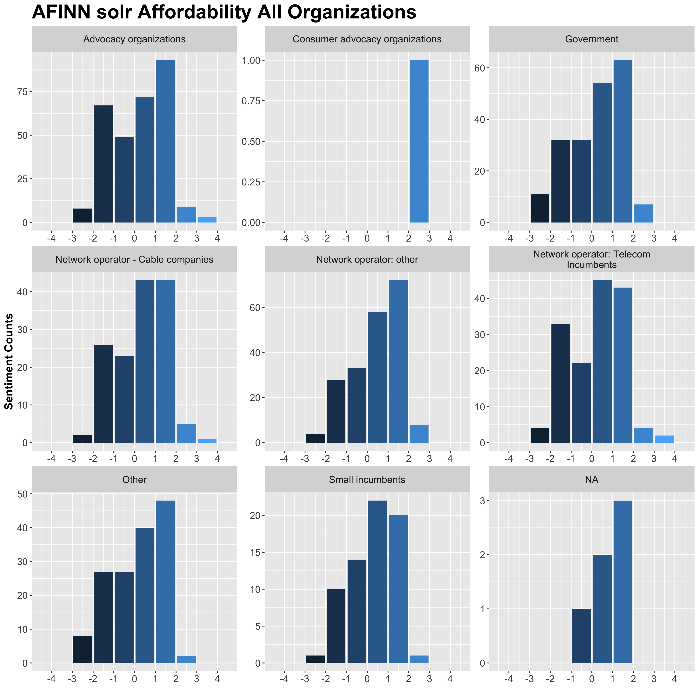

|Organization                         |Sentiment_Mean |Sentiment_SD |Number_of_points |
|:------------------------------------|:--------------|:------------|:----------------|
|Advocacy organizations               |0.21           |1.32         |301              |
|Consumer advocacy organizations      |2.5            |NA           |1                |
|Government                           |0.24           |1.3          |199              |
|Network operator - Cable companies   |0.33           |1.22         |143              |
|Network operator: other              |0.44           |1.19         |203              |
|Network operator: Telecom Incumbents |0.22           |1.3          |153              |
|Other                                |0.15           |1.27         |152              |
|Small incumbents                     |0.28           |1.12         |68               |
|NA                                   |0.83           |0.82         |6                |

### Other Network Operators

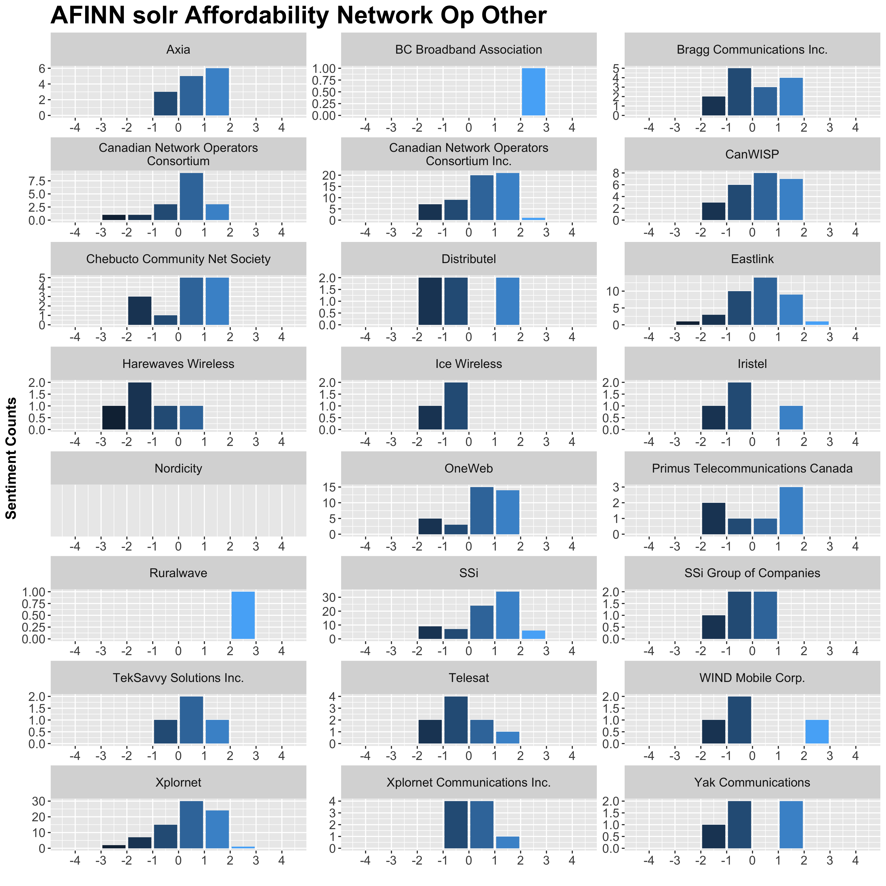


|Organization                               |Sentiment_Mean |Sentiment_SD |Number_of_points |
|:------------------------------------------|:--------------|:------------|:----------------|
|Axia                                       |0.71           |0.8          |14               |
|BC Broadband Association                   |2.5            |NA           |1                |
|Bragg Communications Inc.                  |0.14           |1.08         |14               |
|Canadian Network Operators Consortium      |0.21           |1.05         |17               |
|Canadian Network Operators Consortium Inc. |0.5            |1.04         |58               |
|CanWISP                                    |0.29           |1.02         |24               |
|Chebucto Community Net Society             |0.36           |1.17         |14               |
|Distributel                                |-0.17          |1.37         |6                |
|Eastlink                                   |0.29           |1.07         |38               |
|Harewaves Wireless                         |-1.1           |1.14         |5                |
|Ice Wireless                               |-0.83          |0.58         |3                |
|Iristel                                    |-0.25          |1.26         |4                |
|Nordicity                                  |NaN            |NA           |0                |
|OneWeb                                     |0.53           |1.01         |37               |
|Primus Telecommunications Canada           |0.21           |1.38         |7                |
|Ruralwave                                  |2.5            |NA           |1                |
|SSi                                        |0.76           |1.1          |80               |
|SSi Group of Companies                     |-0.3           |0.84         |5                |
|TekSavvy Solutions Inc.                    |0.5            |0.82         |4                |
|Telesat                                    |-0.28          |0.97         |9                |
|WIND Mobile Corp.                          |0              |1.73         |4                |
|Xplornet                                   |0.39           |1.06         |79               |
|Xplornet Communications Inc.               |0.17           |0.71         |9                |
|Yak Communications                         |0.1            |1.34         |5                |

### Government
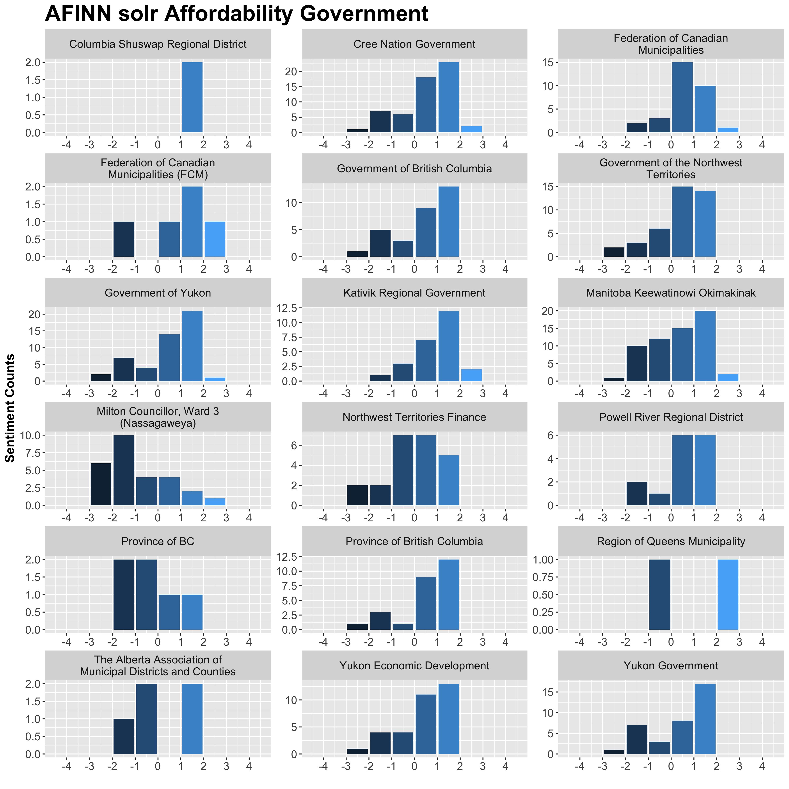

|Organization                                                |Sentiment_Mean |Sentiment_SD |Number_of_points |
|:-----------------------------------------------------------|:--------------|:------------|:----------------|
|Columbia Shuswap Regional District                          |1.5            |0            |2                |
|Cree Nation Government                                      |0.57           |1.15         |57               |
|Federation of Canadian Municipalities                       |0.66           |0.9          |31               |
|Federation of Canadian Municipalities (FCM)                 |0.9            |1.52         |5                |
|Government of British Columbia                              |0.4            |1.22         |31               |
|Government of the Northwest Territories                     |0.4            |1.13         |40               |
|Government of Yukon                                         |0.48           |1.25         |49               |
|Kativik Regional Government                                 |0.94           |0.96         |25               |
|Manitoba Keewatinowi Okimakinak                             |0.32           |1.21         |60               |
|Milton Councillor,  Ward 3 (Nassagaweya)                    |-0.91          |1.39         |27               |
|Northwest Territories Finance                               |-0.02          |1.2          |23               |
|Powell River Regional District                              |0.57           |1.03         |15               |
|Province of BC                                              |-0.33          |1.17         |6                |
|Province of British Columbia                                |0.58           |1.16         |26               |
|Region of Queens Municipality                               |1              |2.12         |2                |
|The Alberta Association of Municipal Districts and Counties |0.1            |1.34         |5                |
|Yukon Economic Development                                  |0.44           |1.14         |33               |
|Yukon Government                                            |0.42           |1.27         |36               |


### Advocacy organizations
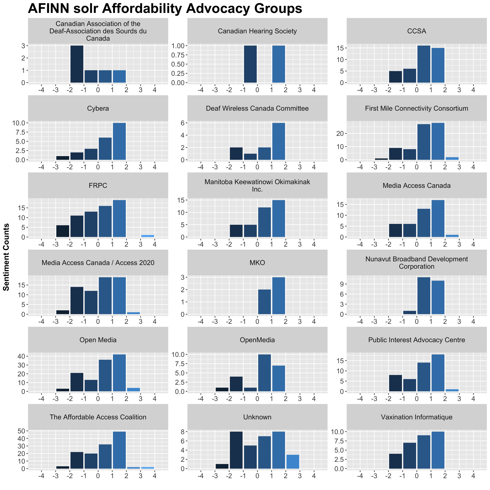
|Organization                                                      |Sentiment_Mean |Sentiment_SD |Number_of_points |
|:-----------------------------------------------------------------|:--------------|:------------|:----------------|
|Canadian Association of the Deaf-Association des Sourds du Canada |-0.5           |1.26         |6                |
|Canadian Hearing Society                                          |0.5            |1.41         |2                |
|CCSA                                                              |0.48           |1            |42               |
|Cybera                                                            |0.5            |1.2          |22               |
|Deaf Wireless Canada Committee                                    |0.59           |1.22         |11               |
|First Mile Connectivity Consortium                                |0.54           |1.1          |75               |
|FRPC                                                              |0.03           |1.38         |66               |
|Manitoba Keewatinowi Okimakinak Inc.                              |0.5            |1.05         |37               |
|Media Access Canada                                               |0.52           |1.1          |43               |
|Media Access Canada / Access 2020                                 |0.13           |1.23         |67               |
|MKO                                                               |1.1            |0.55         |5                |
|Nunavut Broadband Development Corporation                         |0.91           |0.59         |22               |
|Open Media                                                        |0.38           |1.24         |119              |
|OpenMedia                                                         |0.28           |1.2          |23               |
|Public Interest Advocacy Centre                                   |0.46           |1.14         |47               |
|The Affordable Access Coalition                                   |0.39           |1.27         |130              |
|Unknown                                                           |0.19           |1.42         |32               |
|Vaxination Informatique                                           |0.33           |1.05         |30               |

### "Other"

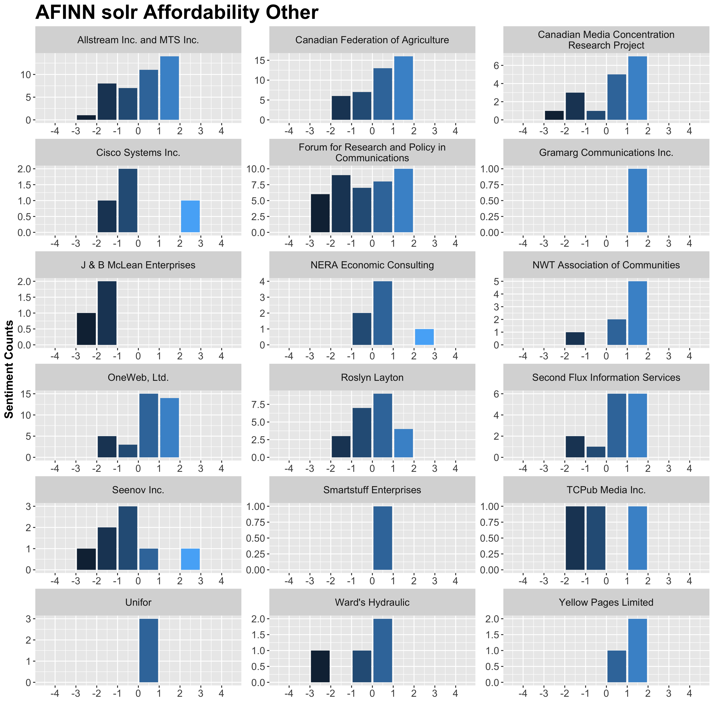

|Organization                                    |Sentiment_Mean |Sentiment_SD |Number_of_points |
|:-----------------------------------------------|:--------------|:------------|:----------------|
|Allstream Inc. and MTS Inc.                     |0.21           |1.21         |41               |
|Canadian Federation of Agriculture              |0.43           |1.07         |42               |
|Canadian Media Concentration Research Project   |0.32           |1.33         |17               |
|Cisco Systems Inc.                              |0              |1.73         |4                |
|Forum for Research and Policy in Communications |-0.32          |1.43         |40               |
|Gramarg Communications Inc.                     |1.5            |NA           |1                |
|J & B McLean Enterprises                        |-1.83          |0.58         |3                |
|NERA Economic Consulting                        |0.5            |1            |7                |
|NWT Association of Communities                  |0.88           |1.06         |8                |
|OneWeb, Ltd.                                    |0.53           |1.01         |37               |
|Roslyn Layton                                   |0.11           |0.94         |23               |
|Second Flux Information Services                |0.57           |1.03         |15               |
|Seenov Inc.                                     |-0.5           |1.51         |8                |
|Smartstuff Enterprises                          |0.5            |NA           |1                |
|TCPub Media Inc.                                |-0.17          |1.53         |3                |
|Unifor                                          |0.5            |0            |3                |
|Ward's Hydraulic                                |-0.5           |1.41         |4                |
|Yellow Pages Limited                            |1.17           |0.58         |3                |
[1] "Beginning query" "6"              

### Cable companies
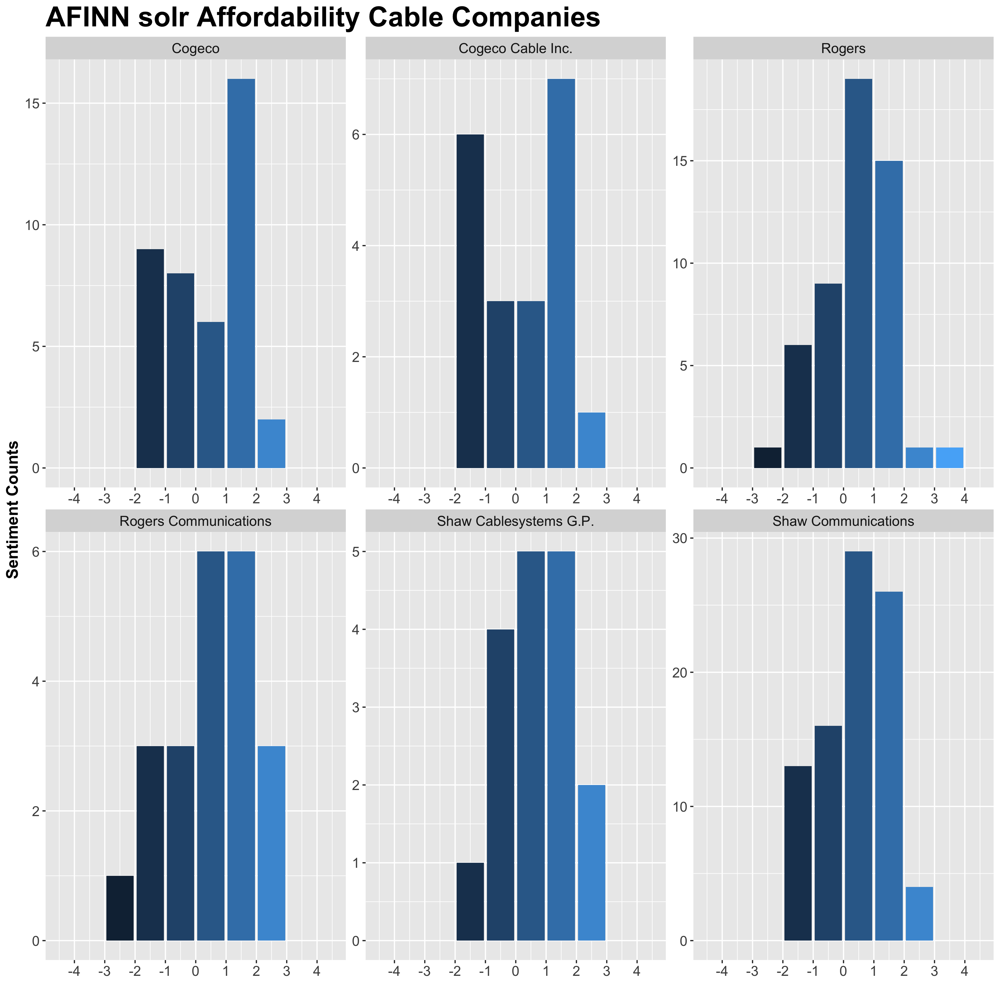


|Organization           |Sentiment_Mean |Sentiment_SD |Number_of_points |
|:----------------------|:--------------|:------------|:----------------|
|Cogeco                 |0.35           |1.3          |41               |
|Cogeco Cable Inc.      |0.2            |1.38         |20               |
|Rogers                 |0.42           |1.17         |52               |
|Rogers Communications  |0.5            |1.41         |22               |
|Shaw Cablesystems G.P. |0.68           |1.13         |17               |
|Shaw Communications    |0.41           |1.12         |88               |

### Telecom incumbents
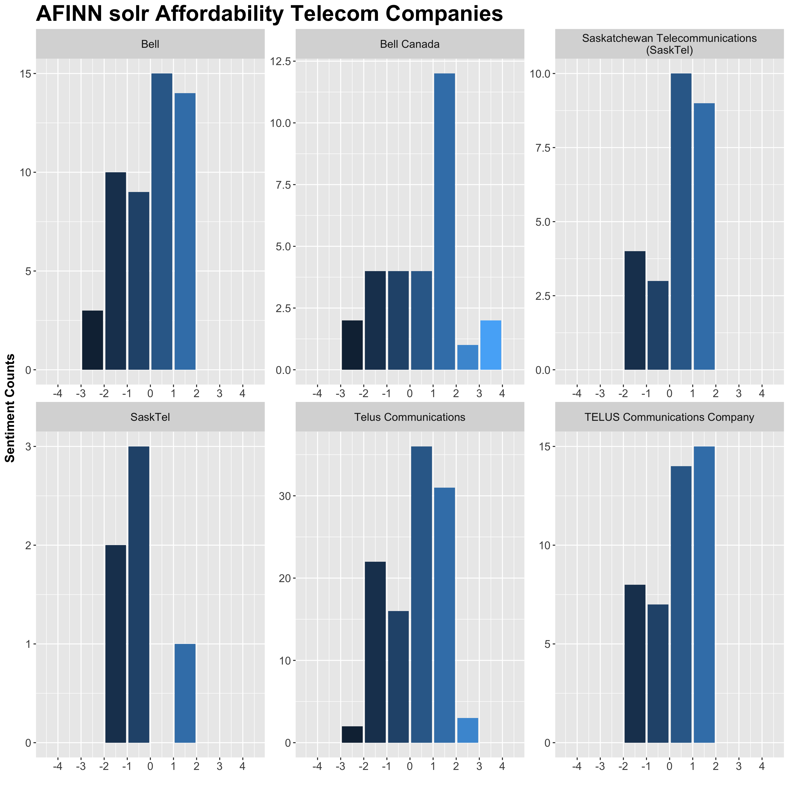
|Organization                              |Sentiment_Mean |Sentiment_SD |Number_of_points |
|:-----------------------------------------|:--------------|:------------|:----------------|
|Bell                                      |0.03           |1.25         |51               |
|Bell Canada                               |0.57           |1.6          |29               |
|Saskatchewan Telecommunications (SaskTel) |0.42           |1.06         |26               |
|SaskTel                                   |-0.5           |1.1          |6                |
|Telus Communications                      |0.24           |1.2          |110              |
|TELUS Communications Company              |0.32           |1.11         |44               |

### Consumer Advocacy
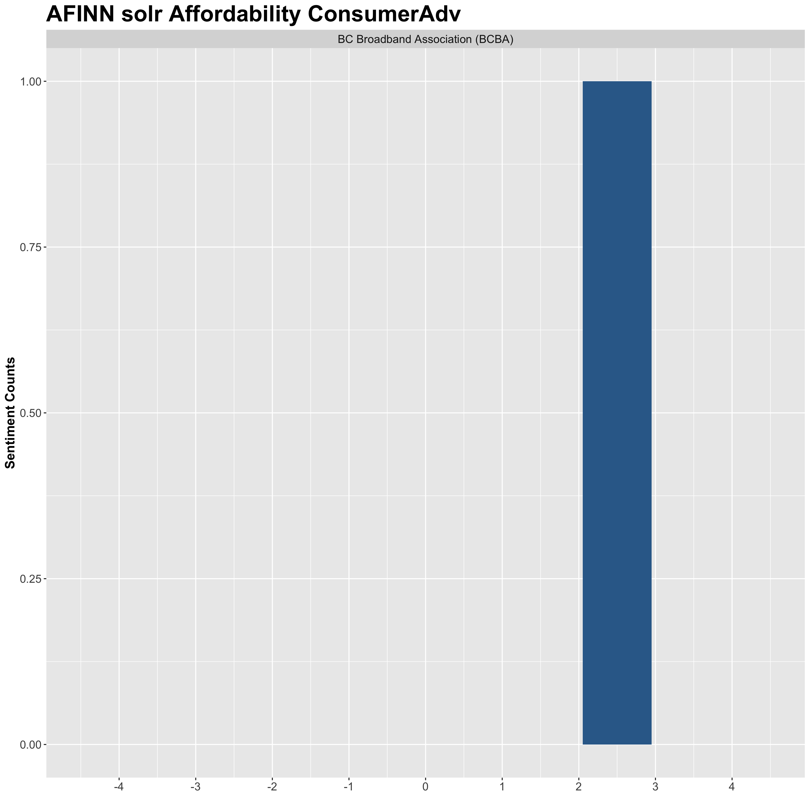

Organization                    |Sentiment_Mean |Sentiment_SD |Number_of_points |
|:-------------------------------|:--------------|:------------|:----------------|
|BC Broadband Association (BCBA) |2.5            |NA           |1                |

### Small Incumbents
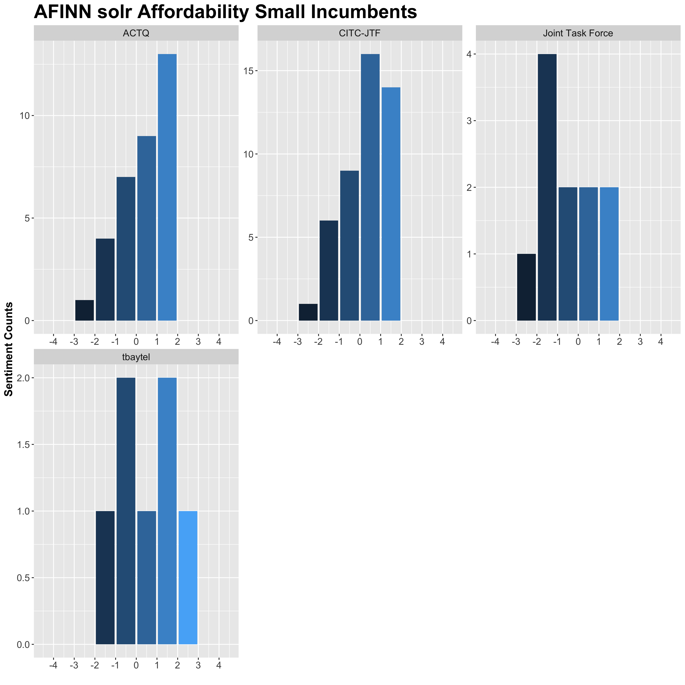

|Organization     |Sentiment_Mean |Sentiment_SD |Number_of_points |
|:----------------|:--------------|:------------|:----------------|
|ACTQ             |0.35           |1.16         |34               |
|CITC-JTF         |0.28           |1.09         |46               |
|Joint Task Force |-0.5           |1.34         |11               |
|tbaytel          |0.5            |1.41         |7                |


##Basic Service question
This was found with a query that looks similar to the following
```neo4j
MATCH (Q:Question)<-[:ABOUT]-(Qe:Query) <-[:MATCHES]-(s:Segment)-[:SEGMENT_OF]->(d:Document)<-[:SUBMITTED]-(o:Organization)
WHERE NOT ID(Qe) = 140612
AND Q.ref='Q9'
RETURN s.content AS Segment, o.category as Organization
```
Where again `ID(Qe)` is the `doc2vec` query that is unique to my database most likely. For all organizations this returned 1053 segments of text.

###All organizations

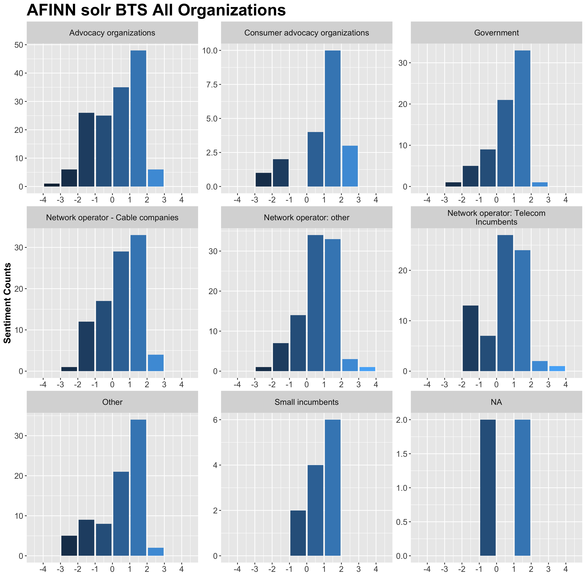


|Organization                         |Sentiment_Mean |Sentiment_SD |Number_of_points |
|:------------------------------------|:--------------|:------------|:----------------|
|Advocacy organizations               |0.23           |1.34         |147              |
|Consumer advocacy organizations      |0.95           |1.36         |20               |
|Government                           |0.69           |1.03         |70               |
|Network operator - Cable companies   |0.47           |1.14         |96               |
|Network operator: other              |0.62           |1.06         |93               |
|Network operator: Telecom Incumbents |0.47           |1.17         |74               |
|Other                                |0.46           |1.3          |79               |
|Small incumbents                     |0.83           |0.78         |12               |
|NA                                   |0.5            |1.15         |4                |

### Other Network Operators

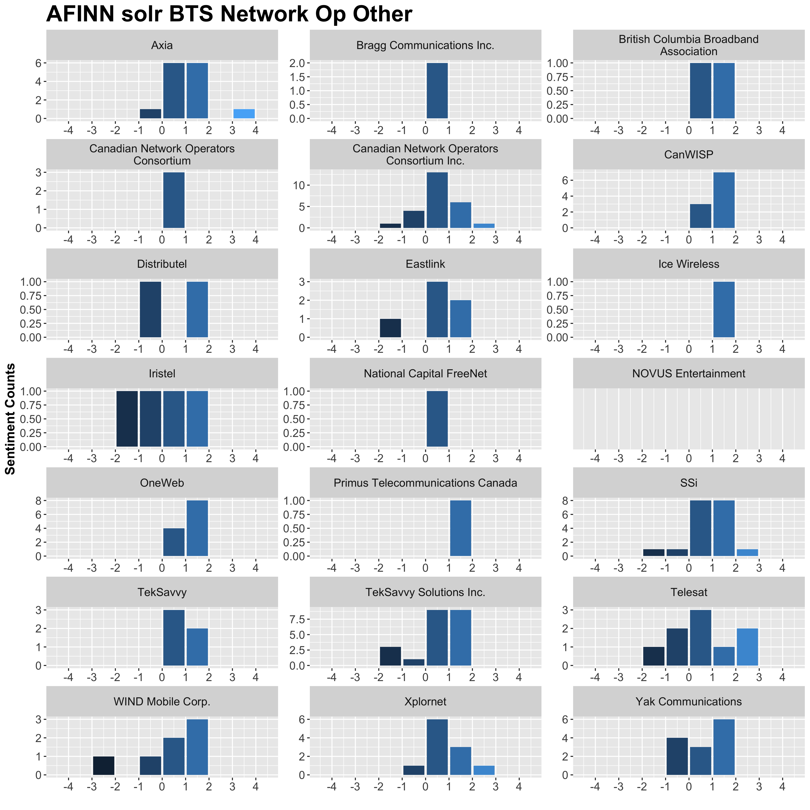


|Organization                               |Sentiment_Mean |Sentiment_SD |Number_of_points |
|:------------------------------------------|:--------------|:------------|:----------------|
|Axia                                       |1.07           |0.94         |14               |
|Bragg Communications Inc.                  |0.5            |0            |2                |
|British Columbia Broadband Association     |1              |0.71         |2                |
|Canadian Network Operators Consortium      |0.5            |0            |3                |
|Canadian Network Operators Consortium Inc. |0.58           |0.86         |25               |
|CanWISP                                    |1.2            |0.48         |10               |
|Distributel                                |0.5            |1.41         |2                |
|Eastlink                                   |0.5            |1.1          |6                |
|Ice Wireless                               |1.5            |NA           |1                |
|Iristel                                    |0              |1.29         |4                |
|National Capital FreeNet                   |0.5            |NA           |1                |
|NOVUS Entertainment                        |NaN            |NA           |0                |
|OneWeb                                     |1.17           |0.49         |12               |
|Primus Telecommunications Canada           |1.5            |NA           |1                |
|SSi                                        |0.87           |0.9          |19               |
|TekSavvy                                   |0.9            |0.55         |5                |
|TekSavvy Solutions Inc.                    |0.59           |1.02         |22               |
|Telesat                                    |0.61           |1.36         |9                |
|WIND Mobile Corp.                          |0.36           |1.46         |7                |
|Xplornet                                   |0.86           |0.81         |11               |
|Yak Communications                         |0.65           |0.9          |13               |

### Government

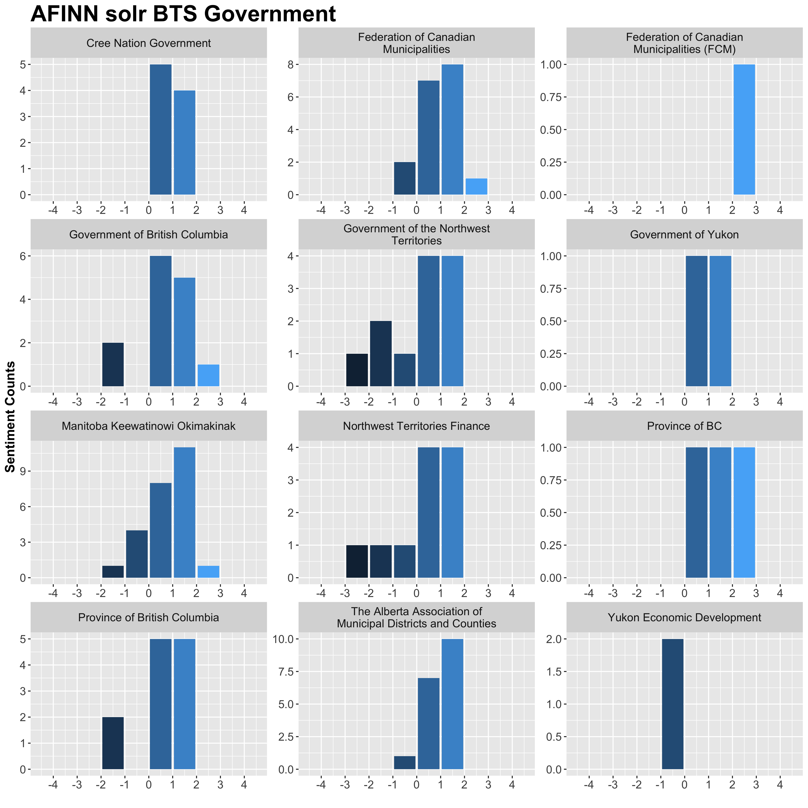


|Organization                                                |Sentiment_Mean |Sentiment_SD |Number_of_points |
|:-----------------------------------------------------------|:--------------|:------------|:----------------|
|Cree Nation Government                                      |0.94           |0.53         |9                |
|Federation of Canadian Municipalities                       |0.94           |0.78         |18               |
|Federation of Canadian Municipalities (FCM)                 |2.5            |NA           |1                |
|Government of British Columbia                              |0.71           |1.12         |14               |
|Government of the Northwest Territories                     |0.17           |1.37         |12               |
|Government of Yukon                                         |1              |0.71         |2                |
|Manitoba Keewatinowi Okimakinak                             |0.78           |0.94         |25               |
|Northwest Territories Finance                               |0.32           |1.33         |11               |
|Province of BC                                              |1.5            |1            |3                |
|Province of British Columbia                                |0.58           |1.08         |12               |
|The Alberta Association of Municipal Districts and Counties |1              |0.62         |18               |
|Yukon Economic Development                                  |-0.5           |0            |2                |

### Advocacy groups

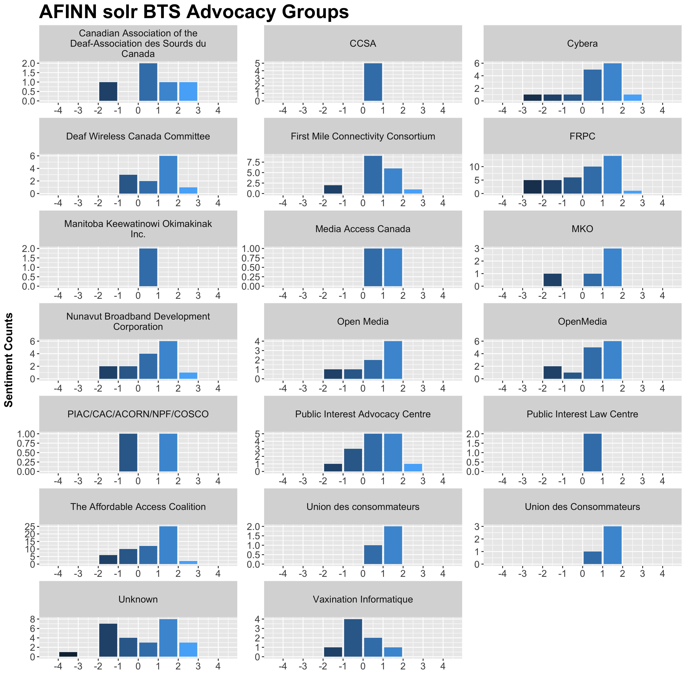


|Organization                                                      |Sentiment_Mean |Sentiment_SD |Number_of_points |
|:-----------------------------------------------------------------|:--------------|:------------|:----------------|
|Canadian Association of the Deaf-Association des Sourds du Canada |0.7            |1.48         |5                |
|CCSA                                                              |0.5            |0            |5                |
|Cybera                                                            |0.63           |1.3          |15               |
|Deaf Wireless Canada Committee                                    |0.92           |1            |12               |
|First Mile Connectivity Consortium                                |0.72           |1            |18               |
|FRPC                                                              |0.13           |1.44         |41               |
|Manitoba Keewatinowi Okimakinak Inc.                              |0.5            |0            |2                |
|Media Access Canada                                               |1              |0.71         |2                |
|MKO                                                               |0.7            |1.3          |5                |
|Nunavut Broadband Development Corporation                         |0.63           |1.19         |15               |
|Open Media                                                        |0.62           |1.13         |8                |
|OpenMedia                                                         |0.57           |1.07         |14               |
|PIAC/CAC/ACORN/NPF/COSCO                                          |0.5            |1.41         |2                |
|Public Interest Advocacy Centre                                   |0.63           |1.06         |15               |
|Public Interest Law Centre                                        |0.5            |0            |2                |
|The Affordable Access Coalition                                   |0.63           |1.11         |55               |
|Union des consommateurs                                           |1.17           |0.58         |3                |
|Union des Consommateurs                                           |1.25           |0.5          |4                |
|Unknown                                                           |0.19           |1.62         |26               |
|Vaxination Informatique                                           |-0.12          |0.92         |8                |

### "Other"

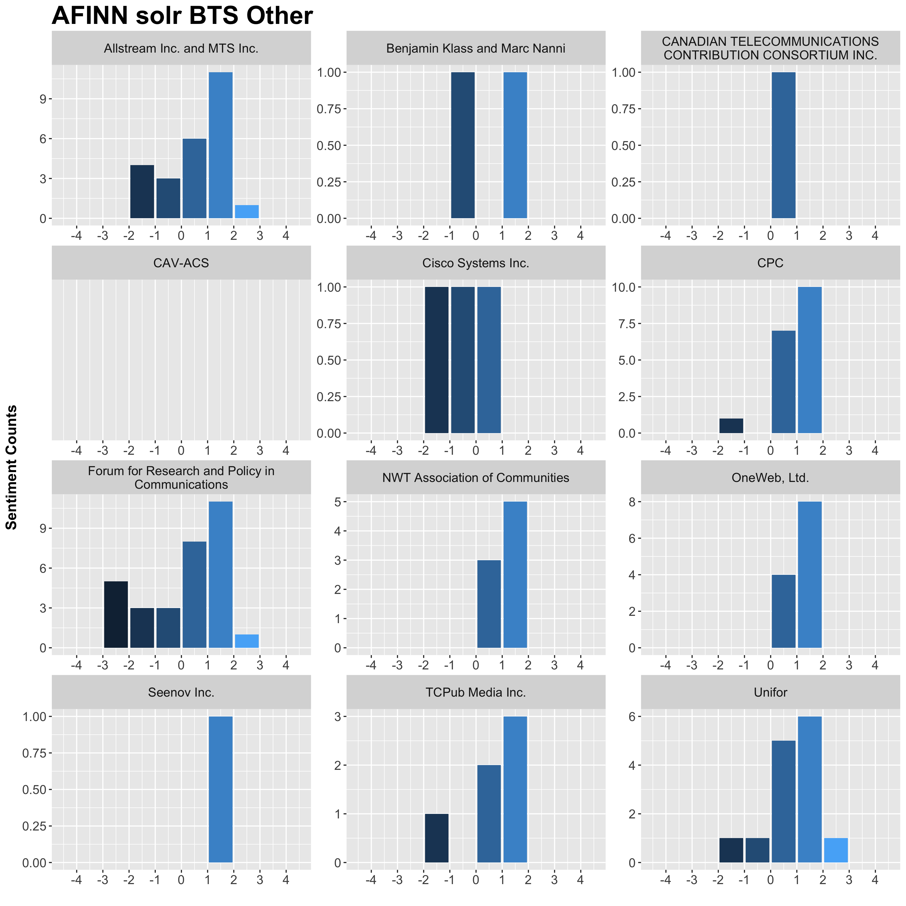


|Organization                                             |Sentiment_Mean |Sentiment_SD |Number_of_points |
|:--------------------------------------------------------|:--------------|:------------|:----------------|
|Allstream Inc. and MTS Inc.                              |0.58           |1.19         |25               |
|Benjamin Klass and Marc Nanni                            |0.5            |1.41         |2                |
|CANADIAN TELECOMMUNICATIONS CONTRIBUTION CONSORTIUM INC. |0.5            |NA           |1                |
|CAV-ACS                                                  |NaN            |NA           |0                |
|Cisco Systems Inc.                                       |-0.5           |1            |3                |
|CPC                                                      |0.94           |0.78         |18               |
|Forum for Research and Policy in Communications          |0.15           |1.54         |31               |
|NWT Association of Communities                           |1.12           |0.52         |8                |
|OneWeb, Ltd.                                             |1.17           |0.49         |12               |
|Seenov Inc.                                              |1.5            |NA           |1                |
|TCPub Media Inc.                                         |0.67           |1.17         |6                |
|Unifor                                                   |0.86           |1.01         |14               |

### Cable Companies
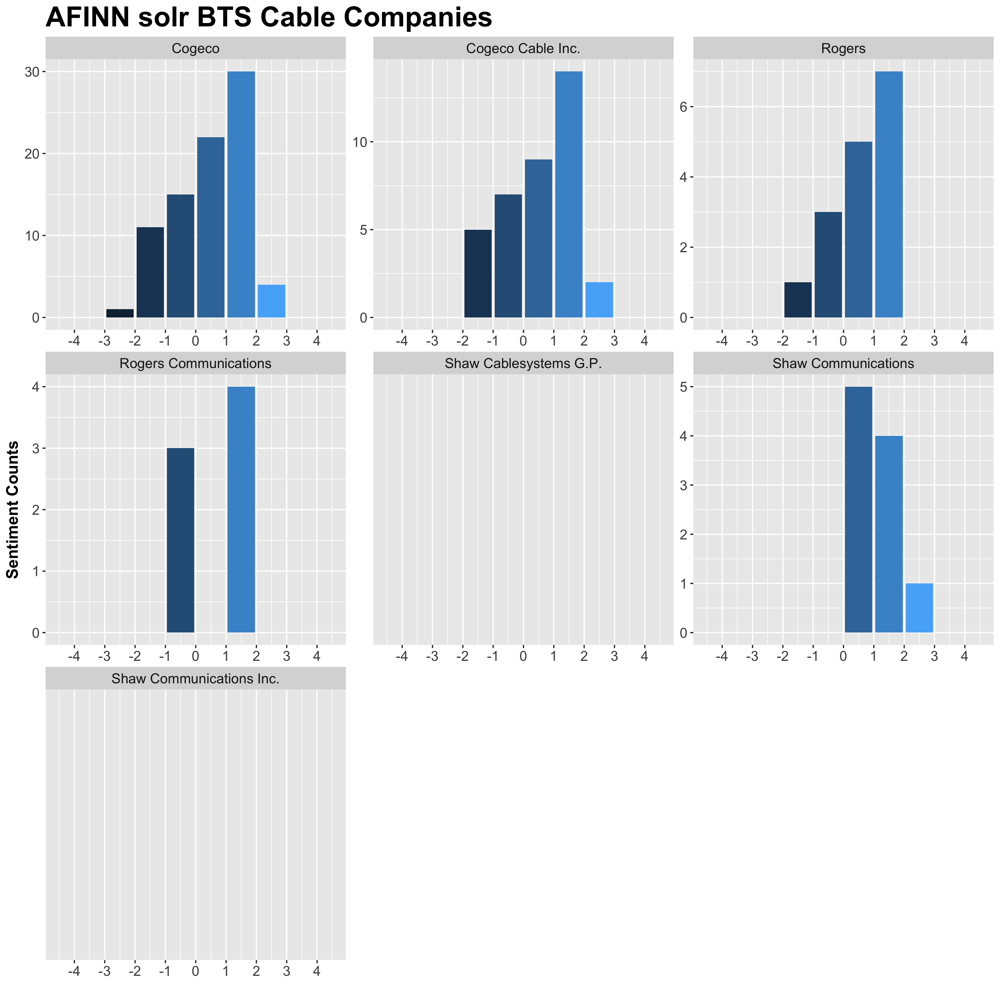


|Organization             |Sentiment_Mean |Sentiment_SD |Number_of_points |
|:------------------------|:--------------|:------------|:----------------|
|Cogeco                   |0.48           |1.18         |83               |
|Cogeco Cable Inc.        |0.53           |1.17         |37               |
|Rogers                   |0.62           |0.96         |16               |
|Rogers Communications    |0.64           |1.07         |7                |
|Shaw Cablesystems G.P.   |NaN            |NA           |0                |
|Shaw Communications      |1.1            |0.7          |10               |
|Shaw Communications Inc. |NaN            |NA           |0                |

### Telecoms
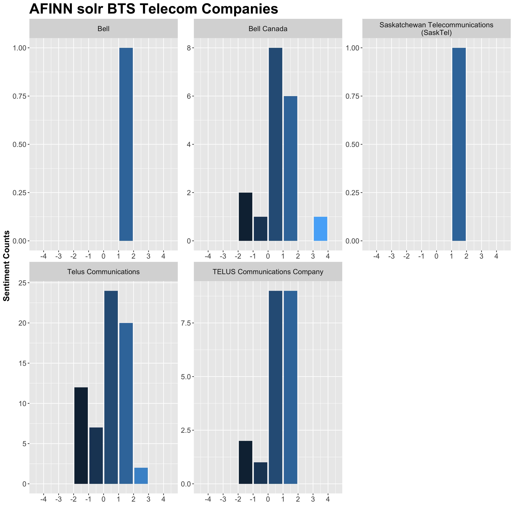


|Organization                              |Sentiment_Mean |Sentiment_SD |Number_of_points |
|:-----------------------------------------|:--------------|:------------|:----------------|
|Bell                                      |1.5            |NA           |1                |
|Bell Canada                               |0.72           |1.17         |18               |
|Saskatchewan Telecommunications (SaskTel) |1.5            |NA           |1                |
|Telus Communications                      |0.39           |1.13         |65               |
|TELUS Communications Company              |0.69           |0.93         |21               |

### Consumer Advocacy Groups
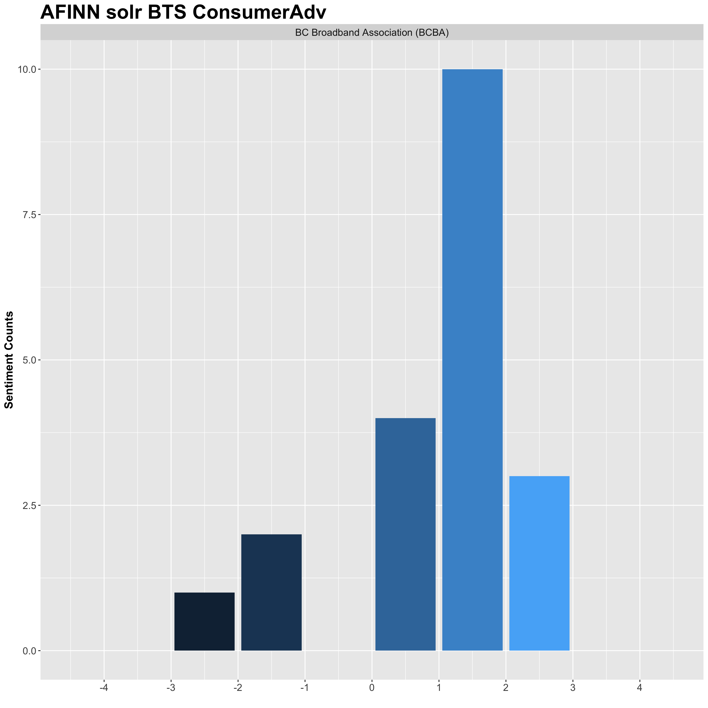


|Organization                    |Sentiment_Mean |Sentiment_SD |Number_of_points |
|:-------------------------------|:--------------|:------------|:----------------|
|BC Broadband Association (BCBA) |0.95           |1.36         |20               |

### Small Incumbents
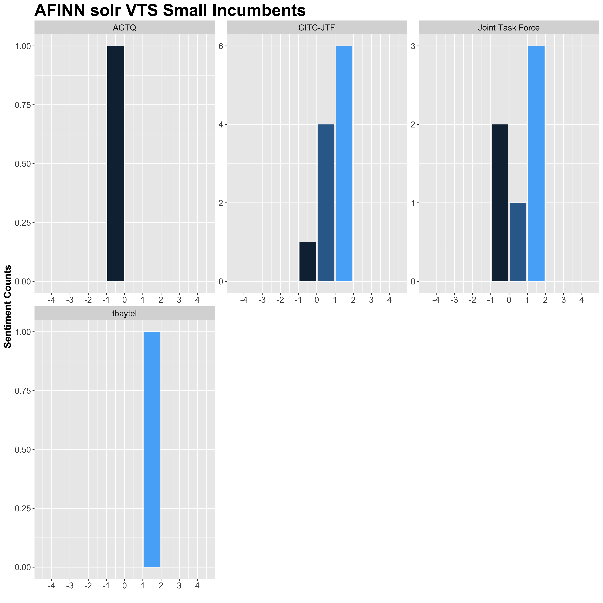


|Organization     |Sentiment_Mean |Sentiment_SD |Number_of_points |
|:----------------|:--------------|:------------|:----------------|
|ACTQ             |-0.5           |NA           |1                |
|CITC-JTF         |0.95           |0.69         |11               |
|Joint Task Force |0.67           |0.98         |6                |
|tbaytel          |1.5            |NA           |1                |


## Thoughts

The sentiment scores between the `doc2vec` and `solr` searches don't really vary in terms of over all sentiment or distribution of sentiment. There are certainly differences, however most of it can be attributed to the sample sizes in `doc2vec` being larger. I'm not sure I can conclusively say which method is better from this. I think the next step might be to produce one of the word webs that Tatiana showed us in stand up on the Open Media submissions, and perhaps from those we can see what these groups are talking about that gives us the above sentiments.
