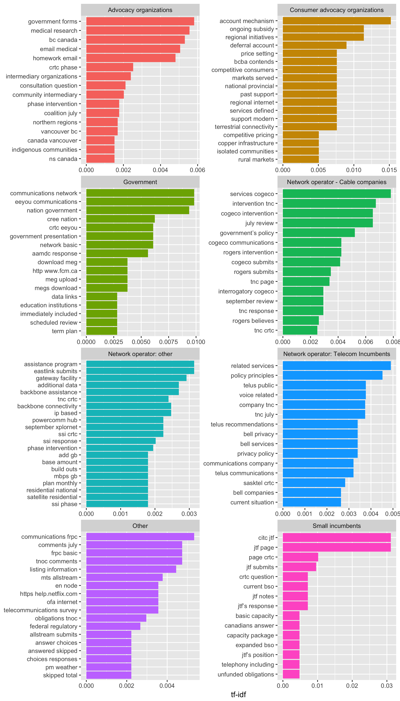
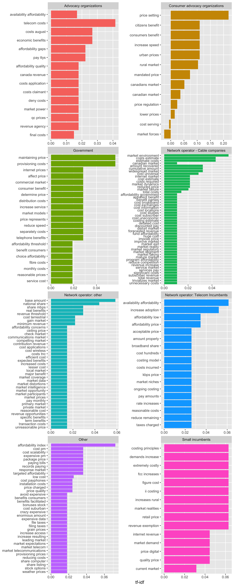

#### Question12:

 Should some or all services that are considered to be basic telecommunications services be subsidized? Explain, with supporting details, which services should be subsidized and under what circumstances.

`Solr searches`

- bin/segment 'content:"services, subsidies"~10 OR "service, subsidies"' --add --rows=113
- bin/segment 'content:"services, subsidy"~10 OR "service, subsidy"' --rows=141 --add
- bin/segment 'content:"services, subsidized"~10 OR "service, subsidized"~10' --add --rows=92

`Results`

Category| In database | Search results | doc2vec | 
--- | --- | --- | -- | 
Advocacy organizations |  289 | 22 | 72 | 
Chamber of commerce/economic dev agency |    4 | 0 | 0 |
Consumer advocacy organizations |    3  | 1 | 2 | 
Government  | 134 | 17 | 28 |
Network operator - Cable companies | 118 | 23 | 28 | 
Network operator: other | 271 | 29 | 58 |
Network operator: Telecom Incumbents | 339 | 30 | 53 |
Other | 107 | 4 | 23 | 
Small incumbents  | 66  | 8  | 18 |  

*Solr search results*:
- 205 documents
- 134 - have organization
- 134 - have category
- 48 organizations out of 175 covered

## Bigram Analysis

Using results of segments of text matching a Doc2Vec based query: "Should some or all services that are considered to be basic telecommunications services be subsidized?", we can split it further into word pairs (bigrams), group by the submitting organization type, and obtain tf-idf scores for each bigram under this grouping. This allows us to see differences in the language different organization types use when talking about this question.

Unfortunately, doing just this doesn't seem to provide a lot of information around the question itself, even if the initial segments were more related to begin with.

We end up seeing a lot of company names, abbreviations, locations, and other more unique words in these bigrams due to their lower frequency. They stand out more easily as different when they appear in a few documents in a particular category.

Word embeddings can be used to filter the bigrams first into a conceptual space. By picking a few words to define that space, such as "affordability", "cost", "price", and "expensive" to define as representatives of what people might say when they talk about "affordability", we can use their word embeddings from a publicily available pre-trained set of embeddings (we used [Stanford's GloVe 100 dimension, 400k vocaulary set](https://nlp.stanford.edu/projects/glove/), which was trained on Wikipedia articles), we could then compute cosine similarities between vectors representing our conceptual space and every unique word in matching segments, taking the maximum "similarity" score to any of the 4 words.

With these similarities in place, we can now filter the bigrams so that we only select bigrams where at least one of the words is above a certain threshold in similarity to our conceptual space. For this example, a relatively high similarity score of 0.7 was chosen. Here are the resulting bigrams:

At first glance, we can see that these results are much more relevant to what we're looking for. Specifically, we can think of these as word pairs representing how affordability is talked about when trying to answer the question: "Should some or all services that are considered to be basic telecommunications services be subsidized?". We also see higher tf-idf scores. This is because these are bigrams that are more frequent *and* we've filtered out most of the least frequent bigrams that would normally push the scores of all bigrams down.

Now we can start to see some more relevant differences between the organization types, where general advocacy organizations talk about the "economic benefits" and "affordability gaps", consumer groups are concerned (perhaps unsurprisingly) that "consumers benefit", but also about "urban prices" and the "rural market". Industry groups talk more about "cost studies", "fund affordability" and the "market environment". Network operators are concerned with "efficient cost" and "expected benefits" and small incumbents talk about "market demand", "demands increase(ing)", and aspects that are "extremely costly".

None of the bigrams stand out as huge surprises, but it is interesting to see these distinct differences between the groups when talking (in theory) about the same thing. It suggests that while, in theory, there should be one conversation over subsidies, there are really several, where each group is very focused on the affects to themselves.