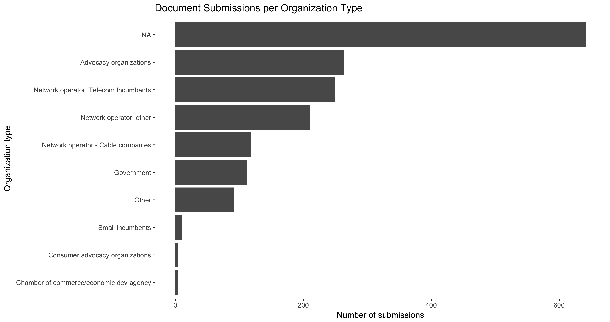
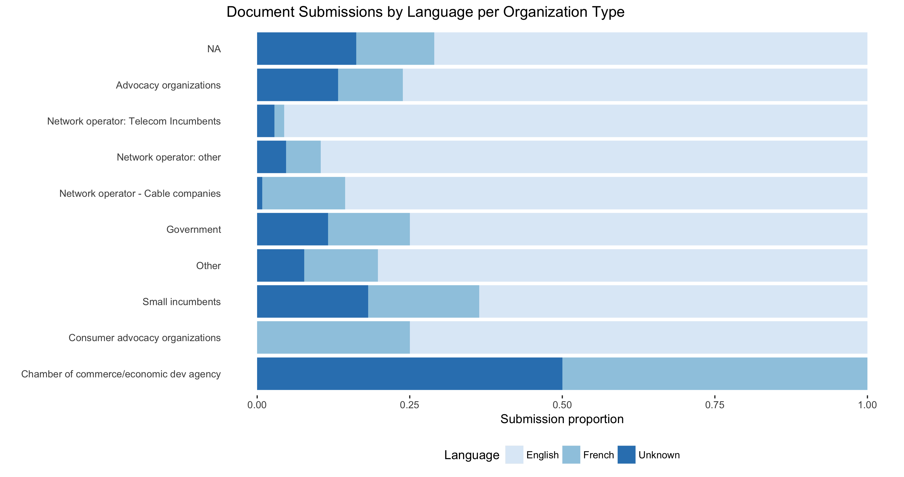

# Summary Stats

## Document Submissions per Organization Type

The following plot represents a count of document submissions that could be traced back to a particular organization, divided by the hand-sorted categories of those organizations.

There are a large number of `NA` classifications. Note that these *do not* represent documents where the organization couldn't be found, but rather where the organization has not been or could not be classified.

### Grouped by language

Google's [Compact Language Detector 2](https://cran.r-project.org/web/packages/cld2/index.html), a pre-trained neural network, was used to probabilistically detect the language in the content of the above submissions. Most detected results were either in French or English. There were a couple of different langauges detected (Dutch and Slovak), but upon further inspection, this was simply due to heavy formatting of spreadsheet like data throwing the network off. Because the set of "detected" languages that are not French or English is so small, these are simply lumped into an `Unknown` classification, along with any `NA` values produced by the neural network's attempts to classify.

This plot shows the proportion of submissions in English, French, or Unknown, as detected by the CLA2 library per organization type.

### Overall language representation
As the following plot shows, roughly 85% of the documents are in English, and the proportion of documents that the CLA2 library can't classify is greater than the amount of French documents it can classify.

## Top Locations for Open Media Submissions

## Open Media Submission Count Map

Open Media submissions contained postal codes, and joining those up with the locations associated with the first 3 letters/numbers, we can obtain the following map:

As might be expected, submissions tended to cluster in areas of higher population density, but there seems to be at least some coverage in most of the populated areas of the country as well.